# HTML5

## 第一个前端程序


### 两步完成一个网页程序

**第一步：使用记事本，编写代码**

在E盘下保存路径`E:/itbaizhan/...`, 文件名`Welcome.html`


```html
<html>
	<head>
		<title>我的网页</title>
	</head>
	<body>
		Hello，我的第一个网页
	</body>
</html>
```


​	

> **注意事项**
>
> 1. 文件后缀名以`.html`结尾
> 2. 在编写代码的过程中，`<>`必须是英文状态下编写


**第二步：以浏览器方式打开**

右键打开方式，以浏览器方式打开即可


**实时效果反馈**

**1. 网页文件是有其特殊的后缀名规则，以下正确的是：**

<font style="background-color:rgb(233, 30, 100)">A</font>   后缀为`.txt`

<font style="background-color:rgb(255, 197, 10)">B</font>   后缀为`.html`

<font style="background-color:#8bc34a">C</font>   后缀为`Welcome`

<font style="background-color:rgb(2, 170, 244);">D</font>   后缀为`.浏览器`


**2. 以下是编写的标签，符合规范的是:**

<font style="background-color:rgb(233, 30, 100)">A</font>   `《html》《/html》`

<font style="background-color:rgb(255, 197, 10)">B</font>   `<html><html/>`

<font style="background-color:#8bc34a">C</font>   `<html></html>`

<font style="background-color:rgb(2, 170, 244);">D</font>   `<html><html>`


**答案**

1=>B  		2=>C 


## 前端工具的选择与安装


### 前端常见开发者工具

工欲善其事必先利其器


#### 浏览器

浏览器是我们最重要的合作伙伴


> **推荐选择**
>
> 我们推荐谷歌浏览器，有两点原因：
>
> 1. 简洁大方，打开响应速度快
> 2. 开发者调试工具


#### 开发者工具

开发者工具有效的提高了开发效率


> **推荐选择**
>
> 我们推荐选择VSCode
>
> 1. 打开速度快
> 2. 使用方便

**VSCode中文语言包安装：**

扩展 → 搜索Chinese → 点击安装


**实时效果反馈**

**1. 如何安装VSCode中文语言包：**

<font style="background-color:rgb(233, 30, 100)">A</font>   扩展 → 搜索中文→ 点击安装

<font style="background-color:rgb(255, 197, 10)">B</font>   扩展 → 搜索Chinese → 点击安装

<font style="background-color:#8bc34a">C</font>   文件→ 搜索Chinese → 点击安装

<font style="background-color:rgb(2, 170, 244);">D</font>   文件→ 搜索中文 → 点击安装


**答案**

1 => B


## VScode开发者工具快捷键


**VSCode打开文件夹与创建文件**

1. 选择文件夹
2. 拖拽文件夹


生成浏览器文件`.html`的快捷方式

```js
! + 回车
```


**VSCode常用快捷键列表**

1. 代码格式化：`Shift+Alt+F`
2. 向上或向下移动一行：`Alt+Up 或 Alt+Down`
3. 快速复制一行代码：`Shift+Alt+Up 或 Shift+Alt+Down`
4. 快速保存：`Ctrl + S`
5. 快速查找：`Ctrl + F`
6. 快速替换：`Ctrl + H`


**实时效果反馈**

**1. VSCode快速复制一行代码的快捷键是：**

<font style="background-color:rgb(233, 30, 100)">A</font>   Shift+Alt+F

<font style="background-color:rgb(255, 197, 10)">B</font>   Ctrl + S

<font style="background-color:#8bc34a">C</font>   Alt+Up 或 Alt+Down

<font style="background-color:rgb(2, 170, 244);">D</font>   Shift+Alt+Up 或 Shift+Alt+Down


**2. VSCode快速移动一行代码快捷键:**

<font style="background-color:rgb(233, 30, 100)">A</font>   Shift+Alt+F

<font style="background-color:rgb(255, 197, 10)">B</font>   Ctrl + S

<font style="background-color:#8bc34a">C</font>   Alt+Up 或 Alt+Down

<font style="background-color:rgb(2, 170, 244);">D</font>   Shift+Alt+Up 或 Shift+Alt+Down


**答案**

1=>D  		2=>C 


## HTML5简介与基础骨架


### HTML5介绍


HTML5是用来描述网页的一种语言，被称为超文本标记语言。用HTML5编写的文件，后缀以`.html`结尾

HTML是一种标记语言，标记语言是一套标记标签。标签是由尖括号包围的关键字，例如：`<html>`

标签有两种表现形式：

1. 双标签，例如：`<html></html>`
2. 单标签，例如：``


### HTML5的DOCTYPE声明

DOCTYPE是`document type` (文档类型) 的缩写。`<!DOCTYPE html >`是H5的声明位于文档的最前面，处于标签之前。
他是网页必备的组成部分，避免浏览器的怪异模式。

```js
<!DOCTYPE html>
```


### HTML5基本骨架


#### html标签

定义 HTML 文档，这个元素我们浏览器看到后就明白这是个HTML文档了，所以你的其它元素要包裹在它里面，标签限定了文档的开始点和结束点。

```html
<!DOCTYPE html>
<html>
</html>
```

#### head标签

head标签用于定义文档的头部。文档的头部描述了文档的各种属性和信息，包括文档的标题、在 Web 中的位置以及和其他文档的关系等。绝大多数文档头部包含的数据都不会真正作为内容显示给读者。

```html
<!DOCTYPE html>
<html>
    <head>
    </head>
</html>
```

#### body标签

body 元素定义文档的主体。

body 元素包含文档的所有内容（比如文本、超链接、图像、表格和列表等等。）

它会直接在页面中显示出来，也就是用户可以直观看到的内容

```html
<!DOCTYPE html>
<html>
    <head>
    </head>
    <body>
        我会显示在浏览器中
    </body>
</html>
```

#### title标签

1. 可定义文档的标题。
2. 它显示在浏览器窗口的标题栏或状态栏上。
3. `<title>` 标签是 `<head>` 标签中唯一必须要求包含的东西，就是说写head一定要写title
4. `<title>`的增加有利于SEO优化

> SEO是搜索引擎优化的英文缩写。通过对网站内容调整，满足搜索引擎的排名需求


```html
<!DOCTYPE html>
<html>
    <head>
        <title>第一个页面</title>
    </head>
    <body>
        我会显示在浏览器中
    </body>
</html>
```

#### meta标签

meta标签用来描述一个HTML网页文档的属性，关键词等，例如：`charset="utf-8"`是说当前使用的是`utf-8`编码格式，在开发中我们经常会看到`utf-8`，或是`gbk`，这些都是编码格式，通常使用`utf-8`。

```html
<!DOCTYPE html>
<html lang="en">
    <head>
        <meta charset="UTF-8">
        <title>itbaizhan</title>
    </head>
    <body>
    </body>
</html>
```


**实时效果反馈**

**1. 下列哪些标签书写格式是正确的是：**

<font style="background-color:rgb(233, 30, 100)">A</font>   《html》

<font style="background-color:rgb(255, 197, 10)">B</font>   <!html>

<font style="background-color:#8bc34a">C</font>   html

<font style="background-color:rgb(2, 170, 244);">D</font>   `<html>`


**2.  以下组成HTML5基础骨架标签正确的是:**

<font style="background-color:rgb(233, 30, 100)">A</font>   `<html>、<body>、<head>、<div>、<meta>`

<font style="background-color:rgb(255, 197, 10)">B</font>   `<html>、<body>、<DOCTYPE>、<title>、<meta>`

<font style="background-color:#8bc34a">C</font>   `<html>、<body>、<head>、<title>、<meta>`

<font style="background-color:rgb(2, 170, 244);">D</font>   `<html>、<body>、<!DOCTYPE html>、<title>、<meta>`


**答案**

1=>D  		2=>C 


## 标签之标题


### 标题介绍与应用

标题（Heading）是通过 `<h1> - <h6> `标签进行定义的。

`<h1>`定义最大的标题   `<h6>`定义最小的标题

```html
<h1>一级标题</h1>
<h2>二级标题</h2>
<h3>三级标题</h3>
<h4>四级标题</h4>
<h5>五级标题</h5>
<h6>六级标题</h6>
```


> 生成h1~h6快捷键：h$*6


### VSCode插件

快速打开浏览器

扩展 -> 搜索open in browser -> 点击安装


**正确使用标题**

请确保将 HTML 标题标签只用于标题。

不要仅仅是为了生成粗体或大号的文本而使用标题。

正确使用标题有益于SEO

应该将`< h1>` 用作主标题（最重要的），其后是 `<h2>`（次重要的），再其次是 `<h3>`，以此类推


**标题标签位置摆放**

在标签中添加属性：`align="left | center | right"` 默认居左


 

**实时效果反馈**

**1. 以下那个是三级标题标签：**

<font style="background-color:rgb(233, 30, 100)">A</font>   `<h1></h1>`

<font style="background-color:rgb(255, 197, 10)">B</font>   `<h2></h2>`

<font style="background-color:#8bc34a">C</font>   `<h3></h3>`

<font style="background-color:rgb(2, 170, 244);">D</font>   `<h4></h4>`


**2.  标题标签居中摆放属性使用正确的是:**

<font style="background-color:rgb(233, 30, 100)">A</font>   `align="left | center | right"`

<font style="background-color:rgb(255, 197, 10)">B</font>   `align="left"`

<font style="background-color:#8bc34a">C</font>   `align="center"`

<font style="background-color:rgb(2, 170, 244);">D</font>   `align="right"`


**答案**

1=>C  		2=>C 


## 标签之段落、换行、水平线


### 标签之段落

段落是通过`<p>`标签定义的

```html
<p>这是一个段落 </p> 
<p>这是另一个段落</p>
```


### 换行

如果您希望在不产生一个新段落的情况下进行换行（新行），请使用 `<br>`

`<br />` 元素是一个空的 HTML 元素。

```html
<p>这个<br>段落<br>演示了分行的效果</p>
```


### 水平线

`<hr/>`标签在 HTML 页面中创建水平线

```html
<hr color="" width="" size="" align=""/>
```

属性：

1. color：设置水平线的颜色
2. width：设置水平线的宽度
3. size：设置水平线的高度
4. align：设置水平线的对齐方式（默认居中），可取值left|right


**实时效果反馈**

**1. 要实现一个文本换行，可以使用以下那个标签：**

<font style="background-color:rgb(233, 30, 100)">A</font>   `<p>`标签

<font style="background-color:rgb(255, 197, 10)">B</font>   `<hr>`标签

<font style="background-color:#8bc34a">C</font>   `<br>`标签

<font style="background-color:rgb(2, 170, 244);">D</font>   ``标签


**2.  承载段落文本信息使用以下那个标签:**

<font style="background-color:rgb(233, 30, 100)">A</font>   `<p>`标签

<font style="background-color:rgb(255, 197, 10)">B</font>   `<hr>`标签

<font style="background-color:#8bc34a">C</font>   `<br>`标签

<font style="background-color:rgb(2, 170, 244);">D</font>   ``标签


**答案**

1=>C  		2=>A 


## 标签之图片


### 网站中最多的元素

网站中最多的元素毋庸置疑，一定是图片

`` 标签定义 HTML 页面中的图像

```html

```


> **注意事项**
>
> ``是单标签，不需要进行闭合操作


属性：

1. src：路径（图片地址与名字）
2. alt：规定图像的替代文本
3. width：规定图像的宽度
4. height：规定图像的高度
5. title：鼠标悬停在图片上给予提示


**实时效果反馈**

**1. ``标签中alt属性的作用：**

<font style="background-color:rgb(233, 30, 100)">A</font>   规定图像的替代文本

<font style="background-color:rgb(255, 197, 10)">B</font>   鼠标悬停在图片上给予提示

<font style="background-color:#8bc34a">C</font>   路径（图片地址与名字）

<font style="background-color:rgb(2, 170, 244);">D</font>   规定图像的宽度和高度


**2.  以下那个不是``标签的属性：**

<font style="background-color:rgb(233, 30, 100)">A</font>   src

<font style="background-color:rgb(255, 197, 10)">B</font>   alt

<font style="background-color:#8bc34a">C</font>   title

<font style="background-color:rgb(2, 170, 244);">D</font>   href


**答案**

1=>A  		2=>D 


## 图片路径详解


### 绝对路径

绝对路径是电脑的盘符存储与访问的具体地址

```html
E:\itbaizhanCode\1.jpg
```

```html

```


### 相对路径

两者相对关系，两者在同⼀路径下可以直接访问

1. 子级关系: `/`

2. 父级关系: `../`

3. 同级关系: `./`（可以省略）

   

### 网络路径

具体的⽹络地址: http://iwenwiki.com/api/newworld/images/n1.png


**实时效果反馈**

**1. 以下那个是相对路径：**

<font style="background-color:rgb(233, 30, 100)">A</font>   `E:\itbaizhanCode\1.jpg`

<font style="background-color:rgb(255, 197, 10)">B</font>   `http://iwenwiki.com/api/newworld/images/n1.png`

<font style="background-color:#8bc34a">C</font>   `../images/1.jpg`

<font style="background-color:rgb(2, 170, 244);">D</font>   `C:\itbaizhanCode\2.jpg`


**2.  以下关于相对路径描述正确的是：**

<font style="background-color:rgb(233, 30, 100)">A</font>   相对路径是电脑的盘符存储与访问的具体地址

<font style="background-color:rgb(255, 197, 10)">B</font>   相对路径是两者相对关系，两者在同⼀路径下可以直接访问

<font style="background-color:#8bc34a">C</font>   相对路径是具体的⽹络地址

<font style="background-color:rgb(2, 170, 244);">D</font>   相对路径是不存在的


**答案**

1=>C  		2=>B 


## 标签之超文本链接


### 超链接描述

HTML使用标签 `<a>`来设置超文本链接

超链接可以是一个字，一个词，或者一组词，也可以是一幅图像，您可以点击这些内容来跳转到新的文档

```html
<a href="url">链接文本</a>
```


### 超链接属性

在标签`<a> `中使用了`href`属性来描述链接的地址

默认情况下，链接将以，以下形式出现在浏览器中：

1. 一个未访问过的链接显示为蓝色字体并带有下划线。

2. 访问过的链接显示为紫色并带有下划线。

3. 点击链接时，链接显示为红色并带有下划线。

   

> **特别提示**
>
> 后期我们会通过CSS样式修改掉这些效果


### 超链接表现

当您把鼠标指针移动到网页中的某个链接上时，箭头会变为一只小手


**实时效果反馈**

**1. 超链接的作用是**

<font style="background-color:rgb(233, 30, 100)">A</font>   跳转到新的文档

<font style="background-color:rgb(255, 197, 10)">B</font>   显示图片的标签

<font style="background-color:#8bc34a">C</font>   显示段落的标签

<font style="background-color:rgb(2, 170, 244);">D</font>   显示标题的标签


**2.  超链接中`href`属性的作用**

<font style="background-color:rgb(233, 30, 100)">A</font>   设置超链接的宽度和高度

<font style="background-color:rgb(255, 197, 10)">B</font>   设置超链接的跳转地址

<font style="background-color:#8bc34a">C</font>   设置超链接的显示颜色

<font style="background-color:rgb(2, 170, 244);">D</font>   设置超链接的文本内容


**答案**

1 =>A 	2=>B 


## 标签之文本


### 常用文本标签

|    标签    |        描述        |
| :--------: | :----------------: |
|   `<em>`   |    定义着重文字    |
|   `<b>`    |    定义粗体文本    |
|   `<i>`    |     定义斜体字     |
| `<strong>` |    定义加重语气    |
|  `<del>`   |     定义删除字     |
|  `<span>`  | 元素没有特定的含义 |


> **特别提示**
>
> 常用文本标签和段落是不同的，段落代表一段文本，而文本标签一般表示文本词汇


**实时效果反馈**

**1. 定义加重语气的标签是哪一个：**

<font style="background-color:rgb(233, 30, 100)">A</font>   `em`

<font style="background-color:rgb(255, 197, 10)">B</font>   `<i>`

<font style="background-color:#8bc34a">C</font>   `<del>`

<font style="background-color:rgb(2, 170, 244);">D</font>   `<strong>`


**2.  定义着重文字的标签是哪一个：**

<font style="background-color:rgb(233, 30, 100)">A</font>   `em`

<font style="background-color:rgb(255, 197, 10)">B</font>   `<i>`

<font style="background-color:#8bc34a">C</font>   `<del>`

<font style="background-color:rgb(2, 170, 244);">D</font>   `<strong>`


**答案**

1=>D  		2=>A 


## 列表标签之有序列表


### 有序列表

有序列表是一列项目，列表项目使用数字进行标记。 有序列表始于` <ol>` 标签。每个列表项始于 `<li> `标签。

```html
<ol>
    <li>尚学堂</li>
    <li>百战程序员</li>
</ol>
```


### type属性

`<ol>`的属性type 拥有的选项

1. 1   表示列表项目用数字标号（1,2,3...）
2. a   表示列表项目用小写字母标号（a,b,c...）
3. A  表示列表项目用大写字母标号（A,B,C...）
4. i   表示列表项目用小写罗马数字标号（i,ii,iii...）
5. I   表示列表项目用大写罗马数字标号（I,II,III...）


### 有序列表嵌套

列表是可以进行嵌套的

```html
<ol>
    <li>尚学堂</li>
    <li>
        <ol>
            <li>阿里</li>
            <li>京东</li>
        </ol>
    </li>
    <li>百战程序员</li>
</ol>
```


**实时效果反馈**

**1. 有序列表展示效果以下那个描述是正确的：**

<font style="background-color:rgb(233, 30, 100)">A</font>   展示一个段落效果

<font style="background-color:rgb(255, 197, 10)">B</font>   展示一个无序的列表效果

<font style="background-color:#8bc34a">C</font>   展示一个有序的列表效果

<font style="background-color:rgb(2, 170, 244);">D</font>   展示一个加粗的文本效果


**2.  有序列表的标签组合正确的是：**

<font style="background-color:rgb(233, 30, 100)">A</font>   `<ul> + <li>`

<font style="background-color:rgb(255, 197, 10)">B</font>   `<ol> + <li>`

<font style="background-color:#8bc34a">C</font>   `<h1> + <li>`

<font style="background-color:rgb(2, 170, 244);">D</font>   ` + <li>`


**答案**

1=>C  		2=>B 


## 列表标签之无序列表


### 无序列表实现

无序列表是一个项目的列表，此列项目使用粗体圆点（典型的小黑圆圈）进行标记

无序列表始于 `<ul>` 标签。每个列表项始于` <li>` 标签。

```html
<ul>
    <li>尚学堂</li>
    <li>百战程序员</li>
</ul>
```


### type属性

`<ul>`的属性type 拥有的选项

- disc 默认实心圆

- circle 空心圆

- square 小方块

- none 不显示


### 无序列表嵌套

列表是可以进行嵌套的

```html
<ul>
    <li>尚学堂</li>
    <li>
        <ul>
            <li>阿里</li>
            <li>京东</li>
        </ul>
    </li>
    <li>百战程序员</li>
</ul>
```


### 常见应用场景

1. 无序的列表效果
2. 导航效果


### 导航效果

```html
<ul>
    <li>Xiaomi手机</li>
    <li>Redmi 红米</li>
    <li>电视</li>
    <li>笔记本</li>
</ul>
```


> **快捷键**
>
> 快速生成ul+li的布局：ul>li*3（数字根据自己的需要的li数量修改）


**实时效果反馈**

**1. 无序列表的type属性以下描述错误的是：**

<font style="background-color:rgb(233, 30, 100)">A</font>   disc 默认实心圆

<font style="background-color:rgb(255, 197, 10)">B</font>   circle 空心圆

<font style="background-color:#8bc34a">C</font>   square 小方块

<font style="background-color:rgb(2, 170, 244);">D</font>   triangle 三角形


**2.  无序列表的标签组合正确的是：**

<font style="background-color:rgb(233, 30, 100)">A</font>   `<ul> + <li>`

<font style="background-color:rgb(255, 197, 10)">B</font>   `<ol> + <li>`

<font style="background-color:#8bc34a">C</font>   `<h1> + <li>`

<font style="background-color:rgb(2, 170, 244);">D</font>   ` + <li>`


**答案**

1=>D  		2=>A 


## 标签之表格


### 表格展示效果

表格在数据展示方面非常简单，并且表现优秀


> **表格组成与特点**
>
> 行、列、单元格 
>
> 单元格特点：同行等高、同列等宽。
>
> ---
>
> **表格标签**
>
> 表格：`<table>`
>
> 行：`<tr>`
>
> 单元格(列)：`<td>`

```html
<table>
    <tr>
        <td>尚学堂</td>
        <td>百战程序员</td>
    </tr>
    <tr>
        <td>阿里</td>
        <td>京东</td>
    </tr>
</table>
```


> **快捷键**
>
> 快速生成表格结构：table>tr*2>td{单元格}


### 表格属性

1. border：设置表格的边框
2. width：设置表格的宽度
3. height：设置表格的高度


**实时效果反馈**

**1. 以下那个是表格组成标签组合：**

<font style="background-color:rgb(233, 30, 100)">A</font>   table + tr + td

<font style="background-color:rgb(255, 197, 10)">B</font>   table + tr + dl

<font style="background-color:#8bc34a">C</font>   ul + tr + td

<font style="background-color:rgb(2, 170, 244);">D</font>   ul + table + tr


**2.  以下代码，空格处要填写的标签：**

```html
<table>
    ___
        <td>尚学堂</td>
        <td>百战程序员</td>
    ___
</table>
```

<font style="background-color:rgb(233, 30, 100)">A</font>   `<th>` `</th>`

<font style="background-color:rgb(255, 197, 10)">B</font>   `<tbody>` `</tbody>`

<font style="background-color:#8bc34a">C</font>   `<td>` `</td>`

<font style="background-color:rgb(2, 170, 244);">D</font>   `<tr>` `</tr>`


**答案**

1=>A  		2=>D 


## 表格单元格合并


### 单元格合并属性


- 水平合并：colspan
- 垂直合并：rowspan

```html
<table border="1" width="500px" height="200px">
    <tr>
        <td colspan="3">单元格1单元格2单元格3</td>
        <td>单元格4</td>
        <td>单元格5</td>
    </tr>
    <tr>
        <td rowspan="2">单元格6-11</td>
        <td>单元格7</td>
        <td rowspan="3">单元格81318</td>
        <td colspan="2" rowspan="2">单元格9101415</td>
    </tr>
    <tr>
        <td>单元格12</td>
    </tr>
    <tr>
        <td>单元格16</td>
        <td>单元格17</td>
        <td>单元格19</td>
        <td>单元格20</td>
    </tr>
</table>
```


**实时效果反馈**

**1. 下列那个是单元格垂直合并的属性：**

<font style="background-color:rgb(233, 30, 100)">A</font>   border

<font style="background-color:rgb(255, 197, 10)">B</font>   align

<font style="background-color:#8bc34a">C</font>   colspan

<font style="background-color:rgb(2, 170, 244);">D</font>   rowspan


**答案**

1=>D  	


## Form表单


表单在 Web 网页中用来给用户填写信息，从而能采用户信息，使网页具有交互的功能。

所有的用户输入内容的地方都用表单来写，如登录注册、搜索框


表单是由容器和控件组成的,一个表单一般应该包含用户填写信息的输入框,按钮等，这些输入框,按钮叫做控件,表单就是容器,它能够容纳各种各样的控件

```html
<form action="url" method="get|post" name="myform"></form>
```

> **属性说明**
>
> action服务器地址
>
> name表单名称
>
> **method中Get和Post的区别**
>
> 1. 数据提交方式，get把提交的数据url可以看到，post看不到
> 2. get一般用于提交少量数据，post用来提交大量数据


### 表单元素

一个完整的表单包含三个基本组成部分：表单标签、表单域、表单按钮

1. 表单标签
2. 表单域
3. 表单按钮

```html
<form>
    <input type="text">
    <input type="submit">
</form>
```


**实时效果反馈**

**1.以下哪个元素不是表单元素：**

<font style="background-color:rgb(233, 30, 100)">A</font>   表单标签

<font style="background-color:rgb(255, 197, 10)">B</font>   表单域

<font style="background-color:#8bc34a">C</font>   表单按钮

<font style="background-color:rgb(2, 170, 244);">D</font>   图片


**答案**

1=>D  


## 表单元素


### 文本框

文本域通过`<input type="text">` 标签来设定，当用户要在表单中键入字母、数字等内容时，就会用到文本域

```html
<form>
    First name: <input type="text" name="firstname">
    <br>
    Last name: <input type="text" name="lastname">
</form>
```


### 密码框

密码字段通过标签`<input type="password">` 来定义

```html
<form>
    Password: <input type="password" name="pwd">
</form>
```


> **温馨提示**
>
> 密码字段字符不会明文显示，而是以星号或圆点替代


### 提交按钮

当用户单击确认按钮时，表单的内容会被传送到另一个文件。表单的动作属性定义了目的文件的文件名。由动作属性定义的这个文件通常会对接收到的输入数据进行相关的处理

```html
<form name="input" action="url" method="get">
    Username: <input type="text" name="user">
    <input type="submit" value="Submit">
</form>
```


**实时效果反馈**

**1.设置输入框为密码框，type属性应该填写内容：**

<font style="background-color:rgb(233, 30, 100)">A</font>   text

<font style="background-color:rgb(255, 197, 10)">B</font>   password

<font style="background-color:#8bc34a">C</font>   radio

<font style="background-color:rgb(2, 170, 244);">D</font>   name


**答案**

1=>B


## 块元素与行内元素（内联元素）


HTML5出现之前，经常把元素按照块级元素和内联元素来区分。在HTML5中，元素不再按照这种⽅式来区分， 而是按照内容模型来区分，分为元数据型(metadata content)、区块型(sectioning content)、标题型(heading content)、文档流型(flow content)、语句型(phrasing content)、内嵌型(embedded content)、交互型 (interactive content)。元素不属于任何⼀个类别，被称为穿透的，元素可能属于不止⼀个类别，称为混合的


详细参考地址：https://developer.mozilla.org/zh-CN/docs/Web/Guide/HTML/Content_categories 


虽然到了HTML5的版本，元素分类更细致了，但是这对初学者并不友好,所以我们仍然按照块元素和内联元素做区分，这对我们的布局起到了至关重要的作用


内联元素和块级元素的区别 

|                   块级元素                   |                   内联元素                   |
| :------------------------------------------: | :------------------------------------------: |
| 块元素会在页面中独占一行（自上向下垂直排列） | 行内元素不会独占页面中的一行，只占自身的大小 |
|          可以设置width，height属性           |      行内元素设置width，height属性无效       |
|  ⼀般块级元素可以包含行内元素和其他块级元素  |    ⼀般内联元素包含内联元素不包含块级元素    |


常见块级元素

> div、form、h1~h6、hr、p、table、ul、等


常见内联元素(行内元素)

> a、b、em、i、span、strong等 


行内块级元素（特点：不换行、能够识别宽高）

> button、img、input等 


**实时效果反馈**

**1.下列关于元素分类描述错误的是：**

<font style="background-color:rgb(233, 30, 100)">A</font>   块元素会在页面中独占一行,行内元素不会独占页面中的一行，只占自身的大小

<font style="background-color:rgb(255, 197, 10)">B</font>   块元素可以设置width，height属性,行内元素设置width，height属性无效

<font style="background-color:#8bc34a">C</font>   ⼀般块级元素可以包含行内元素和其他块级元素,⼀般内联元素包含内联元素不包含块级元素 

<font style="background-color:rgb(2, 170, 244);">D</font>   块元素可以设置大小,不会独占一行,行内元素无法无法设置大小,但是会独占一行


**答案**

1=>D  


## HTML5新增标签


`HTML5`是`HTML`最新的修订版本，2014年10月由万维网联盟`（W3C）`完成标准制定

在`HTML5`出现之前，我们一般采用`DIV+CSS`布局我们的页面。但是这样的布局方式不仅使我们的文档结构不够清晰，而且**不利于搜索引擎爬虫对我们页面的爬取**。为了解决上述缺点，`HTML5`新增了很多新的语义化标签


### 扩展知识

`div`容器元素，也是页面中见到的最多的元素


div实现


H5新标签实现


**H5新标签**

1. `<header></header>`  头部
2. `<nav></nav>`  导航
3. `<section></section>`定义文档中的节,比如章节、页眉、页脚
4. `<aside></aside>`  侧边栏
5. `<footer></footer>` 脚部
6. `<article></article>`  代表一个独立的、完整的相关内容块,例如一篇完整的论坛帖子，一篇博客文章，一个用户评论等


**实时效果反馈**

**1.下列哪个不属于HTML5的新增标签**

<font style="background-color:rgb(233, 30, 100)">A</font>   `<header></header>`

<font style="background-color:rgb(255, 197, 10)">B</font>   `<div></div>`

<font style="background-color:#8bc34a">C</font>   `<footer></footer>`

<font style="background-color:rgb(2, 170, 244);">D</font>   `<nav></nav>`


**答案**

1=>B  

# CSS6


## CSS简介


### CSS概念

CSS（Cascading Style Sheets）层叠样式表，又叫级联样式表，简称样式表

CSS文件后缀名为`.css`

CSS用于HTML文档中元素样式的定义


### 为什么需要CSS

使用css的唯一目的就是让网页具有美观一致的页面


### 语法

CSS 规则由两个主要的部分构成：选择器，以及一条或多条声明（样式）


选择器通常是您需要改变样式的 HTML 元素

每条声明由一个属性和一个值组成

属性（property）是您希望设置的样式属性（style attribute）。每个属性有一个值。属性和值被冒号分开

```css
<style>
    h1{
        color: blue;
        font-size: 12px;
    }
</style>
```


**实时效果反馈**

**1.下列关于CSS基础语法描述错误的是：**

<font style="background-color:rgb(233, 30, 100)">A</font>   CSS 规则由两个主要的部分构成：选择器，以及一条或多条声明

<font style="background-color:rgb(255, 197, 10)">B</font>   选择器通常是您需要改变样式的 HTML 元素

<font style="background-color:#8bc34a">C</font>   每条声明由一个属性和一个值组成

<font style="background-color:rgb(2, 170, 244);">D</font>   属性与属性值之间用分号隔开


**答案**

1=>D 


## CSS的引入方式


### 内联样式（行内样式）

要使用内联样式，你需要在相关的标签内使用样式（style）属性。Style 属性可以包含任何 CSS 属性

> **温馨提示**
>
> 缺乏整体性和规划性，不利于维护，维护成本高

```html
<p style="background: orange; font-size: 24px;">CSS<p>
```


### 内部样式

当单个文档需要特殊的样式时，就应该使用内部样式表。你可以使用 `<style>` 标签在文档头部定义内部样式表

> **温馨提示**
>
> 单个页面内的CSS代码具有统一性和规划性，便于维护，但是在多个页面之间容易混乱

```html
<head>
    <style> 
       h1 { 
           background: red; 
       } 
    </style>
</head>
```


### 外部样式（推荐）

当样式需要应用于很多页面时，外部样式表将是理想的选择。在使用外部样式表的情况下，你可以通过改变一个文件来改变整个站点的外观。每个页面使用 `<link>` 标签链接到样式表。 `<link>` 标签在（文档的）头部

```html
<link rel="stylesheet" type="text/css" href="xxx.css">
```


**实时效果反馈**

**1.外部CSS样式的引入方式，以下正确的是：**

<font style="background-color:rgb(233, 30, 100)">A</font>   `<style></style>`

<font style="background-color:rgb(255, 197, 10)">B</font>   `<link rel="stylesheet" href="xxx.css">`

<font style="background-color:#8bc34a">C</font>   `<p style="background: orange; font-size: 24px;">CSS<p>`


**答案**

1=>B 


## 选择器一


CSS语法 规则由两个主要的部分构成：**选择器**，以及一条或多条声明（样式）


### 全局选择器

可以与任何元素匹配，优先级最低，一般做样式初始化

```css
*{
     margin: 0;
     padding: 0;
 }
```


### 元素选择器

HTML文档中的元素，`p、b、div、a、img、body`等。

标签选择器，选择的是页面上所有这种类型的标签，所以经常描述“共性”，无法描述某一个元素的“个性”

```css
p{
    font-size:14px;
}
```

再比如说，我想让“学完前端，继续学Java”这句话中的“前端”两个变为红色字体，那么我可以用`<span>`标签把“前端”这两个字围起来，然后给`<span>`标签加一个标签选择器

```html
<p>学完了<span>前端</span>，继续学Java</p>
span{
	color: red;
}
```

> **温馨提示**
>
> 1. 所有的标签，都可以是选择器。比如ul、li、label、dt、dl、input、div等
> 2. 无论这个标签藏的多深，一定能够被选择上
> 3. 选择的所有，而不是一个


### 类选择器

规定用圆点 `.` 来定义，针对你想要的所有标签使用

> **优点**
>
> 灵活

```html
<h2 class="oneclass">你好</h2>
/*定义类选择器*/
.oneclass{
	width:800px;
}
```

> **class属性的特点**
>
> 1. 类选择器可以被多种标签使用
> 2. 类名不能以数字开头
> 3. 同一个标签可以使用多个类选择器。用空格隔开

```html
<h3 class="classone  classtwo">我是一个h3啊</h3>
```

```html
<h3 class="teshu" class="zhongyao">我是一个h3啊</h3>  // 错误
```


**实时效果反馈**

**1.下列代码哪个是类选择器使用方式：**

<font style="background-color:rgb(233, 30, 100)">A</font>   `h1{color:red;}`

<font style="background-color:rgb(255, 197, 10)">B</font>   `*{margin:0;}`

<font style="background-color:#8bc34a">C</font>   `.title{color:red;}`

<font style="background-color:rgb(2, 170, 244);">D</font>   `h3{color:red;}`


**答案**

1=>C 


## 选择器二


### ID选择器

针对某一个特定的标签来使用，只能使用一次。`css`中的`ID选择器`以 `#` 来定义

```html
<h2 id="mytitle">你好</h2>
#mytitle{
    border:3px dashed green;
}
```

> **特别强调**
>
> 1. ID是唯一的
> 2. ID不能以数字开头


### 合并选择器

语法：`选择器1,选择器2,...{ }`

作用：提取共同的样式，减少重复代码

```css
.header, .footer{
    height:300px;
}
```


### 选择器的优先级

CSS中,权重用数字衡量

元素选择器的权重为: 1

class选择器的权重为: 10

id选择器的权重为: 100

内联样式的权重为: 1000

优先级从高到低: 行内样式 > ID选择器 > 类选择器 > 元素选择器


**实时效果反馈**

**1.下列选择器优先级排序正确的是：**

<font style="background-color:rgb(233, 30, 100)">A</font>   行内样式 > ID选择器 > 类选择器 > 元素选择器

<font style="background-color:rgb(255, 197, 10)">B</font>   行内样式 > 类选择器 > ID选择器 > 元素选择器

<font style="background-color:#8bc34a">C</font>   行内样式 > 元素选择器 > 类选择器 > ID选择器

<font style="background-color:rgb(2, 170, 244);">D</font>   元素选择器 > ID选择器 > 类选择器 > 行内样式


**答案**

1=>A 


## 字体属性


CSS字体属性定义字体，颜色、大小，加粗，文字样式


### color

规定文本的颜色

```css
div{ color:red;}
div{ color:#ff0000;}
div{ color:rgb(255,0,0);}
div{ color:rgba(255,0,0,.5);}
```


### font-size

设置文本的大小

能否管理文字的大小，在网页设计中是非常重要的。但是，你不能通过调整字体大小使段落看上去像标题，或者使标题看上去像段落。

```css
h1 {font-size:40px;}
h2 {font-size:30px;}
p {font-size:14px;}
```

> **温馨提示**
>
> chrome浏览器接受最小字体是12px


### font-weight

设置文本的粗细

| 值      | 描述                                       |
| ------- | ------------------------------------------ |
| bold    | 定义粗体字符                               |
| bolder  | 定义更粗的字符                             |
| lighter | 定义更细的字符                             |
| 100~900 | 定义由细到粗  400等同默认，而700等同于bold |

```css
H1 {font-weight:normal;}
div{font-weight:bold;}
p{font-weight:900;}
```


### font-style

指定文本的字体样式

| 值     | 描述       |
| ------ | ---------- |
| normal | 默认值     |
| italic | 定义斜体字 |


### font-family

font-family属性指定一个元素的字体

> **温馨提示**
>
> 每个值用逗号分开
>
> 如果字体名称包含空格，它必须加上引号

```css
font-family:"Microsoft YaHei","Simsun","SimHei";
```


**实时效果反馈**

**1.下列哪个属性可以设置字体粗细：**

<font style="background-color:rgb(233, 30, 100)">A</font>   font-family

<font style="background-color:rgb(255, 197, 10)">B</font>   font-style

<font style="background-color:#8bc34a">C</font>   font-weight

<font style="background-color:rgb(2, 170, 244);">D</font>   font-size


**答案**

1=>C


## 背景属性


CSS背景属性主要有以下几个

| 属性                | 描述                 |
| ------------------- | -------------------- |
| background-color    | 设置背景颜色         |
| background-image    | 设置背景图片         |
| background-position | 设置背景图片显示位置 |
| background-repeat   | 设置背景图片如何填充 |
| background-size     | 设置背景图片大小属性 |


### background-color属性

该属性设置背景颜色

```css
<div class="box"></div>
.box{
    width: 300px;
    height: 300px;
    background-color: palevioletred;
}
```


### background-image属性

设置元素的背景图像

元素的背景是元素的总大小，包括填充和边界（不包括外边距）。默认情况下background-image属性放置在元素的左上角，如果图像不够大的话会在垂直和水平方向平铺图像，如果图像大小超过元素大小从图像的左上角显示元素大小的那部分

```css
<div class="box"></div>
.box{
    width: 600px;
    height: 600px;
    background-image: url("images/img1.jpg");
}
```


### background-repeat属性

该属性设置如何平铺背景图像

| 值        | 说明             |
| --------- | ---------------- |
| repeat    | 默认值           |
| repeat-x  | 只向水平方向平铺 |
| repeat-y  | 只向垂直方向平铺 |
| no-repeat | 不平铺           |

```css
.box{
    width: 600px;
    height: 600px;
    background-color: #fcc;
    background-image: url("images/img1.jpg");
    background-repeat: no-repeat;
}
```


### background-size属性

该属性设置背景图像的大小

| 值         | 说明                                                         |
| ---------- | ------------------------------------------------------------ |
| length     | 设置背景图片的宽度和高度，第一个值宽度，第二个值高度，如果只是设置一个，第二个值auto |
| percentage | 计算相对位置区域的百分比，第一个值宽度，第二个值高度，如果只是设置一个，第二个值auto |
| cover      | 保持图片纵横比并将图片缩放成完全覆盖背景区域的最小大小       |
| contain    | 保持图片纵横比并将图像缩放成适合背景定位区域的最大大小       |

```css
.box{
    width: 600px;
    height: 600px;
    background-image: url("images/img1.jpg");
    background-repeat: no-repeat;
    background-size: 100% 100%;
}
```


### background-position属性

该属性设置背景图像的起始位置，其默认值是：0% 0%

| 值            | 说明                                                         |
| ------------- | ------------------------------------------------------------ |
| left  top     | 左上角                                                       |
| left center   | 左 中                                                        |
| left bottom   | 左 下                                                        |
| right top     | 右上角                                                       |
| right center  | 右 中                                                        |
| right bottom  | 右 下                                                        |
| center top    | 中 上                                                        |
| center center | 中 中                                                        |
| center bottom | 中 下                                                        |
| x%  y%        | 第一个值是水平位置，第二个值是垂直位置，左上角是0%  0%，右下角是100%  100% 。如果只指定了一个值，其他值默认是50%。默认是0%  0% |
| xpos ypos     | 单位是像素                                                   |

```css
.box{
    width: 600px;
    height: 600px;
    background-color: #fcc;
    background-image: url("images/img1.jpg");
    background-repeat: no-repeat;
    background-position: center;
}
```


**实时效果反馈**

**1.下列哪个属性可以设置背景图片位置的调整：**

<font style="background-color:rgb(233, 30, 100)">A</font>   background-position

<font style="background-color:rgb(255, 197, 10)">B</font>   background-repeat

<font style="background-color:#8bc34a">C</font>   background-attachment

<font style="background-color:rgb(2, 170, 244);">D</font>   background-size


**2.下列关于`background-repeat`属性描述错误的是：**

<font style="background-color:rgb(233, 30, 100)">A</font>   repeat-x只向水平方向平铺

<font style="background-color:rgb(255, 197, 10)">B</font>   repeat-y只向垂直方向平铺

<font style="background-color:#8bc34a">C</font>   no-repeat不平铺

<font style="background-color:rgb(2, 170, 244);">D</font>   repeat默认不平铺


**答案**

1=>A   2=>D


## 文本属性


### text-align

指定元素文本的水平对齐方式

| 值     | 描述                 |
| ------ | -------------------- |
| left   | 文本居左排列，默认值 |
| right  | 把文本排列到右边     |
| center | 把文本排列到中间     |

```css
h1 {text-align:center}
h2 {text-align:left}
h3 {text-align:right}
```


### text-decoration

text-decoration 属性规定添加到文本的修饰，下划线、上划线、删除线等

| 值           | 描述       |
| ------------ | ---------- |
| underline    | 定义下划线 |
| overline     | 定义上划线 |
| line-through | 定义删除线 |

```css
h1 {text-decoration:overline} 
h2 {text-decoration:line-through} 
h3 {text-decoration:underline}
```


### text-transform

text-transform 属性控制文本的大小写

| 值         | 描述                 |
| ---------- | -------------------- |
| captialize | 定义每个单词开头大写 |
| uppercase  | 定义全部大写字母     |
| lowercase  | 定义全部小写字母     |

```css
h1 {text-transform:uppercase;}
h2 {text-transform:capitalize;}
p {text-transform:lowercase;}
```


### text-indent

text-indent 属性规定文本块中首行文本的缩进

```css
p{
	text-indent:50px;
}
```

> **温馨提示**
>
> 负值是允许的。如果值是负数，将第一行左缩进


**实时效果反馈**

**1.下列哪个属性可以设置文本首字母大写：**

<font style="background-color:rgb(233, 30, 100)">A</font>   text-indent

<font style="background-color:rgb(255, 197, 10)">B</font>   text-transform

<font style="background-color:#8bc34a">C</font>   text-decoration

<font style="background-color:rgb(2, 170, 244);">D</font>   text-align


**答案**

1=>B


## 表格属性


使用 CSS 可以使 HTML 表格更美观


### 表格边框

指定CSS表格边框，使用border属性

```css
table, td { 
    border: 1px solid black; 
}
```


### 折叠边框

border-collapse 属性设置表格的边框是否被折叠成一个单一的边框或隔开

```css
table { border-collapse:collapse; }
table,td { border: 1px solid black; }
```


### 表格宽度和高度

width和height属性定义表格的宽度和高度

```css
table { width:100%; } 
td { height:50px; }
```


### 表格文字对齐

表格中的文本对齐和垂直对齐属性

text-align属性设置水平对齐方式，向左，右，或中心

```css
td { text-align:right; }
```

垂直对齐属性设置垂直对齐

```css
td { height:50px; vertical-align:bottom; }
```


### 表格填充

如果在表的内容中控制空格之间的边框，应使用td和th元素的填充属性

```css
td { padding:15px; }
```


### 表格颜色

下面的例子指定边框的颜色，和th元素的文本和背景颜色

```css
table, td, th { border:1px solid green; } 
td { background-color:green; color:white; }
```


**实时效果反馈**

**1.下列哪个属性可以设置表格边框折叠：**

<font style="background-color:rgb(233, 30, 100)">A</font>   text-align

<font style="background-color:rgb(255, 197, 10)">B</font>   border-collapse

<font style="background-color:#8bc34a">C</font>   border

<font style="background-color:rgb(2, 170, 244);">D</font>   padding


**答案**

1=>B


## 关系选择器


**关系选择器分类**

1. 后代选择器
2. 子代选择器
3. 相邻兄弟选择器
4. 通用兄弟选择器


### 后代选择器

**定义**

选择所有被E元素包含的F元素，中间用空格隔开

**语法**

```css
E F{}
```

```html
<ul>
     <li>宝马</li>
     <li>奔驰</li>
</ul>
 <ol>
     <li>奥迪</li>
</ol>
```

```css
ul li{
    color:green;
}
```


### 子代选择器

**定义**

选择所有作为E元素的直接子元素F，对更深一层的元素不起作用，用>表示

**语法**

```css
E>F{}
```

```html
<div> 
    <a href="#">子元素1</a>
    <p> <a href="#">孙元素</a> </p>
    <a href="#">子元素2</a>
</div>
```

```css
div>a{
    color:red
}
```


### 相邻兄弟选择器

**定义**

选择紧跟E元素后的F元素，用加号表示，选择相邻的第一个兄弟元素，只能向下选择

**语法**

```css
E+F{}
```

```html
<h1>h1元素</h1> 
<p>第一个元素</p> 
<p>第二个元素</p>
```

```css
h1+p{
    color:red;
}
```


### 通用兄弟选择器

**定义**

选择E元素之后的所有兄弟元素F，作用于多个元素，用~隔开，只能向下选择

**语法**

```css
E~F{}
```

```html
<h1>h1元素</h1>
<p>第一个元素</p>
<p>第二个元素</p>
```

```css
h1~p{
    color:red;
}
```


**实时效果反馈**

**1.下列代码属于哪种关系选择器：**

```css
ul li{
    color:green;
}
```

<font style="background-color:rgb(233, 30, 100)">A</font>   后代选择器

<font style="background-color:rgb(255, 197, 10)">B</font>   子代选择器

<font style="background-color:#8bc34a">C</font>   相邻兄弟选择器

<font style="background-color:rgb(2, 170, 244);">D</font>   通用兄弟选择器


**答案**

1=>A


## CSS 盒子模型(Box Model)


### 概念

所有HTML元素可以看作盒子，在CSS中，"box model"这一术语是用来设计和布局时使用

CSS盒模型本质上是一个盒子，封装周围的HTML元素，它包括：

外边距（margin），边框（border），内边距（padding），和实际内容（content）


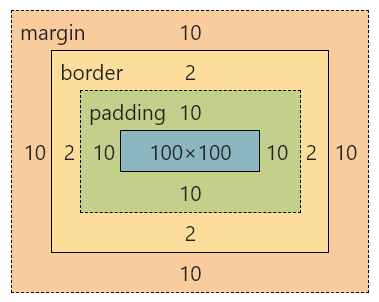


1. Margin(外边距) - 清除边框外的区域，外边距是透明的（两个值：第一个值上下，第二个值左右）
2. Border(边框) - 围绕在内边距和内容外的边框
3. Padding(内边距) - 清除内容周围的区域（两个值：第一个值上下，第二个值左右）
4. Content(内容) - 盒子的内容，显示文本和图像


如果把盒子模型看作是一个生活中的快递，那么内容部分等同于你买的实物，内边距等同于快递盒子中的泡沫，边框等同于快递盒子，外边距等同于两个快递盒子之间的距离


```html
<div></div>
```

```css
div{
    width: 100px;
    height: 100px;
    padding: 10px;
    border: 2px solid red;
    margin: 10px;
    background: green;
}
```


**实时效果反馈**

**1.下列盒子模型元素描述正确的是：**

<font style="background-color:rgb(233, 30, 100)">A</font>   外边距（margin）,边框（border）,内边距（padding）,和实际内容（content）

<font style="background-color:rgb(255, 197, 10)">B</font>   外边距（margin）,边框（border）,大小（font-size）,和实际内容（content）

<font style="background-color:#8bc34a">C</font>   外边距（margin）,背景（background）,内边距（padding）,和实际内容（content）

<font style="background-color:rgb(2, 170, 244);">D</font>   颜色（color）,边框（border）,内边距（padding）,和实际内容（content）


**答案**

1=>A


## 弹性盒模型（flex box）


### **定义**

弹性盒子是 CSS3 的一种新的布局模式

CSS3 弹性盒是一种当页面需要适应不同的屏幕大小以及设备类型时确保元素拥有恰当的行为的布局方式

引入弹性盒布局模型的目的是提供一种更加有效的方式来对一个容器中的子元素进行排列、对齐和分配空白空间


### CSS3弹性盒内容

弹性盒子由弹性容器(Flex container)和弹性子元素(Flex item)组成

弹性容器通过设置 `display `属性的值为 `flex `将其定义为弹性容器

弹性容器内包含了一个或多个弹性子元素

> **温馨提示**
>
> 弹性容器外及弹性子元素内是正常渲染的。弹性盒子只定义了弹性子元素如何在弹性容器内布局

```html
<div class="flex-container">
    <div class="flex-item">flex item 1</div>
    <div class="flex-item">flex item 2</div>
    <div class="flex-item">flex item 3</div> 
</div>
<style>
    .flex-container {
        display: flex;
        width: 400px;
        height: 250px;
        background-color: lightgrey;
    }
    .flex-item {
        background-color: cornflowerblue;
        width: 100px;
        height: 100px;
        margin: 10px;
    }
</style>
```


> **温馨提示**
>
> 默认弹性盒里内容横向摆放


### 父元素上的属性


#### **display 属性**

`display:flex;`开启弹性盒

`display:flex;`属性设置后子元素默认水平排列


#### **flex-direction属性**

**定义**

flex-direction 属性指定了弹性子元素在父容器中的位置

**语法**

```css
flex-direction: row | row-reverse | column | column-reverse
```

1. row：横向从左到右排列（左对齐），默认的排列方式

2. row-reverse：反转横向排列（右对齐，从后往前排，最后一项排在最前面

3. column：纵向排列

4. column-reverse：反转纵向排列，从后往前排，最后一项排在最上面

   

```css
.flex-container {
    display: flex;
    flex-direction: column;
    width: 400px;
    height: 250px;
    background-color: lightgrey;
}
```


#### justify-content 属性

**定义**

内容对齐（justify-content）属性应用在弹性容器上，把弹性项沿着弹性容器的主轴线（main axis）对齐

**语法**

```css
justify-content: flex-start | flex-end | center 
```

1. `flex-start` 弹性项目向行头紧挨着填充。这个是默认值。第一个弹性项的main-start外边距边线被放置在该行的main-start边线，而后续弹性项依次平齐摆放
2. `flex-end` 弹性项目向行尾紧挨着填充。第一个弹性项的main-end外边距边线被放置在该行的main-end边线，而后续弹性项依次平齐摆放
3. `center` 弹性项目居中紧挨着填充。（如果剩余的自由空间是负的，则弹性项目将在两个方向上同时溢出）

```css
.flex-container {
    display: flex;
    justify-content: center;
    width: 400px;
    height: 250px;
    background-color: lightgrey;
}
```


#### align-items 属性

**定义**

`align-items` 设置或检索弹性盒子元素在侧轴（纵轴）方向上的对齐方式

**语法**

```css
align-items: flex-start | flex-end | center 
```

1. `flex-start` 弹性盒子元素的侧轴（纵轴）起始位置的边界紧靠住该行的侧轴起始边界
2. `flex-end` 弹性盒子元素的侧轴（纵轴）起始位置的边界紧靠住该行的侧轴结束边界
3. `center` 弹性盒子元素在该行的侧轴（纵轴）上居中放置。（如果该行的尺寸小于弹性盒子元素的尺寸，则会向两个方向溢出相同的长度）


### **子元素上的属性**


#### flex

`flex` 根据弹性盒子元素所设置的扩展因子作为比率来分配剩余空间

默认为0，即如果存在剩余空间，也不放大

如果只有一个子元素设置，那么按扩展因子转化的百分比对其分配剩余空间。0.1即10%，1即100%，超出按100%

```css
<div class="flex-container">
    <div class="flex-item1">flex item 1</div>
    <div class="flex-item2">flex item 2</div>
    <div class="flex-item3">flex item 3</div> 
</div>
<style>
	.flex-container {
        display: flex;
        width: 400px;
        height: 250px;
        background-color: gold;
    }
    .flex-item1 {
        height: 150px;
        background-color: red;
        flex: 1;
    }
    .flex-item2 {
        height: 150px;
        background-color: green;
        flex: 2;
    }
    .flex-item3 {
        height: 150px;
        background-color: blue;
        flex: 1;
    }
</style>
```


**实时效果反馈**

**1.在弹性盒子模型中，一个元素块上下左右居中如何实现：**

<font style="background-color:rgb(233, 30, 100)">A</font>   `{justify-content:center;align-items:center;}`

<font style="background-color:rgb(255, 197, 10)">B</font>   `{flex-direction:center;align-items:center;}`

<font style="background-color:#8bc34a">C</font>   `{justify-content:center;display:center;}`

<font style="background-color:rgb(2, 170, 244);">D</font>   `{justify-content:center;flex:center;}`


**答案**

1=>A


## 文档流


文档流是文档中可显示对象在排列时所占用的位置/空间

例如：块元素自上而下摆放，内联元素，从左到右摆放 

标准流里面的限制非常多，导致很多页面效果无法实现

1. 高矮不齐，底边对齐
2. 空白折叠现象
   1. 无论多少个空格、换行、tab，都会折叠为一个空格
   2. 如果我们想让img标签之间没有空隙，必须紧密连接


### 文档流产生的问题


#### 高矮不齐，底边对齐


```html
<span>我是文本内容</span>

```

```css
img{
    width: 200px;
}
```


#### 空格折叠


```html
<span>我是文本       内容</span>

```

```css
img{
    width: 200px;
}
```


#### 元素无空隙


```html
<span>我是文本内容</span>

```

```css
img{
    width: 200px;
}
```

如果我们现在就要并排顶部对齐，那该怎么办呢？办法是：移民！脱离标准流！


### 脱离文档流

使⼀个元素脱离标准文档流有三种方式

1. 浮动
2. 绝对定位
3. 固定定位 


**实时效果反馈**

**1.下列哪种方式不能脱离文档流：**

<font style="background-color:rgb(233, 30, 100)">A</font>   浮动

<font style="background-color:rgb(255, 197, 10)">B</font>   绝对定位

<font style="background-color:#8bc34a">C</font>   固定定位

<font style="background-color:rgb(2, 170, 244);">D</font>   相对布局


**答案**

1=>D


## 浮动


### 浮动的定义

`float `属性定义元素在哪个方向浮动，任何元素都可以浮动。

| 值    | 描述         |
| ----- | ------------ |
| left  | 元素向左浮动 |
| right | 元素向右浮动 |


### 浮动的原理

1. 浮动以后使元素脱离了文档流
2. 浮动只有左右浮动，没有上下浮动


### 元素向左浮动

脱离文档流之后，元素相当于在页面上面增加一个浮层来放置内容。此时可以理解为有两层页面，一层是底层的原页面，一层是脱离文档流的上层页面，所以会出现折叠现象


```html
<div class="box"></div>
<div class="container"></div>
```

```css
.container{
    width: 200px;
    height: 200px;
    background-color: #81c784;
}

.box{
    width: 100px;
    height: 100px;
    background-color: #fff176;
    float: left;
}
```


### 元素向右浮动


```html
<div class="box"></div>
<div class="container"></div>
```

```css
.container{
    width: 200px;
    height: 200px;
    background-color: #81c784;
}
.box{
    width: 100px;
    height: 100px;
    background-color: #fff176;
    float: right;
}
```


### 所有元素向左浮动

当所有元素同时浮动的时候，会变成水平摆放，向左或者向右


```html
<div class="box"></div>
<div class="box"></div>
<div class="box"></div>
```

```css
.box{
    width: 100px;
    height: 100px;
    background-color: #fff176;
    float: left;
    margin: 0 5px;
}
```


### 当容器不足时

当容器不足以横向摆放内容时候，会在下一行摆放


```html
<div class="container">
    <div class="box"></div>
    <div class="box"></div>
    <div class="box"></div>
</div>
```

```css
.container{
    width: 250px;
    height: 300px;
    border: 1px solid red;
}
.box{
    width: 100px;
    height: 100px;
    background-color: #fff176;
    float: left;
    margin: 5px;
}
```


**实时效果反馈**

**1.下列关于浮动描述错误的是：**

<font style="background-color:rgb(233, 30, 100)">A</font>   浮动以后使元素脱离了文档流

<font style="background-color:rgb(255, 197, 10)">B</font>   浮动只有左右浮动，没有上下浮动

<font style="background-color:#8bc34a">C</font>   `float `属性定义元素在哪个方向浮动，任何元素都可以浮动

<font style="background-color:rgb(2, 170, 244);">D</font>   当容器不足以横向摆放内容时候，会隐藏元素


**答案**

1=>D


## 清除浮动


### 浮动副作用

当元素设置float浮动后，该元素就会脱离文档流并向左/向右浮动，

1. 浮动元素会造成父元素高度塌陷
2. 后续元素会受到影响

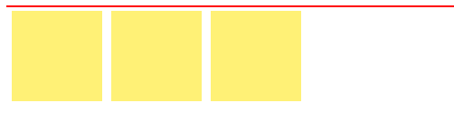

```css
<div class="container">
    <div class="box"></div>
    <div class="box"></div>
    <div class="box"></div>
</div>
```

```css
.container{
    border: 1px solid red;
}
.box{
    width: 100px;
    height: 100px;
    background-color: #fff176;
    float: left;
    margin: 5px;
}
```


```html
<div class="box"></div>
<div class="box"></div>
<div class="box"></div>
<div class="nav"></div>
```

```css
.box{
    width: 100px;
    height: 100px;
    background-color: #fff176;
    float: left;
    margin: 5px;
}
.nav{
    width: 100px;
    height: 100px;
    background-color: red;
}
```


### 清除浮动

当父元素出现塌陷的时候，对布局是不利的，所以我们必须清除副作用

解决方案有很多种

1. 父元素设置高度
2. 受影响的元素增加clear属性
3. overflow清除浮动
4. 伪对象方式


#### 父元素设置高度

如果父元素高度塌陷，可以给父元素设置高度，撑开元素本身大小

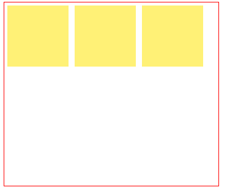

```html
<div class="container">
    <div class="box"></div>
    <div class="box"></div>
    <div class="box"></div>
</div>
```

```css
.container{
    height: 300px;
    width: 350px;
    border: 1px solid red;
}
.box{
    width: 100px;
    height: 100px;
    background-color: #fff176;
    float: left;
    margin: 5px;
}
```


#### overflow清除浮动

如果有父级塌陷，并且同级元素也收到了影响，可以使用`overflow`清除浮动

这种情况下，父布局不能设置高度

父级标签的样式里面加: `overflow:hidden;clear: both;`

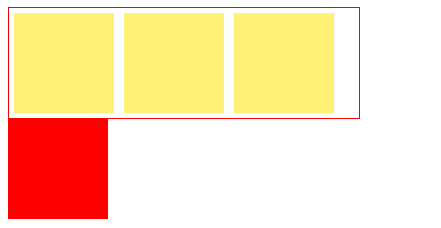

```html
<div class="container">
    <div class="box"></div>
    <div class="box"></div>
    <div class="box"></div>
</div>
<div class="nav"></div>
```

```css
.container{
    width: 350px;
    border: 1px solid red;
    overflow: hidden;
    clear: both;
}
.box{
    width: 100px;
    height: 100px;
    background-color: #fff176;
    float: left;
    margin: 5px;
}
.nav{
    width: 100px;
    height: 100px;
    background-color: red;
}
```


#### 伪对象方式

如果有父级塌陷，并且同级元素也收到了影响，还可以使用伪对象方式处理

为父标签添加伪类`after`,设置空的内容，并且使用`clear:both`;

这种情况下，父布局不能设置高度


```html
<div class="container">
    <div class="box"></div>
    <div class="box"></div>
    <div class="box"></div>
</div>
<div class="nav"></div>
```

```css
.container {
    width: 350px;
    border: 1px solid red;
}
.container::after {
    content: "";
    display: block;
    clear: both;
}
.box {
    width: 100px;
    height: 100px;
    background-color: #fff176;
    float: left;
    margin: 5px;
}
.nav {
    width: 100px;
    height: 100px;
    background-color: red;
}
```


**实时效果反馈**

**1.下列关于清除浮动的方法，描述错误的是：**

<font style="background-color:rgb(233, 30, 100)">A</font>   如果父元素塌陷，可以设置父元素高度消除浮动的副作用

<font style="background-color:rgb(255, 197, 10)">B</font>   如果后续元素受到浮动影响，可以使用`clear: both;`清除

<font style="background-color:#8bc34a">C</font>   如果父元素塌陷，可以使用伪对象方式清除

<font style="background-color:rgb(2, 170, 244);">D</font>   如果父元素塌陷同时影响后续元素，可以使用`float`清除


**答案**

1=>D


## 定位


### 定义

`position `属性指定了元素的定位类型

| 值       | 描述     |
| -------- | -------- |
| relative | 相对定位 |
| absolute | 绝对定位 |
| fixed    | 固定定位 |

其中，绝对定位和固定定位会脱离文档流

设置定位之后：可以使用四个方向值进行调整位置：`left、top、right、bottom` 


### 相对定位

```html
<div class="box"></div>
```

```css
.box{
    width: 200px;
    height: 200px;
    background-color: red;
    position: relative;
    left: 100px;
}
```


### 绝对定位

```html
<div class="box1"></div>
<div class="box2"></div>
```

```css
.box1{
    width: 200px;
    height: 200px;
    background-color: red;
    position:absolute;
    left: 50px;
}
.box2{
    width: 300px;
    height: 300px;
    background-color: green;
}
```


### 固定定位

```html
<div class="box1"></div>
<div class="box2"></div>
```

```css
.box1{
    width: 200px;
    height: 200px;
    background-color: red;
    position:fixed;
    left: 50px;
}
.box2{
    width: 300px;
    height: 300px;
    background-color: green;
}
```


> **温馨提示**
>
> 设置定位之后，相对定位和绝对定位他是相对于具有定位的父级元素进行位置调整，如果父级元素不存在定位，则继续向上逐级寻找，直到顶层文档


```html
<div class="container">
    <div class="box"></div>
</div>
```

```css
.container{
    width: 300px;
    height: 300px;
    background-color: #666;
    position: relative;
    left: 200px;
}
.box{
    width: 200px;
    height: 200px;
    background-color: red;
    position:absolute;
}
```


### Z-index

`z-index`属性设置元素的堆叠顺序。拥有更高堆叠顺序的元素总是会处于堆叠顺序较低的元素的前面

```html
<div class="box1"></div>
<div class="box2"></div>
```

```css
.box1{
    width: 200px;
    height: 200px;
    background-color: red;
    position:absolute;
    z-index: 2;
}
.box2{
    width: 300px;
    height: 300px;
    background-color: green;
    position:absolute;
    z-index: 1;
}
```


**实时效果反馈**

**1.下列哪种属性设置不会脱离文档流：**

<font style="background-color:rgb(233, 30, 100)">A</font>   相对定位

<font style="background-color:rgb(255, 197, 10)">B</font>   绝对定位

<font style="background-color:#8bc34a">C</font>   固定定位

<font style="background-color:rgb(2, 170, 244);">D</font>   浮动


**答案**

1=>A


## CSS3新特性


### 圆角


使用 CSS3 `border-radius` 属性，你可以给任何元素制作 "圆角"

`border-radius` 属性，可以使用以下规则：

1. 四个值: 第一个值为左上角，第二个值为右上角，第三个值为右下角，第四个值为左下角
2. 三个值: 第一个值为左上角, 第二个值为右上角和左下角，第三个值为右下角
3. 两个值: 第一个值为左上角与右下角，第二个值为右上角与左下角
4. 一个值： 四个圆角值相同


```html
<div class="box1"></div>
<div class="box2"></div>
<div class="box3"></div>
```

```css
div{
    margin: 10px;
}
.box1 {
    border-radius: 15px 50px 30px 5px;
    background: #8AC007;
    padding: 20px;
    width: 200px;
    height: 150px;
}
.box2 {
    border-radius: 15px 50px 30px;
    background: #8AC007;
    padding: 20px;
    width: 200px;
    height: 150px;
}
.box3 {
    border-radius: 15px 50px;
    background: #8AC007;
    padding: 20px;
    width: 200px;
    height: 150px;
}
```


### 阴影


box-shadow 向框添加一个或多个阴影。

```css
box-shadow: h-shadow v-shadow blur color;
```

| 值       | 描述                 |
| -------- | -------------------- |
| h-shadow | 必选，水平阴影的位置 |
| v-shadow | 必选，垂直阴影的位置 |
| blur     | 可选，模糊距离       |
| color    | 可选，阴影的颜色     |


```html
<div class="box"></div>
```

```css
.box {
    width: 200px;
    height: 200px;
    background-color: #8ac007;
    margin: 50px;
    box-shadow: 10px 10px green;
}
```


给阴影添加一个模糊效果


```css
.box {
    width: 200px;
    height: 200px;
    background-color: #8ac007;
    margin: 50px;
    box-shadow: 10px 10px 5px green;
}
```


三个方向的阴影效果


```css
.box {
    width: 200px;
    height: 200px;
    background-color: #8ac007;
    margin: 50px;
    box-shadow: 0 10px 30px rgba(0,0,0,.5);
}
```


**实时效果反馈**

**1.将一个正方形盒子改成圆形，下列哪个设置可以实现：**

<font style="background-color:rgb(233, 30, 100)">A</font>   `{border:50%;}`

<font style="background-color:rgb(255, 197, 10)">B</font>   `{border-radius:50%;}`

<font style="background-color:#8bc34a">C</font>   `{border-radius:50px;}`

<font style="background-color:rgb(2, 170, 244);">D</font>   `{border:50px;}`


**2.完成一个水平垂直阴影位置为0，模糊度为10px，颜色为黑色半透明：**

<font style="background-color:rgb(233, 30, 100)">A</font>   `box-shadow: 0px 0px 10px rgba(0,0,0,0.5);`

<font style="background-color:rgb(255, 197, 10)">B</font>   `box-shadow: 0px 0px  rgba(0,0,0,0.5);`

<font style="background-color:#8bc34a">C</font>   `box-shadow:  0px 10px 10px #000;`

<font style="background-color:rgb(2, 170, 244);">D</font>   `box-shadow: 10px 10px 0px rgba(0,0,0,0.5);`


**答案**

1=>B   2=>A


## 动画


动画是使元素从一种样式逐渐变化为另一种样式的效果

您可以改变任意多的样式任意多的次数

请用百分比来规定变化发生的时间，或用关键词 "from" 和 "to"，等同于 0% 和 100%

0% 是动画的开始，100% 是动画的完成。


### @keyframes创建动画

使用`@keyframes`规则，你可以创建动画

```css
@keyframes name {
    from|0%{
    	css样式
    }
    percent{
    	css样式
    }
    to|100%{
    	css样式
    }
}
```

name：动画名称，开发人员自己命名；

percent：为百分比值，可以添加多个百分比值；


### animation执行动画

```css
animation: name duration timing-function delay iteration-count direction;
```

| 值                   | 描述                                                      |
| -------------------- | --------------------------------------------------------- |
| name                 | 设置动画的名称                                            |
| duration             | 设置动画的持续时间                                        |
| timing-function      | 设置动画效果的速率（如下）                                |
| delay                | 设置动画的开始时间（延时执行）                            |
| iteration-count      | 设置动画循环的次数，infinite为无限次数的循环              |
| direction            | 设置动画播放的方向（如下）                                |
| animation-play-state | 控制动画的播放状态：running代表播放，而paused代表停止播放 |

| timing-function值 | 描述             |
| ----------------- | ---------------- |
| ease              | 逐渐变慢（默认） |
| linear            | 匀速             |
| ease-in           | 加速             |
| ease-out          | 减速             |
| ease-in-out       | 先加速后减速     |

| direction值 | 描述                                             |
| ----------- | ------------------------------------------------ |
| normal      | 默认值为normal表示向前播放                       |
| alternate   | 动画播放在第偶数次向前播放，第奇数次向反方向播放 |


**切换背景颜色**

```html
<div class="animation"></div>
```

```css
.animation {
    width: 300px;
    height: 300px;
    background-color: red;
    animation: anima 5s linear 5s infinite;
}
.animation:hover {
    animation-play-state: paused;
}
@keyframes anima {
    0% {
        background-color: red;
    }
    50% {
        background-color: green;
    }
    100% {
        background-color: blueviolet;
    }
}
```


**呼吸效果**

```html
<div class="box"></div>
```

```css
.box {
    width: 500px;
    height: 400px;
    margin: 40px auto;
    background-color: #2b92d4;
    border-radius: 5px;
    box-shadow: 0 1px 2px rgba(0, 0, 0, .3);
    animation: breathe 2700ms ease-in-out infinite alternate;
}
@keyframes breathe {
    0% {
        opacity: .2;
        box-shadow: 0 1px 2px rgba(255, 255, 255, 0.1)
    }
    50% {
        opacity: .5;
        box-shadow: 0 1px 2px rgba(18, 190, 84, 0.76)
    }
    100% {
        opacity: 1;
        box-shadow: 0 1px 30px rgba(59, 255, 255, 1)
    }
}
```


**实时效果反馈**

**1.动画属性中，`iteration-count: infinite `属性的作用是：**

<font style="background-color:rgb(233, 30, 100)">A</font>   设置动画效果时间

<font style="background-color:rgb(255, 197, 10)">B</font>   设置动画效果速率

<font style="background-color:#8bc34a">C</font>   设置动画的开始时间

<font style="background-color:rgb(2, 170, 244);">D</font>   设置动画无限循环


**答案**

1=>D


## 媒体查询


媒体查询能使页面在不同在终端设备下达到不同的效果

媒体查询会根据设备的大小自动识别加载不同的样式


### 设置meta标签

使用设备的宽度作为视图宽度并禁止初始的缩放。在`<head>`标签里加入这个meta标签。 

```css
<meta name="viewport" content="width=device-width, initial-scale=1,maximum-scale=1, user-scalable=no">
```


**参数解释**

1. `width = device-width` 宽度等于当前设备的宽度
2. `initial-scale` 初始的缩放比例（默认设置为1.0）
3. `maximum-scale` 允许用户缩放到的最大比例（默认设置为1.0）
4. `user-scalable` 用户是否可以手动缩放（默认设置为no）


### 媒体查询语法

```css
@media screen and (max-width: 768px) {
	/* 设备小于768px加载样式 */
    body{
        background-color: red;
    }
}
@media screen and (max-width: 992px) and (min-width: 768px) {
     /* 设备小于768px但小于992px加载样式  */
     body{
     	background-color: pink;
     }
}
@media screen and (min-width: 992px) {
	/* 设备大于992px加载样式 */
    body{
    	background-color: green;
   	}
}
```


**实时效果反馈**

**1.下列代码媒体查询，运行在屏幕宽度为800px的设备上，背景颜色是：**

```css
@media screen and (max-width: 768px) {
    body{
        background-color: red;
    }
}
@media screen and (max-width: 992px) and (min-width: 768px) {
     body{
     	background-color: pink;
     }
}
@media screen and (min-width: 992px) {
    body{
    	background-color: green;
   	}
}
```

<font style="background-color:rgb(233, 30, 100)">A</font>   red(红色)

<font style="background-color:rgb(255, 197, 10)">B</font>   pink(粉色)

<font style="background-color:#8bc34a">C</font>   green(绿色)

<font style="background-color:rgb(2, 170, 244);">D</font>   black(黑色)


**答案**

1=>B


## 雪碧图


CSS Sprite也叫CSS精灵图、CSS雪碧图，是一种网页图片应用处理方式。它允许你将一个页面涉及到的所有零星图片都包含到一张大图中去


### 优点

1. 减少图片的字节
2. 减少网页的http请求，从而大大的提高页面的性能


### 原理

1. 通过background-image引入背景图片
2. 通过background-position把背景图片移动到自己需要的位置


### 实例

```html
<i class="icon1"></i>
<i class="icon2"></i>
```

```css
.icon1 {
    display: block;
    background-image: url(1.png);
    background-position: -20px 0;
    width: 45px;
    height: 70px;
}
.icon2 {
    display: block;
    background-image: url(1.png);
    background-position: -93px -84px;
    width: 45px;
    height: 70px;
}
```


## 字体图标


我们会经常用到一些图标。但是我们在使用这些图标时，往往会遇到失真的情况，而且图片数量很多的话，页面加载就越慢。所以，我们可以使用字体图标的方式来显示图标，既解决了失真的问题，也解决了图片占用资源的问题

常用字体图标库：[阿里字体图标库](https://iconfont.cn/)


### 优点

1. 轻量性：加载速度快，减少http请求
2. 灵活性：可以利用CSS设置大小颜色等
3. 兼容性：网页字体支持所有现代浏览器，包括IE低版本


### 使用字体图标

1. 注册账号并登录
2. 选取图标或搜索图标
3. 添加购物车
4. 下载代码
5. 选择`font-class`引用


```html
<span class="iconfont icon-add-circle"></span>
```

```css
<link rel="stylesheet" href="./css/iconfont.css">
.iconfont{
    font-size: 35px;
    color: red;
}
```


## 滑动门


大家在网页中经常会见到这样一种导航效果,因为使用频率广泛,所以广大的程序员给它起了一个名字,叫做滑动门.在学习滑动门之前,首先你要了解什么是滑动门


### 具体实现

```html
<div class="slide">
    <ul>
        <li>
            <a href="#">手机</a>
            <div class="slide-list">小米1</div>
        </li>
        <li>
            <a href="#">电视</a>
            <div class="slide-list">小米2</div>
        </li>
    </ul>
</div>
```

```css
*{
    margin: 0;
    padding: 0;
}
.slide {
    width: 234px;
    height: 420px;
    background-color: rgba(105, 101, 101, .6);
    padding: 20px 0;
    position: relative;
    margin: 100px;
}
.slide ul{
    list-style: none;
}
.slide ul li{
    width: 100%;
    height: 42px;
    line-height: 42px;
    text-align: left;
    padding-left: 30px;
    box-sizing: border-box;
}
.slide ul li:hover{
    background:#ff6700;
}
.slide ul li a{
    display: inline-block;
    text-decoration: none;
    color: #fff;
}
.slide-list {
    width: 992px;
    height: 460px;
    background-color: #fff;
    border: 1px solid #e0e0e0;
    border-left: none;
    box-shadow: 0 8px 16px rgba(0, 0, 0, .18);
    box-sizing: border-box;
    position: absolute;
    top: 0;
    left: 234px;
    display: none;
}
.slide li:hover>.slide-list {
    display: block;
}
```


## 跳动的心_绘制心形


### 绘制心形思路

我们先将心分割为下列三个部分，一个正方形和两个半圆形

为了减少DOM元素，我们可以通过`:before`与`:after`两个伪元素


接下来就简单了，我们需要将“心”进行旋转45度，将“心”放正

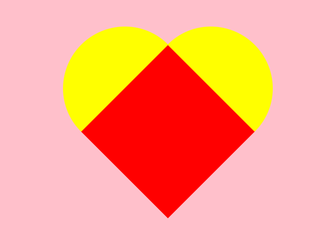


> **温馨提示**
>
> 让半圆与正方形进行重合，避免元素中间出现细线~


### HTML结构

```html
<div class="heart"></div>
```

​	

### CSS样式

```css
* {
    margin: 0;
    padding: 0;
}
html,
body {
    height: 100%;
    width: 100%;
}
body {
    display: flex;
    flex-direction: row;
    align-items: center;
    justify-content: center;
    background-color: pink;
}
.heart {
    width: 200px;
    height: 200px;
    background: red;
    position: relative;
    transform: rotate(45deg);
}
.heart::before {
    content: '';
    width: 200px;
    height: 100px;
    background: red;
    position: absolute;
    left: 0;
    top: -99px;
    border-radius: 100px 100px 0 0;
}
.heart::after {
    content: '';
    width: 100px;
    height: 200px;
    background: red;
    position: absolute;
    left: -99px;
    top: 0;
    border-radius: 100px 0 0 100px;
}
```


## 跳动的心_跳动起来


让心跳动起来，可以使用CSS3动画实现，利用缩放实现跳动

我们可以在添加一些阴影效果，让“心”看起来更美观


```css
*{
    margin: 0;
    padding: 0;
}
html,body{
    height: 100%;
    width: 100%;
}
body {
    display: flex;
    flex-direction: row;
    align-items: center;
    justify-content: center;
    background-color: pink;
}
.heart {
    width: 200px;
    height: 200px;
    background: red;
    position: relative;
    transform: rotate(45deg);
    animation: heartbit 1s alternate infinite;
    box-shadow: 0 0 30px red;
}
.heart::before {
    content: '';
    width: 200px;
    height: 100px;
    background: red;
    position: absolute;
    left: 0;
    top: -99px;
    border-radius: 100px 100px 0 0;
    box-shadow: 0 0 30px red;
}
.heart::after {
    content: '';
    width: 100px;
    height: 200px;
    background: red;
    position: absolute;
    left: -99px;
    top: 0;
    border-radius: 100px 0 0 100px;
    box-shadow: 0 0 30px red;
}
@keyframes heartbit {
    0% {
        transform: rotate(45deg) scale(0.6);
    }
    100% {
        transform: rotate(45deg) scale(1.4);
    }
}
```


## 火柴人_绘制人物


绘制火柴人

```html
<div class="container">
    <div class="person">
        <div class="head"></div>
        <div class='part arm one'></div>
        <div class='part arm two'></div>
        <div class='torso'></div>
        <div class='part leg one'></div>
        <div class='part leg two'></div>
    </div>
</div>
```


```css
body {
    background-color: black;
}
.container {
    height: 300px;
    width: 300px;
    margin: 50px;
}
.person {
    position: absolute;
    left: 150px;
    top: 159px;
}
.head {
    position: absolute;
    top: -30px;
    left: -6px;
    height: 30px;
    width: 30px;
    border-radius: 50%;
    border: 10px solid white;
}
.person .torso {
    position: absolute;
    height: 60px;
    width: 0;
    border-left: 10px solid white;
    left: 0px;
    top: 15px;
}
.person .part {
    position: absolute;
    left: 0;
    top: 75px;
}
.person .part.arm {
    position: absolute;
    border-left: 10px solid white;
    border-bottom: 10px solid white;
    height: 45px;
    width: 39px;
    top: 15px;
    right: 300px;
    transform-origin: 0% 0% 0px;
}
.person .part.arm.one {
    transform: rotate3d(0, 0, 1, 80deg);
}
.person .part.arm.two {
    transform: rotate3d(0, 0, 1, -80deg);
}
.person .part.leg {
    height: 57px;
    width: 60px;
    border-right: 10px solid white;
    border-top: 10px solid white;
    transform-origin: 0% 0% 0px;
}
.person .part.leg.one {
    transform: rotate3d(0, 0, 1, 100deg);
}
.person .part.leg.two {
    transform: rotate3d(0, 0, 1, 10deg);
}
```


## 火柴人_跑起来


```css
body {
    background-color: black;
}
.container {
    height: 300px;
    width: 300px;
    margin: 50px;
}
.person {
    position: absolute;
    height: 75px;
    width: 0;
    color: #fff;
    left: 150px;
    top: 159px;
    animation: sprint 2s infinite ease-in;
}
.head {
    position: absolute;
    top: -30px;
    left: -6px;
    height: 30px;
    width: 30px;
    border-radius: 50%;
    border: 10px solid white;
    animation: bob 2s infinite alternate;
}
.person .torso {
    position: absolute;
    height: 60px;
    width: 0;
    border-left: 10px solid white;
    left: 0px;
    top: 15px;
}
.person .part {
    position: absolute;
    left: 0;
    top: 75px;
}
.person .part.arm {
    position: absolute;
    border-left: 10px solid white;
    border-bottom: 10px solid white;
    height: 45px;
    width: 39px;
    top: 15px;
    right: 300px;
    transform-origin: 0% 0% 0px;
    animation: pump 1s infinite ease-in-out;
}
.person .part.arm.one {
    transform: rotate3d(0, 0, 1, 80deg);
}
.person .part.arm.two {
    transform: rotate3d(0, 0, 1, -80deg);
    animation-delay: .5s;
}
.person .part.leg {
    height: 57px;
    width: 60px;
    border-right: 10px solid white;
    border-top: 10px solid white;
    transform-origin: 0% 0% 0px;
    animation: run 1s infinite ease-in;
}
.person .part.leg.one {
    transform: rotate3d(0, 0, 1, 100deg);
}
.person .part.leg.two {
    transform: rotate3d(0, 0, 1, 10deg);
    animation-delay: .5s;
}
@keyframes bob {
    0% {
        transform: rotate3d(0, 0, 1, 5deg);
    }
    25% {
        transform: rotate3d(0, 0, 1, -30deg) skew(15deg, 0deg);
    }
    50% {
        transform: rotate3d(0, 0, 1, 5deg);
    }
    75% {
        transform: rotate3d(0, 0, 1, -30deg) skew(15deg, 0deg);
    }
    100% {
        transform: rotate3d(0, 0, 1, 20deg) skew(-15deg, 0deg);
    }
}
@keyframes pump {
    0% {
        transform: rotate3d(0, 0, 1, 80deg);
    }
    50% {
        transform: rotate3d(0, 0, 1, -70deg);
    }
    100% {
        transform: rotate3d(0, 0, 1, 80deg);
    }
}
@keyframes run {
    0% {
        transform: rotate3d(0, 0, 1, -5deg);
    }
    50% {
        transform: rotate3d(0, 0, 1, 150deg);
    }
    100% {
        transform: rotate3d(0, 0, 1, -5deg);
    }
}
@keyframes sprint {
    0% {
        transform: translate(-200px, 0px);
    }

    100% {
        transform: translate(1800px, 0px);
    }
}
```


## Git简介与安装


> 本节课讲解目的：可以让别人访问我们的网页（部署到公网）如：https://www.itbaizhan.com/
>
> 1. 付费解决方案：阿里云、腾讯云...
> 2. 免费解决方案：github平台、gitee(码云) https://gitee.com/
>
> 实现网页的托管的前置条件：能将网页代码上传到平台中


### Git简介

Git是什么？

Git是目前世界上最先进的分布式版本控制系统（没有之一）

那什么是版本控制系统？

如果你用Microsoft Word写过论文，那你一定有这样的经历：

想删除一个段落，又怕将来想恢复找不回来怎么办？有办法，先把当前文件“另存为……”一个新的Word文件，再接着改，改到一定程度，再“另存为……”一个新文件，这样一直改下去，最后你的Word文档变成了这样：


过了一周，你想找回被删除的文字，但是已经记不清删除前保存在哪个文件里了，只好一个一个文件去找，真麻烦

看着一堆乱七八糟的文件，想保留最新的一个，然后把其他的删掉，又怕哪天会用上，还不敢删，真郁闷。

更要命的是，有时候你的老师帮你修改或者你的同学帮你修改了，你还不知道哪里被修改了，彻底蒙圈了

于是你想，如果有一个软件，不但能自动帮我记录每次文件的改动，还可以让老师、同学协作编辑，这样就不用自己管理一堆类似的文件了，也不需要把文件传来传去。如果想查看某次改动，只需要在软件里瞄一眼就可以，岂不是很方便？

这个软件用起来就应该像这个样子，能记录每次文件的改动

| 版本 | **文件名** | **用户** | 说明             | **日期**      |
| ---- | ---------- | -------- | ---------------- | ------------- |
| 1    | 毕业论文   | 张三     | 最初版本         | 2030年3月1日  |
| 2    | 毕业论文   | 张三     | 修改了论文查重率 | 2030年3月15日 |
| 3    | 毕业论文   | 李四     | 帮助修改文档格式 | 2030年3月16日 |
| 4    | 毕业论文   | 张三     | 修改老师给的意见 | 2030年3月20日 |

解决上述问题的软件就是`Git`版本控制器


### Git安装

在你开始使用 Git 前，需要将它安装在你的计算机上

`Git`官网：https://git-scm.com/


#### 在 Windows 上安装

下载二进制安装包，然后直接安装，一直下一步直到安装完成。


#### 在 Mac 上安装

下载二进制安装包，然后直接安装，一直下一步直到安装完成。


查看是否安装成功

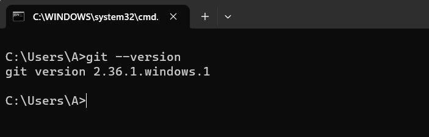


## Git常用操作


Git常用操作：

1. 配置用户信息
2. 初始化本地仓库
3. 工作区、暂存区和版本库
4. 查看历史版本


### 配置用户信息

当安装完 Git 应该做的第一件事就是配置用户名称与邮件地址。因为每一个 Git 的提交都会使用这些信息，并且它会写入到每一次提交中

```bash
$ git config --global user.name xxx
$ git config --global user.email xxxx.com
```

查看信息

```bash
$ git config --list
```


### 初始化本地仓库

在工作区所在目录执行以下命令

```bash
git init
```

> **小提示：**
>
> `git init` 命令会在当前目录中创建一个名为 `.git` 的隐藏目录。


### 工作区、暂存区和版本库

- 工作区（**Workspace**）：放项目代码的地方，项目代码对应的文件。

- 暂存区（**Index/Stage**）：也叫索引，是一个文件，保存了下次将提交的文件列表信息。

- 本地仓库（**Repository**）：就是安全存放数据的位置，这里边有你提交的所有版本的数据。

  


```bash
git add filename
git commit -m '注释'
```


### 查看历史版本

查看提交记录

```bash
git log
git log --oneline
```


## Git远程仓库Gitee


目前我们使用到的 Git 命令都是在本地执行，如果你想通过 Git 分享你的代码或者与其他开发人员合作， 你就需要将数据放到一台其他开发人员能够连接的服务器上，托管在这台服务器上的数据的就是我们的远程仓库。

当然，你也可以利用远程仓库进行静态页面的托管


### 常用的托管服务平台

- `GitHub` (地址: https://github.com/)是一个面向开源及私有软件项目的托管平台，因为只支持Git作 为唯的版本库格式进行托管，故名GitHub。

- ` 码云`（地址: https://gitee.com/）是国内的一个代码托管平台，由于服务器在国内，所以相比于 GitHub，码云速度会更快。

- `GitLab` (地址: https://about.gitlab.com/) 是一个用于仓库管理系统的开源项目，使用Git作为代 码管理工具，并在此基础上搭建起来的web服务


注册码云账号与创建仓库


## Git远程仓库托管网站


想要让Gitee帮我们托管静态页面，需要我们先将本地项目上传到Gitee，然后再利用Gitee提供的GiteePages进行部署


### 上传代码

当我们创建完仓库之后，可以看到这样的界面，再次界面给出了上传的方案


### 页面部署

注意，首先要将仓库修改为开源，因为只有开源项目才可以部署到公网


然后按照操作要求进行部署发布就可以了


# Javascript


## JavaScript简介


### JavaScript介绍

JavaScript 是一种轻量级的脚本语言。所谓“脚本语言”，指的是它不具备开发操作系统的能力，而是只用来编写控制其他大型应用程序的“脚本”。

JavaScript 是一种嵌入式（embedded）语言。它本身提供的核心语法不算很多


### 为什么学习 JavaScript

- 操控浏览器的能力
- 广泛的使用领域
- 易学性


### JavaScript与ECMAScript的关系

ECMAScript和JavaScript的关系是，前者是后者的规格，后者是前者的一种实现。在日常场合，这两个词是可以互换的。


###  JavaScript版本


**实时效果反馈**

**1. ECMAScript和JavaScript关系：**

<font style="background-color:rgb(233, 30, 100)">A</font>   JavaScript是ECMAScript的父级

<font style="background-color:rgb(255, 197, 10)">B</font>   JavaScript是ECMAScript的子级

<font style="background-color:#8bc34a">C</font>   不存在ECMAScript这个名字

<font style="background-color:rgb(2, 170, 244);">D</font>   前者是后者的规格，后者是前者的一种实现


**2.  以下哪个不是JavaScript的优点:**

<font style="background-color:rgb(233, 30, 100)">A</font>   JavaScript操控浏览器的能力

<font style="background-color:rgb(255, 197, 10)">B</font>   JavaScript广泛的使用领域

<font style="background-color:#8bc34a">C</font>   JavaScript易学性

<font style="background-color:rgb(2, 170, 244);">D</font>   JavaScript可以实现操作系统


**答案**

1=>D  		2=>D 


## JavaScript语句、标识符


### 语句

JavaScript 程序的单位是行（line），也就是一行一行地执行。一般情况下，每一行就是一个语句

```js
var num = 10;
```

语句以分号结尾，一个分号就表示一个语句结束


### 标识符

标识符（identifier）指的是用来识别各种值的合法名称。最常见的标识符就是变量名

标识符是由：字母、美元符号($)、下划线(_)和数字组成，其中数字不能开头

>**温馨提示**
>
>中文是合法的标识符，可以用作变量名（不推荐）


### JavaScript保留关键字

以下关键字不需要强行记忆！

> JavaScript有一些保留字，不能用作标识符：arguments、break、case、catch、class、const、continue、debugger、default、delete、do、else、enum、eval、export、extends、false、finally、for、function、if、implements、import、in、instanceof、interface、let、new、null、package、private、protected、public、return、static、super、switch、this、throw、true、try、typeof、var、void、while、with、yield。


**实时效果反馈**

**1. 以下哪个命名是正确的：**

<font style="background-color:rgb(233, 30, 100)">A</font>   `var const = 10;`

<font style="background-color:rgb(255, 197, 10)">B</font>   `var 10Num = 20;`

<font style="background-color:#8bc34a">C</font>   `var @A = 30;`

<font style="background-color:rgb(2, 170, 244);">D</font>   `var age=20;`


**2.  以下哪个是标识符命名规则:**

<font style="background-color:rgb(233, 30, 100)">A</font>   字母、美元符号($)、下划线(_)和数字

<font style="background-color:rgb(255, 197, 10)">B</font>   字母、美元符号($)、下划线(_)和数字，其中数字不能开头

<font style="background-color:#8bc34a">C</font>   字母、美元符号($)、百分号(%)和数字，其中数字不能开头

<font style="background-color:rgb(2, 170, 244);">D</font>   字母、美元符号($)、下划线(_)和特殊符号


**答案**

1=>D  		2=>B 


## 变量


```js
var num = 10; 
```


#### 变量的重新赋值

```js
var num = 10;
num = 20;
```


### 变量提升

JavaScript 引擎的工作方式是，先解析代码，获取所有被声明的变量，然后再一行一行地运行。这造成的结果，就是所有的变量的声明语句，都会被提升到代码的头部，这就叫做变量提升（hoisting）。

```js
console.log(num);
var num = 10; // 结果是什么呢？
```


**实时效果反馈**

**1. 以下代码打印正确的是：**

```js
console.log(num);
var num = 10; 
```

<font style="background-color:rgb(233, 30, 100)">A</font>   10

<font style="background-color:rgb(255, 197, 10)">B</font>   错误

<font style="background-color:#8bc34a">C</font>   undefined

<font style="background-color:rgb(2, 170, 244);">D</font>   num


**答案**

1=>C 


## JavaScript引入到文件


### 嵌入到HTML文件中

```html
<body>
	<script>
		var age = 20
	</script>
</body>
```


### 引入本地独立JS文件

```html
<body>
	<script type="text/javascript" src="./itbaizhan.js">   		</script>
</body>
```


### 引入网络来源文件

```html
<body>
	<script src="https://cdn.bootcdn.net/ajax/libs/jquery/3.6.0/jquery.min.js">	</script>
</body>
```


**实时效果反馈**

**1. 以下哪种不是JS文件引入到HTML文件中的方式：**

<font style="background-color:rgb(233, 30, 100)">A</font>   JS嵌入到HTML文件中

<font style="background-color:rgb(255, 197, 10)">B</font>   引入本地独立JS文件

<font style="background-color:#8bc34a">C</font>   引入网络来源的JS文件

<font style="background-color:rgb(2, 170, 244);">D</font>   JS嵌入到CSS文件中


**2.  以下代码是哪种JS引入到HTML文件中的方式:**

```html
<body>
	<script type="text/javascript" src="./itbaizhan.js">   		</script>
</body>
```

<font style="background-color:rgb(233, 30, 100)">A</font>   JS嵌入到HTML文件中

<font style="background-color:rgb(255, 197, 10)">B</font>   引入本地独立JS文件

<font style="background-color:#8bc34a">C</font>   引入网络来源的JS文件

<font style="background-color:rgb(2, 170, 244);">D</font>   JS嵌入到CSS文件中


**答案**

1=>D  		2=>B 


## JavaScript注释与常见输出方式


### JavaScript注释

源码中注释是不被引擎所解释的，它的作用是对代码进行解释。Javascript 提供两种注释的写法：一种是单行注释，用//起头；另一种是多行注释，放在/*和*/之间。

```js
// 这是单行注释

/*
 这是
 多行
 注释
*/
```

嵌入在HTML文件中的注释

```html
<!-- 注释 -->
```

> **温馨提示**
>
> 注释的快捷键：`ctrl + /`


### JavaScript输出方式

JavaScript有很多种输出方式，都可以让我们更直观的看到程序运行的结果

```js
// 在浏览器中弹出一个对话框,然后把要输出的内容展示出来,alert都是把要输出的内容首先转换为字符串然后在输出的
alert("要输出的内容");

document.write("要输出的内容"); 

// 在控制台输出内容
console.log("要输出的内容");
```


**实时效果反馈**

**1. 下述代码横线处应填写的代码：**

```js
document.___("要输出的内容"); 
```

<font style="background-color:rgb(233, 30, 100)">A</font>   document

<font style="background-color:rgb(255, 197, 10)">B</font>   alert

<font style="background-color:#8bc34a">C</font>   log

<font style="background-color:rgb(2, 170, 244);">D</font>   write


**2.  下述代码横线处应填写的代码:**

```html
console.___("要输出的内容");
```

<font style="background-color:rgb(233, 30, 100)">A</font>   document

<font style="background-color:rgb(255, 197, 10)">B</font>   alert

<font style="background-color:#8bc34a">C</font>   log

<font style="background-color:rgb(2, 170, 244);">D</font>   write


**答案**

1=>D  		2=>C 


## 数据类型


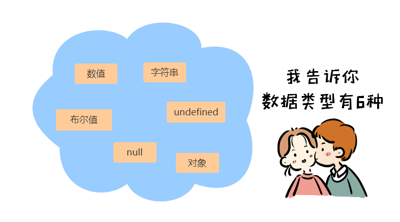


### 数据类型分类

JavaScript 语言的每一个值，都属于某一种数据类型。JavaScript 的数据类型，共有六种。（ES6 又新增了第七种 Symbol 类型的值和第八种 BigInt类型，当前课程暂不涉及）


### 数据类型分类


#### 原始类型(基础类型)


```js
var age = 20;
var name = "尚学堂";
var learn = true;
```


#### 合成类型(复合类型)

对象：因为一个对象往往是多个原始类型的值的合成，可以看作是一个存放各种值的容器


```js
var user = {
    name:"尚学堂",
    age:20,
    learn:true
}
```


> **温馨提示**
>
> 至于undefined和null，一般将它们看成两个特殊值。


**实时效果反馈**

**1. 以下那个是字符串类型数据：**

<font style="background-color:rgb(233, 30, 100)">A</font>   `var age = 20; `

<font style="background-color:rgb(255, 197, 10)">B</font>   `var name = "尚学堂"`

<font style="background-color:#8bc34a">C</font>   `var learn = true`

<font style="background-color:rgb(2, 170, 244);">D</font>   `var user = {}`


**2.  以下关于原始数据类型分类正确的是:**

<font style="background-color:rgb(233, 30, 100)">A</font>   数值、字符串、布尔值、对象

<font style="background-color:rgb(255, 197, 10)">B</font>   数值、字符串、布尔值、null

<font style="background-color:#8bc34a">C</font>   数值、字符串、布尔值、undefined

<font style="background-color:rgb(2, 170, 244);">D</font>   数值、字符串、布尔值


**答案**

1=>B  		2=>D 


## typeof运算符


JavaScript 有三种方法，可以确定一个值到底是什么类型。而我们现在需要接触到的就是typeof


### 数值返回number

```js
typeof 123 // "number"
```


### 字符串返回string

```js
typeof '123' // "string"
```


### 布尔值返回boolean

```js
typeof false // "boolean"
```


### 对象返回object

```js
typeof {} // "object"
```


### unll和undefined的区别

null与undefined都可以表示“没有”，含义非常相似。将一个变量赋值为undefined或null，老实说，语法效果几乎没区别。既然含义与用法都差不多，为什么要同时设置两个这样的值，这不是无端增加复杂度，令初学者困扰吗？这与历史原因有关


**实时效果反馈**

**1. 下列字符串数据类型的关键字是：**

<font style="background-color:rgb(233, 30, 100)">A</font>   number

<font style="background-color:rgb(255, 197, 10)">B</font>   string

<font style="background-color:#8bc34a">C</font>   boolean

<font style="background-color:rgb(2, 170, 244);">D</font>   object


**2.  以下代码执行结果正确的是:**

```js
console.log(typeof 100)
```

<font style="background-color:rgb(233, 30, 100)">A</font>   number

<font style="background-color:rgb(255, 197, 10)">B</font>   string

<font style="background-color:#8bc34a">C</font>   boolean

<font style="background-color:rgb(2, 170, 244);">D</font>   object


**答案**

1=>B  		2=>A 


## 运算符之算术运算符


### 加减乘除运算符

加减乘除运算符就是基本的数学运算符效果

```js
10 + 10; // 20
100 - 10; // 90
10 * 2; //20
10 / 5; 2
```


### 余数运算符

余数运算符是比较常用的，因为在逻辑思维上寻找规律，余数运算符是很好用的

```js
13 % 5 // 3
```


### 自增和自减运算符

自增和自减运算符，是一元运算符，只需要一个运算子。它们的作用是将运算子首先转为数值，然后加上1或者减去1

```js
var x = 1;
var y = 1;
++x // 2
--y // 0
```


自增和自减运算符有一个**需要注意**的地方，就是放在变量之后，会先返回变量操作前的值，再进行自增/自减操作；放在变量之前，会先进行自增/自减操作，再返回变量操作后的值。

```js
var x = 1;
var y = 1;

x++ // 1
++y // 2
```

```js
var x = 10;
var y = 20;
console.log(x++ + y);// 30
```


**实时效果反馈**

**1. 下列代码执行结果正确的是：**

```js
var x = 5;
var y = 5;
console.log(x++  +  --y);
```

<font style="background-color:rgb(233, 30, 100)">A</font>   9

<font style="background-color:rgb(255, 197, 10)">B</font>   10

<font style="background-color:#8bc34a">C</font>   11

<font style="background-color:rgb(2, 170, 244);">D</font>   12


**2. 关于自增自减运算符描述正确的是 :**

<font style="background-color:rgb(233, 30, 100)">A</font>   自增和自减运算符，是二元运算符，只需要二个运算子

<font style="background-color:rgb(255, 197, 10)">B</font>   自增和自减运算符，就是加法和减法运算符

<font style="background-color:#8bc34a">C</font>   自增和自减运算符，是一元运算符，只需要一个运算子

<font style="background-color:rgb(2, 170, 244);">D</font>   自增和自减运算符，符号在前或者在后都是一样的


**答案**

1=>A  		2=>C 


## 运算符之赋值运算符


赋值运算符（Assignment Operators）用于给变量赋值

最常见的赋值运算符，当然就是等号（=）

```js
// 将 1 赋值给变量 x
var x = 1;

// 将变量 y 的值赋值给变量 x
var x = y;
```

赋值运算符还可以与其他运算符结合，形成变体。下面是与算术运算符的结合

```js
// 等同于 x = x + y
x += y

// 等同于 x = x - y
x -= y

// 等同于 x = x * y
x *= y

// 等同于 x = x / y
x /= y

// 等同于 x = x % y
x %= y
```


**实时效果反馈**

**1.下列代码的运行结果是 ：**

```js
var num1 = 10;
var num2 = 20;
console.log(num1 += num2);
```

<font style="background-color:rgb(233, 30, 100)">A</font>   10

<font style="background-color:rgb(255, 197, 10)">B</font>   20

<font style="background-color:#8bc34a">C</font>   30

<font style="background-color:rgb(2, 170, 244);">D</font>   40


**2.  下列代码的运行结果是:**

```js
var num1 = 12;
var num2 = num1;		
console.log(++num1 + num2);
```

<font style="background-color:rgb(233, 30, 100)">A</font>   20

<font style="background-color:rgb(255, 197, 10)">B</font>   25

<font style="background-color:#8bc34a">C</font>   30

<font style="background-color:rgb(2, 170, 244);">D</font>   35


**答案**

1=>C  		2=>B 


## 运算符之比较运算符


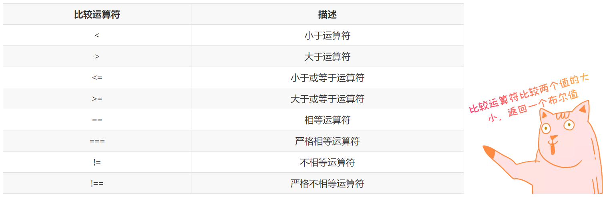


比较运算符用于比较两个值的大小，然后返回一个布尔值，表示是否满足指定的条件。

```js
2 > 1 // true
```

JavaScript 一共提供了8个比较运算符。

| 比较运算符 |       描述       |
| :--------: | :--------------: |
|     <      |    小于运算符    |
|     \>     |    大于运算符    |
|     <=     | 小于或等于运算符 |
|    \>=     | 大于或等于运算符 |
|     ==     |    相等运算符    |
|    ===     |  严格相等运算符  |
|     !=     |   不相等运算符   |
|    !==     | 严格不相等运算符 |


### “==”和“===”的区别

## ==：双等比较值

===：三等比较值和类型


**实时效果反馈**

**1.下列那个选项是比较运算符 ：**

<font style="background-color:rgb(233, 30, 100)">A</font>   `=`

<font style="background-color:rgb(255, 197, 10)">B</font>   `==`

<font style="background-color:#8bc34a">C</font>   `+=`

<font style="background-color:rgb(2, 170, 244);">D</font>   `++`


**2.  下列关于"=="和"==="运算符的描述正确的是:**

<font style="background-color:rgb(233, 30, 100)">A</font>   双等比较值,三等也是比较值

<font style="background-color:rgb(255, 197, 10)">B</font>   双等比较值和类型,三等比较值

<font style="background-color:#8bc34a">C</font>   双等比较值和类型,三等比较值和类型

<font style="background-color:rgb(2, 170, 244);">D</font>   双等比较值,三等比较值和类型


**答案**

1=>B  		2=>D 


## 运算符之布尔运算符


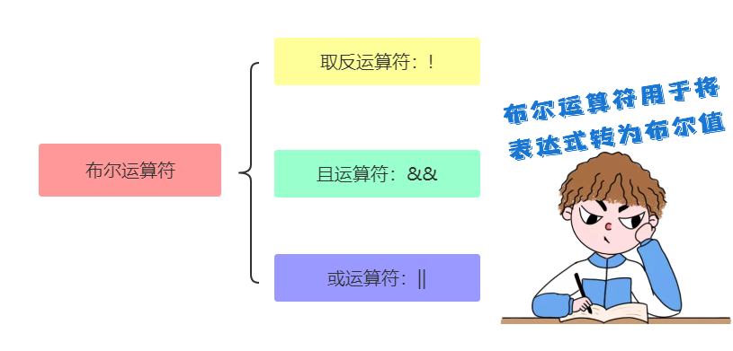


### 取反运算符（!）


#### 布尔值取反

```js
!true // false
!false // true
```


#### 非布尔值取反

对于非布尔值，取反运算符会将其转为布尔值。可以这样记忆，以下六个值取反后为true，其他值都为false。

> **温馨提示**
>
> undefined
> null
> false
> 0
> NaN
> 空字符串（''）


```js
!undefined // true
!null // true
!0 // true
!NaN // true
!"" // true

!54 // false
!'hello' // false
```


### 且运算符（&&）

多个条件都要满足

> 如果一个人一直做好事，突然有一天做了一件坏事，那么人们会认为这个人很虚伪，以前说不定都是装的！对这个人不在认可

```js
console.log(10 < 20 && 10 >5); // true
```


### 或运算符（||）

满足一个条件即可

> 如果一个人一直做坏事，突然有一天做了一件好事，那么人们会认为这个人其实还不错，以前也许是另有原因！对这个人突然就认可了

```js
console.log(10 < 20 || 10 < 5); // true
```


**实时效果反馈**

**1.下列代码运行结果是 ：**

```js
!undefined
!'hello'
```

<font style="background-color:rgb(233, 30, 100)">A</font>   true  true

<font style="background-color:rgb(255, 197, 10)">B</font>   false false

<font style="background-color:#8bc34a">C</font>   true false

<font style="background-color:rgb(2, 170, 244);">D</font>   false true


**2.  下列代码中运行结果是:**

```js
var num = 0;
++num;
console.log(!num);
```

<font style="background-color:rgb(233, 30, 100)">A</font>   0

<font style="background-color:rgb(255, 197, 10)">B</font>   true

<font style="background-color:#8bc34a">C</font>   1

<font style="background-color:rgb(2, 170, 244);">D</font>   false


**答案**

1=>C  		2=>D 


## 条件语句之 if语句


if结构先判断一个表达式的布尔值，然后根据布尔值的真伪，执行不同的语句。所谓布尔值，指的是 JavaScript 的两个特殊值，true表示真，false表示伪。


### if语句语法规范

```js
if (布尔值){
   语句; 
}
```


需要注意的是，“布尔值”往往由一个条件表达式产生的，必须放在圆括号中

```js
var m = 3;
if (m === 3) {
    m++;
}
console.log(m); // 4
```


注意，if后面的表达式之中，不要混淆赋值表达式（=）、严格相等运算符（===）和相等运算符（==）。尤其是赋值表达式不具有比较作用。

```js
var x = 1;
var y = 2;
if (x = y) {
    console.log(x);
}
```


**实时效果反馈**

**1.下列条件语句中，横线处应填写代码是 ：**

```js
var zhangsan = 34;
var lisi = 30;
if(zhangsan ___ lisi){
    console.log("张三更大"); // 张三更大
}
```

<font style="background-color:rgb(233, 30, 100)">A</font>   <

<font style="background-color:rgb(255, 197, 10)">B</font>   =

<font style="background-color:#8bc34a">C</font>   ==

<font style="background-color:rgb(2, 170, 244);">D</font>   >


**2. 下列代码运行结果是:**

```js
var num1 = "10"
var num2 = 10;
if(num1 ___ num2){
    console.log("num1等于num2"); // 无打印
}
```

<font style="background-color:rgb(233, 30, 100)">A</font>   >=

<font style="background-color:rgb(255, 197, 10)">B</font>   =

<font style="background-color:#8bc34a">C</font>   ==

<font style="background-color:rgb(2, 170, 244);">D</font>   ===


**答案**

1=>D  		2=>D


## 条件语句之 if...else


### if...else基本结构

if代码块后面，还可以跟一个else代码块，表示不满足条件时，所要执行的代码。


```js
if (m === 3) {
  // 满足条件时，执行的语句
} else {
  // 不满足条件时，执行的语句
}
```


### 多个if...else连接

对同一个变量进行多次判断时，多个if...else语句可以连写在一起。


```js
if (m === 0) {
  // ...
} else if (m === 1) {
  // ...
} else if (m === 2) {
  // ...
} else {
  // ...
}
```


### if...else嵌套

```js
var eat = true;
var food = "猪肉炖粉条";
if (eat) {
    if (food == "双椒鱼头") {
        console.log('双椒鱼头');	
    }else{
        console.log("猪肉炖粉条");
    }
} else {
    console.log('不吃了');
}
```

else代码块总是与离自己最近的那个if语句配对。


**实时效果反馈**

**1.下列条件语句中，横线处应填写代码是 ：**

```js
var eat = true;
var food = "猪肉炖粉条";
if (eat) {
    if (food ___ "双椒鱼头") {    
        console.log('双椒鱼头'); // 打印双椒鱼头
    }else{
        console.log("猪肉炖粉条");  
    }
} else {
    console.log('不吃了');
}
```

<font style="background-color:rgb(233, 30, 100)">A</font>   =

<font style="background-color:rgb(255, 197, 10)">B</font>   ==

<font style="background-color:#8bc34a">C</font>   ===

<font style="background-color:rgb(2, 170, 244);">D</font>   !=


**2. 下列代码运行结果是:**

```js
var day = 3;
if(day === 1){
    console.log("再向虎山行");
}else if(day === 2){
    console.log("路漫漫");
}else if(day === 3){
    console.log("野茫茫");
}else if(day === 4){
    console.log("曙光在前头");
}else if(day === 5){
    console.log("归心似箭");
}else{
    console.log("胜利大逃亡");
}
```

<font style="background-color:rgb(233, 30, 100)">A</font>   再向虎山行

<font style="background-color:rgb(255, 197, 10)">B</font>   野茫茫

<font style="background-color:#8bc34a">C</font>   曙光在前头

<font style="background-color:rgb(2, 170, 244);">D</font>   胜利大逃亡


**答案**

1=>D  		2=>B


## 条件语句之 switch


多个if...else连在一起使用的时候，可以转为使用更方便的switch结构


```js
switch (fruit) {
  case "banana":
    // ...
    break;
  case "apple":
    // ...
    break;
  default:
    // ...
}
```

需要注意的是，每个case代码块内部的break语句不能少，否则会接下去执行下一个case代码块，而不是跳出switch结构。

```js
var x = 1;

switch (x) {
  case 1:
    console.log('x 等于1');
  case 2:
    console.log('x 等于2');
  default:
    console.log('x 等于其他值');
}
// x等于1
// x等于2
// x等于其他值
```


**实时效果反馈**

**1.下列swtich语句中，横线处应填写代码是 ：**

```js
var x = 4;
switch (x) {
    case 1:
        console.log('x 等于1');
        break
    case 2:
        console.log('x 等于2');
        ____
    default:
        console.log('x 等于其他值'); // 打印x等于其他值
}
```

<font style="background-color:rgb(233, 30, 100)">A</font>   swtich

<font style="background-color:rgb(255, 197, 10)">B</font>   case

<font style="background-color:#8bc34a">C</font>   break

<font style="background-color:rgb(2, 170, 244);">D</font>   default


**2. 下列代码运行结果是:**

```js
var x = 2;
switch (x) {
    case 1:
        console.log('x 等于1');
    case 2:
        console.log('x 等于2');
    default:
        console.log('x 等于其他值');
}
```

<font style="background-color:rgb(233, 30, 100)">A</font>    x 等于1     x 等于2     x 等于其他值

<font style="background-color:rgb(255, 197, 10)">B</font>    x 等于1     x 等于2     

<font style="background-color:#8bc34a">C</font>    x 等于2     x 等于其他值

<font style="background-color:rgb(2, 170, 244);">D</font>    x 等于1     x 等于其他值


**答案**

1=>C  		2=>C


## 三元运算符 


JavaScript还有一个三元运算符（即该运算符需要三个运算子）`?:`，也可以用于逻辑判断。

```js
(条件) ? 表达式1 : 表达式2
```


这个三元运算符可以被视为if...else...的简写形式，因此可以用于多种场合。


### 判断一个整数是奇数与偶数

#### if...else语句

```js
var n = 100;
if (n % 2 === 0) {
  console.log("偶数");
} else {
  console.log("奇数");
}
```

#### 三元运算符

```js
var n = 100;
n % 2 === 0 ? '偶数' : '奇数'
```


**实时效果反馈**

**1.以下代码是三元运算符，横线处应该填写 ：**

```js
n % 2 === 0 ___ '偶数' ___ '奇数'
```

<font style="background-color:rgb(233, 30, 100)">A</font>   &&    ||

<font style="background-color:rgb(255, 197, 10)">B</font>   ?     :

<font style="background-color:#8bc34a">C</font>   >=   <=

<font style="background-color:rgb(2, 170, 244);">D</font>   ==  ===


**2.  下列关于三元运算符表达式描述正确的是:**

<font style="background-color:rgb(233, 30, 100)">A</font>   `if(条件){}else{}`

<font style="background-color:rgb(255, 197, 10)">B</font>   `switch(条件){}`

<font style="background-color:#8bc34a">C</font>   `if(条件){}`

<font style="background-color:rgb(2, 170, 244);">D</font>   `(条件) ? 表达式1 : 表达式2`


**答案**

1=>B  		2=>D


## 循环语句之for


循环语句用于重复执行某个操作

for语句就是循环命令，可以指定循环的起点、终点和终止条件。它的格式如下

```js
for (初始化表达式; 条件; 迭代因子) {
  语句
}
```


for语句后面的括号里面，有三个表达式。

1. 初始化表达式（initialize）：确定循环变量的初始值，只在循环开始时执行一次。

2. 布尔表达式（test）：每轮循环开始时，都要执行这个条件表达式，只有值为真，才继续进行循环。

3. 迭代因子（increment）：每轮循环的最后一个操作，通常用来递增循环变量。

   

   

```js
var x = 3;
for (var i = 0; i < x; i++) {
  console.log(i);
}
```


for语句的三个表达式，可以省略任何一个，也可以全部省略。

```js
for ( ; ; ){
  console.log('Hello World');
}
```

> **温馨提示**
>
> 如果三个都省略，结果就导致了一个无限循环（死循环）


**实时效果反馈**

**1.以下代码是一个循环语句，横线处应该填写 ：**

```js
var x = 3;
for (var i = 0; i __ x; i__) {
  console.log(i);  // 输出:0，1，2
}
```

<font style="background-color:rgb(233, 30, 100)">A</font>   ==    ++

<font style="background-color:rgb(255, 197, 10)">B</font>   <      ++

<font style="background-color:#8bc34a">C</font>   >      ++     

<font style="background-color:rgb(2, 170, 244);">D</font>   <     ==


**2.  下列关于循环语句描述错误的是:**

<font style="background-color:rgb(233, 30, 100)">A</font>   初始化表达式：确定循环变量的初始值，只在循环开始时执行一次。

<font style="background-color:rgb(255, 197, 10)">B</font>   布尔表达式：每轮循环开始时，都要执行条件表达式，只有值为真，才继续进行循环

<font style="background-color:#8bc34a">C</font>   迭代因子：每轮循环的最后一个操作，通常用来递增循环变量

<font style="background-color:rgb(2, 170, 244);">D</font>   三个表达式全部省略，不会出现无限循环（死循环）


**答案**

1=>B  		2=>D


## for循环语句实操


### 循环输出1~100之间数字的和

```js
var sum=0;
for(var i=1;i<=100;i++){
    sum+=i;
}
console.log(sum);
```


### 循环输出1000以内的奇数

```js
for(i = 0 ; i<1000; i ++){
    if( i % 2 ==1){
        console.log( i + " ");   
    }
}
```


### 打印九九乘法表


```js
for(var i = 1;i <= 9;i++){
    document.write("<br>"); 
    for(var j = 1;j <= i;j++){
        sum = i * j;
        document.write(i ,"*",j ,"=",sum," ");
    }
}
```


## 循环语句之while


While语句包括一个循环条件和一段代码块，只要条件为真，就不断循环执行代码块。


```js
while (条件) {
  语句;
}
```


### while例子

```js
var i = 0;
while (i < 100) {
  console.log('i 当前为：' + i);
  i = i + 1;
}
```

下面的例子是一个无限循环，因为循环条件总是为真

```js
while (true) {
  console.log('Hello, world');
}
```

所有for循环，都可以改写成while循环

```js
// for
var x = 3;
for (var i = 0; i < x; i++) {
  console.log(i);
}

// while
var x = 3;
var i = 0;
while (i < x) {
  console.log(i);
  i++;
}
```


**实时效果反馈**

**1.以下代码是一个循环语句，横线处应该填写 ：**

```js
var i = 0;
while (i ___ 100) {
  console.log('i 当前为：' + i);  // 结束输出到100
  i = i + 1;
}
```

<font style="background-color:rgb(233, 30, 100)">A</font>   <

<font style="background-color:rgb(255, 197, 10)">B</font>   <=

<font style="background-color:#8bc34a">C</font>   >

<font style="background-color:rgb(2, 170, 244);">D</font>   >=


**2.  下列代码，运行结果是 ：**

```js
while (true) {
  console.log('Hello, world');
}
```

<font style="background-color:rgb(233, 30, 100)">A</font>   输出一次"Hello, world"

<font style="background-color:rgb(255, 197, 10)">B</font>   没有任何输出

<font style="background-color:#8bc34a">C</font>   无限次输出"Hello, world"(死循环)

<font style="background-color:rgb(2, 170, 244);">D</font>   输出两次"Hello, world"


**答案**

1=>B  		2=>C


## break 语句和 continue 语句


break语句和continue语句都具有跳转作用，可以让代码不按既有的顺序执行


### break

break语句用于跳出代码块或循环

```js
for (var i = 0; i < 5; i++) {
    if (i === 3){
        break;
    }
    console.log(i);
}
```


### continue

continue语句用于立即终止本轮循环，返回循环结构的头部，开始下一轮循环

```js
for (var i = 0; i < 5; i++) {
    if (i === 3){
        continue;
    }
    console.log(i);
}
```


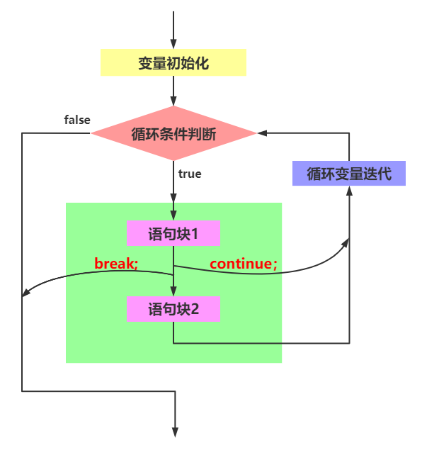


**实时效果反馈**

**1.break和continue的区别 ：**

<font style="background-color:rgb(233, 30, 100)">A</font>   break和continue一样，都是跳出本次循环，进行下次循环

<font style="background-color:rgb(255, 197, 10)">B</font>   break跳出本次循环，进入下次循环，continue跳出整个循环

<font style="background-color:#8bc34a">C</font>   break跳出整个循环，continue跳出本次循环，进入下次循环

<font style="background-color:rgb(2, 170, 244);">D</font>   break和continue一样，跳出全部循环


**2.  以下代码，横线处应该填写的内容是：**

```js
for (var i = 0; i < 5; i++) {
    if (i === 3){
        ___;
    }
    console.log(i); // 输出:0,1,2,4
}
```

<font style="background-color:rgb(233, 30, 100)">A</font>   i++

<font style="background-color:rgb(255, 197, 10)">B</font>   i--

<font style="background-color:#8bc34a">C</font>   break

<font style="background-color:rgb(2, 170, 244);">D</font>   continue


**答案**

1=>C  		2=>D


## 字符串


字符串就是零个或多个排在一起的字符，放在单引号或双引号之中

```js
'itbaizhan'
"itbaizhan"
```

单引号字符串的内部，可以使用双引号。双引号字符串的内部，可以使用单引号

```js
'key = "value"'
"It's a long itbaizhan"
```

如果要在单引号字符串的内部，使用单引号，就必须在内部的单引号前面加上反斜杠，用来转义。双引号字符串内部使用双引号，也是如此

```js
'Did she say \'Hello\'?'
// "Did she say 'Hello'?"

"Did she say \"Hello\"?"
// "Did she say "Hello"?"
```

> **温馨提示**
>
> 字符串默认只能写在一行内，分成多行将会报错

如果长字符串必须分成多行，可以在每一行的尾部使用反斜杠

```js
var longString = 'Long \
long \
string';
longString
// "Long long long string"
```


### length 属性

length属性返回字符串的长度，该属性也是无法改变的

```js
var s = 'itbaizhan';
s.length // 9
```


**实时效果反馈**

**1. 下列字符串，横线处应该填写的代码是：**

```js
"Did she say ___"Hello___"?"
```

<font style="background-color:rgb(233, 30, 100)">A</font>   ""   ''

<font style="background-color:rgb(255, 197, 10)">B</font>   ''    ""

<font style="background-color:#8bc34a">C</font>   \   \

<font style="background-color:rgb(2, 170, 244);">D</font>  ""  ""


**答案**

1=>C   


## 字符串方法_charAt()


`charAt`方法返回指定位置的字符，参数是从`0`开始编号的

```js
var s = new String('itbaizhan');

s.charAt(1) // "t"
s.charAt(s.length - 1) // "n"
```


如果参数为负数，或大于等于字符串的长度，`charAt`返回空字符串

```js
'itbaizhan'.charAt(-1) // ""
'itbaizhan'.charAt(9) // ""
```


**实时效果反馈**

**1. 下列字符串方法charAt的应用，代码输出结果是：**

```js
'itbaizhan'.charAt(9);
```

<font style="background-color:rgb(233, 30, 100)">A</font>   o

<font style="background-color:rgb(255, 197, 10)">B</font>   0

<font style="background-color:#8bc34a">C</font>   hello

<font style="background-color:rgb(2, 170, 244);">D</font>  ""


**答案**

1=>D  


## 字符串方法_concat()


`concat`方法用于连接两个字符串，返回一个新字符串，不改变原字符串

```js
var s1 = 'itbaizhan';
var s2 = 'sxt';

s1.concat(s2) // "itbaizhansxt"
s1 // "itbaizhan"
```

该方法可以接受多个参数

```js
'sxt'.concat('itbaizhan', 'bjsxt') // "sxtitbaizhanbjsxt"
```

如果参数不是字符串，`concat`方法会将其先转为字符串，然后再连接

```js
var one = 1;
var two = 2;
var three = '3';

''.concat(one, two, three) // "123"
```


**实时效果反馈**

**1. 下列字符串方法concat的应用，代码输出结果是：**

```js
var one = 1;
var two = 2;
var three = '3';

console.log(''.concat(one, two, three) )
console.log(one + two + three )
```

<font style="background-color:rgb(233, 30, 100)">A</font>   123    33

<font style="background-color:rgb(255, 197, 10)">B</font>   123    123

<font style="background-color:#8bc34a">C</font>   33      33

<font style="background-color:rgb(2, 170, 244);">D</font>   6       6


**答案**

1=>A  


## 字符串方法_substring()


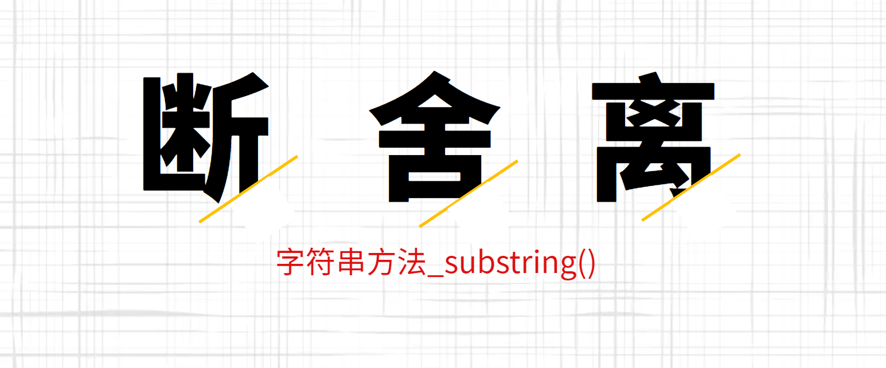


`substring`方法用于从原字符串取出子字符串并返回，不改变原字符串。它的第一个参数表示子字符串的开始位置，第二个位置表示结束位置（返回结果不含该位置）

```js
'itbaizhan'.substring(0, 2) // "it"
```

如果省略第二个参数，则表示子字符串一直到原字符串的结束

```js
'itbaizhan'.substring(2) // "baizhan"
```

如果第一个参数大于第二个参数，`substring`方法会自动更换两个参数的位置

```js
'itbaizhan'.substring(9, 2) // "baizhan"
// 等同于
'itbaizhan'.substring(2, 9) // "baizhan"
```

如果参数是负数，`substring`方法会自动将负数转为0

```
'itbaizhan'.substring(-3) // "itbaizhan"
'itbaizhan'.substring(2, -3) // "it"
```


**实时效果反馈**

**1. 下列字符串方法substring的应用，代码输出结果是：**

```js
'itbaizhan'.substring(5, -3)
```

<font style="background-color:rgb(233, 30, 100)">A</font>   ""

<font style="background-color:rgb(255, 197, 10)">B</font>   itbaizhan

<font style="background-color:#8bc34a">C</font>   itbai

<font style="background-color:rgb(2, 170, 244);">D</font>   bai


**答案**

1=>C  


## 字符串方法_substr()


`substr`方法用于从原字符串取出子字符串并返回，不改变原字符串，跟`substring`方法的作用相同

`substr`方法的第一个参数是子字符串的开始位置（从0开始计算），第二个参数是子字符串的长度

```js
'itbaizhan'.substr(2, 7); // baizhan
```

如果省略第二个参数，则表示子字符串一直到原字符串的结束

```js
'itbaizhan'.substr(2) // "baizhan"
```

如果第一个参数是负数，表示倒数计算的字符位置。如果第二个参数是负数，将被自动转为0，因此会返回空字符串

```js
'itbaizhan'.substr(-7) // "baizhan"
'itbaizhan'.substr(4, -1) // ""
```


**实时效果反馈**

**1. 下列字符串方法substr的应用，代码输出结果是：**

```js
'itbaizhan'.substr(2, -2)
```

<font style="background-color:rgb(233, 30, 100)">A</font>   ""

<font style="background-color:rgb(255, 197, 10)">B</font>   itbaizhan

<font style="background-color:#8bc34a">C</font>   itbai

<font style="background-color:rgb(2, 170, 244);">D</font>   bai


**答案**

1=>A 


## 字符串方法_indexOf()


`indexOf`方法用于确定一个字符串在另一个字符串中第一次出现的位置，返回结果是匹配开始的位置。如果返回`-1`，就表示不匹配

```js
'hello world'.indexOf('o') // 4
'itbaizhan'.indexOf('sxt') // -1
```

`indexOf`方法还可以接受第二个参数，表示从该位置开始向后匹配

```js
'hello world'.indexOf('o', 6) // 7
```


**实时效果反馈**

**1. 下列字符串方法indexOf的应用，代码输出结果是：**

```js
'itbaizhan'.indexOf("z",6)
```

<font style="background-color:rgb(233, 30, 100)">A</font>   -1

<font style="background-color:rgb(255, 197, 10)">B</font>   itbaizhan

<font style="background-color:#8bc34a">C</font>   0

<font style="background-color:rgb(2, 170, 244);">D</font>   5


**答案**

1=>A 


## 字符串方法_trim()


`trim`方法用于去除字符串两端的空格，返回一个新字符串，不改变原字符串

```js
'  hello world  '.trim()
// "hello world"
```

该方法去除的不仅是空格，还包括制表符（`\t`、`\v`）、换行符（`\n`）和回车符（`\r`）

```js
'\r\nitbaizhan \t'.trim() // 'itbaizhan'
```

ES6扩展方法，`trimEnd()`和`trimStart()`方法

```js
"   itbaizhan   ".trimEnd(); //    itbaizhan
"   itbaizhan   ".trimStart(); // itbaizhan   
```


**实时效果反馈**

**1. 下列字符串方法trim的应用，代码输出结果是：**

```js
'\r\n itbaizhan \t  '.trim()
```

<font style="background-color:rgb(233, 30, 100)">A</font>   \r\n itbaizhan \t

<font style="background-color:rgb(255, 197, 10)">B</font>   \r\nitbaizhan\t

<font style="background-color:#8bc34a">C</font>   \r\nitbaizhan  \t

<font style="background-color:rgb(2, 170, 244);">D</font>   itbaizhan


**答案**

1=>D 


## 字符串方法_split()


`split`方法按照给定规则分割字符串，返回一个由分割出来的子字符串组成的数组

```js
'it|sxt|baizhan'.split('|') // ["it", "sxt", "baizhan"]
```

如果分割规则为空字符串，则返回数组的成员是原字符串的每一个字符。

```js
'a|b|c'.split('') // ["a", "|",  "b","|", "c"]
```

如果省略参数，则返回数组的唯一成员就是原字符串

```js
'it|sxt|bz'.split() // [it|sxt|bz]
```

`split`方法还可以接受第二个参数，限定返回数组的最大成员数。

```js
'it|sxt|bz'.split('|', 0) // []
'it|sxt|bz'.split('|', 1) // ["it"]
'it|sxt|bz'.split('|', 2) // ["it", "sxt"]
'it|sxt|bz'.split('|', 3) // ["it", "sxt", "bz"]
'it|sxt|bz'.split('|', 4) // ["it", "sxt", "bz"]
```


**实时效果反馈**

**1. 下列字符串操作代码，执行结果是：**

```js
"itbaizhan".split("");
```

<font style="background-color:rgb(233, 30, 100)">A</font>   `[itbaizhan]`

<font style="background-color:rgb(255, 197, 10)">B</font>   `['it','haizhan']`

<font style="background-color:#8bc34a">C</font>   `['i', 't', 'b', 'a', 'i', 'z', 'h', 'a', 'n']`

<font style="background-color:rgb(2, 170, 244);">D</font>   `'i', 't', 'b', 'a', 'i', 'z', 'h', 'a', 'n'`


**答案**

1=>C 


## 数组


数组（array）是按次序排列的一组值。每个值的位置都有编号（从0开始），整个数组用方括号表示。

```js
var arr = ['sxt', 'baizhan', 'it'];
```

两端的方括号是数组的标志。`sxt`是0号位置，`baizhan`是1号位置，`it`是2号位置。（位置也被称为下标）


除了在定义时赋值，数组也可以先定义后赋值。

```js
var arr = [];

arr[0] = 'sxt';
arr[1] = 'baizhan';
arr[2] = 'it';
```

任何类型的数据，都可以放入数组

```js
var arr = [ 100, [1, 2, 3],false ];
```

如果数组的元素还是数组，就形成了多维数组

```js
var a = [[1, 2], [3, 4]];
a[0][1] // 2
a[1][1] // 4
```


### length 属性

数组的length属性，返回数组的成员数量

```js
['sxt', 'baizhan', 'it'].length // 3
```


**实时效果反馈**

**1. 下列关于数组的操作，输出结果是：**

```js
var arr = [ 'sxt', 'baizhan', 'it' ];
console.log(arr[5])
```

<font style="background-color:rgb(233, 30, 100)">A</font>   0

<font style="background-color:rgb(255, 197, 10)">B</font>   []

<font style="background-color:#8bc34a">C</font>   undefined

<font style="background-color:rgb(2, 170, 244);">D</font>   ""


**答案**

1=>C


## 数组的遍历


数组的遍历可以考虑使用for循环或while循环

```js
var a = ['sxt', 'baizhan', 'it'];

// for循环
for(var i = 0; i < a.length; i++) {
  console.log(a[i]);
}

// while循环
var i = 0;
while (i < a.length) {
  console.log(a[i]);
  i++;
}
```

for...in遍历数组

```js
var a = ['sxt', 'baizhan', 'it'];

for (var i in a) {
  console.log(a[i]);
}
```


**实时效果反馈**

**1. 下列遍历数组的操作中，画横线的地方应该填写的代码是：**

```js
var arr = ["尚学堂", 100, true];
for (var i = 0; i < ___; i++) {
    console.log(arr[i]);
}
```

<font style="background-color:rgb(233, 30, 100)">A</font>   arr

<font style="background-color:rgb(255, 197, 10)">B</font>   10

<font style="background-color:#8bc34a">C</font>   length

<font style="background-color:rgb(2, 170, 244);">D</font>   arr.length


**答案**

1=>D


## 数组静态方法_Array.isArray()


`Array.isArray`方法返回一个布尔值，表示参数是否为数组。它可以弥补`typeof`运算符的不足

```js
var arr = ["尚学堂", 100, true];
console.log(typeof arr); // object
```


```js
var arr = ['sxt', 'baizhan', 'it'];
Array.isArray(arr) // true
```


**实时效果反馈**

**1. 下列代码输出分别是？：**

```js
var arr = ["尚学堂", 100, true];
var str = "itbaizhan";
console.log(typeof arr);
console.log(Array.isArray(arr));
console.log(typeof str);
console.log(Array.isArray(str));
```

<font style="background-color:rgb(233, 30, 100)">A</font>   object  false  string  false

<font style="background-color:rgb(255, 197, 10)">B</font>   object  true  string  true

<font style="background-color:#8bc34a">C</font>   object  true  false false

<font style="background-color:rgb(2, 170, 244);">D</font>   object  true  string  false


**答案**

1=>D


## 数组方法_push()/pop()


`push`方法用于在数组的末端添加一个或多个元素，并返回添加新元素后的数组长度。注意，该方法会改变原数组

```js
var arr = [];
arr.push("尚学堂") // 1
arr.push('itbaizhan') // 2
arr.push(true, {}) // 4
arr // [尚学堂, 'itbaizhan', true, {}]
```

`pop`方法用于删除数组的最后一个元素，并返回该元素。注意，该方法会改变原数组

```js
var arr = ['尚学堂', 'itbaizhan', 'WEB前端'];

arr.pop() // 'WEB前端'
arr // ['尚学堂', 'itbaizhan']
```


**实时效果反馈**

**1. 下列关于数组输出的结果是：**

```js
var arr = [];
arr.push('尚学堂', 'itbaizhan');
arr.push('WEB前端');
arr.pop();
arr.push('尚学堂');
console.log(arr);
```

<font style="background-color:rgb(233, 30, 100)">A</font>   `['尚学堂', 'itbaizhan', '尚学堂']`

<font style="background-color:rgb(255, 197, 10)">B</font>   `['尚学堂', 'itbaizhan', 'WEB前端']`

<font style="background-color:#8bc34a">C</font>   `['尚学堂', 'itbaizhan']`

<font style="background-color:rgb(2, 170, 244);">D</font>   `['尚学堂', 'WEB前端']`


**答案**

1=>A


## 数组方法_shift()/unshift()


`shift`方法用于删除数组的第一个元素，并返回该元素。注意，该方法会改变原数组

```js
var arr = ['尚学堂', 'itbaizhan', 'WEB前端'];

arr.shift() // '尚学堂'
arr // ['itbaizhan', 'WEB前端']
```

`shift`方法可以遍历并清空一个数组

```js
var list = [1, 2, 3, 4, 5, 6];
var item;

while (item = list.shift()) {
  console.log(item);
}

list // []
```

`unshift`方法用于在数组的第一个位置添加元素，并返回添加新元素后的数组长度。注意，该方法会改变原数组

```js
var arr = ['尚学堂', 'itbaizhan', 'WEB前端'];

arr.unshift('baizhan'); // 4
arr // ['baizhan', '尚学堂', 'itbaizhan', 'WEB前端']
```

`unshift`方法可以接受多个参数，这些参数都会添加到目标数组头部

```js
var arr = [ '尚学堂', 'itbaizhan' ];
arr.unshift('WEB前端', 'baizhan') // 4
arr // [ 'WEB前端', 'baizhan', '尚学堂', 'itbaizhan' ]
```


**实时效果反馈**

**1. 下列关于数组输出的结果是：**

```js
var arr = [];
arr.unshift('尚学堂', 'itbaizhan');
arr.unshift('WEB前端');
arr.shift();
arr.unshift('尚学堂');
console.log(arr);
```

<font style="background-color:rgb(233, 30, 100)">A</font>   `['尚学堂', '尚学堂', 'itbaizhan']`

<font style="background-color:rgb(255, 197, 10)">B</font>   `['尚学堂', 'itbaizhan', 'WEB前端']`

<font style="background-color:#8bc34a">C</font>   `['尚学堂', 'itbaizhan']`

<font style="background-color:rgb(2, 170, 244);">D</font>   `['尚学堂', 'WEB前端']`


**答案**

1=>A


## 数组方法_join()


`join`方法以指定参数作为分隔符，将所有数组成员连接为一个字符串返回。如果不提供参数，默认用逗号分隔

```js
var a = [1, 2, 3, 4];

a.join(' ') // '1 2 3 4'
a.join(' | ') // "1 | 2 | 3 | 4"
a.join() // "1,2,3,4"
```

如果数组成员是`undefined`或`null`或空位，会被转成空字符串

```js
[undefined, null].join('#')
// '#'

['a',, 'b'].join('-')
// 'a--b'
```

数组的`join`配合字符串的`split`可以实现数组与字符串的互换

```js
var arr = ["a","b","c"];
var myArr = arr.join("");
console.log(myArr);
console.log(myArr.split(""));
```


**实时效果反馈**

**1. 下列关于数组输出的结果是：**

```js
var arr = ["尚学堂","百战程序员"];
var myArr = arr.join("");
console.log(myArr);
console.log(myArr.split(""));
```

<font style="background-color:rgb(233, 30, 100)">A</font>   尚学堂百战程序员    ["尚学堂","百战程序员"]

<font style="background-color:rgb(255, 197, 10)">B</font>   尚学堂百战程序员   ['尚', '学', '堂', '百', '战', '程', '序', '员']

<font style="background-color:#8bc34a">C</font>   ["尚学堂","百战程序员"]    尚学堂百战程序员 

<font style="background-color:rgb(2, 170, 244);">D</font>   ['尚', '学', '堂', '百', '战', '程', '序', '员']    尚学堂百战程序员


**答案**

1=>B


## 数组方法_concat()


`concat`方法用于多个数组的合并。它将新数组的成员，添加到原数组成员的后部，然后返回一个新数组，原数组不变

```js
['hello'].concat(['world'])
// ["hello", "world"]

['hello'].concat(['world'], ['!'])
// ["hello", "world", "!"]
```

除了数组作为参数，`concat`也接受其他类型的值作为参数，添加到目标数组尾部。

```js
[1, 2, 3].concat(4, 5, 6)
// [1, 2, 3, 4, 5, 6]
```

> **应用场景**
>
> 上拉加载，合并数据


**实时效果反馈**

**1. 下列关于数组输出的结果是：**

```js
[1, 2, 3].concat(4, 5, 6,[7,8,9])
```

<font style="background-color:rgb(233, 30, 100)">A</font>   ` [1, 2, 3, 4, 5, 6]`

<font style="background-color:rgb(255, 197, 10)">B</font>   `[1, 2, 3, 4, 5, 6, [7, 8, 9]]`

<font style="background-color:#8bc34a">C</font>   `[1, 2, 3, 4, 5, 6, 7, 8, 9]`

<font style="background-color:rgb(2, 170, 244);">D</font>   ` [1, 2, 3, 4, 5, 6][7, 8, 9]`


**答案**

1=>C


## 数组方法_reverse()


`reverse`方法用于颠倒排列数组元素，返回改变后的数组。注意，该方法将改变原数组

```js
var a = ['a', 'b', 'c'];

a.reverse() // ["c", "b", "a"]
a // ["c", "b", "a"]
```

实现一个字符串反转排列

```js
var str = "hello";
str.split("").reverse().join("")
```


**实时效果反馈**

**1. 下列关于数组输出的结果是：**

```js
var str = "hello";
str.split("").reverse().join("-");
```

<font style="background-color:rgb(233, 30, 100)">A</font>   olleh

<font style="background-color:rgb(255, 197, 10)">B</font>   hello

<font style="background-color:#8bc34a">C</font>   'o-l-l-e-h'

<font style="background-color:rgb(2, 170, 244);">D</font>   'h-e-l-l-o'


**答案**

1=>C


## 数组方法_indexOf()


`indexOf`方法返回给定元素在数组中第一次出现的位置，如果没有出现则返回`-1`

```js
var arr = ['a', 'b', 'c'];

arr.indexOf('b') // 1
arr.indexOf('y') // -1
```

`indexOf`方法还可以接受第二个参数，表示搜索的开始位置

```js
['尚学堂', '百战程序员', 'itbaizhan'].indexOf('尚学堂', 1) // -1
```


**实时效果反馈**

**1. 下列关于数组方法，运行正确结果是：**

```js
var arr = ["尚学堂", "it", "itbaizhan","it"];
arr.indexOf("it",2)
```

<font style="background-color:rgb(233, 30, 100)">A</font>   -1

<font style="background-color:rgb(255, 197, 10)">B</font>   1

<font style="background-color:#8bc34a">C</font>   3

<font style="background-color:rgb(2, 170, 244);">D</font>   undefined


**答案**

1=>B


## 函数


函数是一段可以反复调用的代码块


### 函数的声明

function 命令： function命令声明的代码区块，就是一个函数。function命令后面是函数名，函数名后面是一对圆括号，里面是传入函数的参数。函数体放在大括号里面。

```js
function print(s) {
  console.log(s);
}
```


### 函数名的提升

JavaScript 引擎将函数名视同变量名，所以采用function命令声明函数时，整个函数会像变量声明一样，被提升到代码头部

```js
add();

function add() {}
```


### 函数参数

函数运行的时候，有时需要提供外部数据，不同的外部数据会得到不同的结果，这种外部数据就叫参数

```js
function square(x) {
	console.log(x * x);
}

square(2) // 4
square(3) // 9
```


### 函数返回值

JavaScript函数提供两个接口实现与外界的交互，其中参数作为入口，接收外界信息；返回值作为出口，把运算结果反馈给外界

```js
function getName(name){
    return name;
}

var myName = getName("itbaizhan")
console.log(myName); // itbaizhan
```

> **温馨提示**
>
> `return` 后面不能在添加任何代码，因为不会执行


**实时效果反馈**

**1. 下列函数执行输出“itbaizhan”，横线处应该填写的代码是：**

```js
function getName(name) {
    ___;
}
var myName = getName("itbaizhan")
console.log(myName); // itbaizhan
```

<font style="background-color:rgb(233, 30, 100)">A</font>   return name

<font style="background-color:rgb(255, 197, 10)">B</font>   return

<font style="background-color:#8bc34a">C</font>   name  

<font style="background-color:rgb(2, 170, 244);">D</font>   return "itbaizhan"    


**答案**

1=>A


## 对象概述


什么是对象？对象（object）是 JavaScript 语言的核心概念，也是最重要的数据类型

简单说，对象就是一组“键值对”（key-value）的集合，是一种无序的复合数据集合


```js
var user = {
  name: 'itbaizhan',
  age: '13'
};
```


对象的每一个键名又称为“属性”（property），它的“键

值”可以是任何数据类型。如果一个属性的值为函数，通常把这个属性称为“方法”，它可以像函数那样调用

```js
var user = {
  getName: function (name) {
    return name;
  }
};
user.getName("itbaizhan") // itbaizhan
```

如果属性的值还是一个对象，就形成了链式引用

```js
var user = {
    name:"itbaizhan",
    age:13,
    container:{
        frontEnd:["Web前端","Android","iOS"],
        backEnd:["Java","Python"]
    }
}
user.container.frontEnd // ["Web前端","Android","iOS"]
```


**实时效果反馈**

**1. 下列关于对象描述正确的是：**

<font style="background-color:rgb(233, 30, 100)">A</font>   对象是条件语句，负责进行判断

<font style="background-color:rgb(255, 197, 10)">B</font>   对象是一段反复调用的代码块

<font style="background-color:#8bc34a">C</font>   对象就是一组“键值对”（key-value）的集合

<font style="background-color:rgb(2, 170, 244);">D</font>   对象是按次序排列的一组值。每个值的位置都有编号（从0开始）


**答案**

1=>C    


## Math对象


Math是 JavaScript 的原生对象，提供各种数学功能。


### Math.abs()

**`Math.abs`方法返回参数值的绝对值**

```js
Math.abs(1) // 1
Math.abs(-1) // 1
```


### Math.max()，Math.min()

`Math.max`方法返回参数之中最大的那个值，`Math.min`返回最小的那个值。如果参数为空, `Math.min`返回`Infinity`, `Math.max`返回`-Infinity`。

```js
Math.max(2, -1, 5) // 5
Math.min(2, -1, 5) // -1
Math.min() // Infinity
Math.max() // -Infinity
```


### Math.floor()，Math.ceil()

`Math.floor`方法返回小于参数值的最大整数

```js
Math.floor(3.2) // 3
Math.floor(-3.2) // -4
```

`Math.ceil`方法返回大于参数值的最小整数

```js
Math.ceil(3.2) // 4
Math.ceil(-3.2) // -3
```


### Math.random()

`Math.random()`返回0到1之间的一个伪随机数，可能等于0，但是一定小于1

```js
Math.random() // 0.28525367438365223
```

任意范围的随机数生成函数如下

```js
function getRandomArbitrary(min, max) {
  return Math.random() * (max - min) + min;
}

getRandomArbitrary(5, 10)
```


**实时效果反馈**

**1. 下列代码获得一个正整数，横线处应该填写的内容是：**

```js
function ToInteger(x) {
    x = Number(x);
    return ___(___(x));
}
ToInteger(-10.4); // 向下取整：10
```

<font style="background-color:rgb(233, 30, 100)">A</font>   `Math.floor`  `Math.abs`

<font style="background-color:rgb(255, 197, 10)">B</font>   `Math.ceil`  `Math.abs`

<font style="background-color:#8bc34a">C</font>   `Math.ceil`  `Math.min`

<font style="background-color:rgb(2, 170, 244);">D</font>   `Math.floor`  `Math.min`


**答案**

1=>A 


## Date对象


`Date`对象是 JavaScript 原生的时间库。它以1970年1月1日00:00:00作为时间的零点，可以表示的时间范围是前后各1亿天（单位为毫秒）


### Date.now()

`Date.now`方法返回当前时间距离时间零点（1970年1月1日 00:00:00 UTC）的毫秒数，相当于 Unix 时间戳乘以1000

```js
Date.now();   // 1635216733395
```


### 时间戳

时间戳是指格林威治时间1970年01月01日00时00分00秒(北京时间1970年01月01日08时00分00秒)起至现在的总秒数。

格林威治和北京时间就是时区的不同

Unix是20世纪70年代初出现的一个操作系统，Unix认为1970年1月1日0点是时间纪元。JavaScript也就遵循了这一约束


`Date`对象提供了一系列`get*`方法，用来获取实例对象某个方面的值

> **实例方法get类**
>
> getTime()：返回实例距离1970年1月1日00:00:00的毫秒数
> getDate()：返回实例对象对应每个月的几号（从1开始）
> getDay()：返回星期几，星期日为0，星期一为1，以此类推
> getYear()：返回距离1900的年数
> getFullYear()：返回四位的年份
> getMonth()：返回月份（0表示1月，11表示12月）
> getHours()：返回小时（0-23）
> getMilliseconds()：返回毫秒（0-999）
> getMinutes()：返回分钟（0-59）
> getSeconds()：返回秒（0-59）

```js
var d = new Date('January 6, 2022');
d.getDate() // 6
d.getMonth() // 0
d.getYear() // 122
d.getFullYear() // 2022
```

编写函数获得本年度剩余天数

```js
function leftDays() {
  var today = new Date();
  var endYear = new Date(today.getFullYear(), 11, 31, 23, 59, 59, 999);
  var msPerDay = 24 * 60 * 60 * 1000;
  return Math.round((endYear.getTime() - today.getTime()) / msPerDay);
}
```


**实时效果反馈**

**1. 下列代码计算本年度剩余天数，划横线处应该填写代码是：**

```js
function leftDays() {
  var today = new Date();
  var endYear = new Date(today.___, 11, 31, 23, 59, 59, 999);
  var msPerDay = 24 * 60 * 60 * 1000;
  return Math.round((endYear.___ - today.___) / msPerDay);
}
```

<font style="background-color:rgb(233, 30, 100)">A</font>   getTime()   getDate()   getTime()   

<font style="background-color:rgb(255, 197, 10)">B</font>   getTime()   getTime()    getDate()

<font style="background-color:#8bc34a">C</font>   getFullYear()   getTime()   getDate()

<font style="background-color:rgb(2, 170, 244);">D</font>   getFullYear()  getTime()   getTime()


**答案**

1=>D  


## DOM概述


DOM 是 JavaScript 操作网页的接口，全称为“文档对象模型”（Document Object Model）。它的作用是将网页转为一个 JavaScript 对象，从而可以用脚本进行各种操作（比如对元素增删内容）

浏览器会根据 DOM 模型，将结构化文档HTML解析成一系列的节点，再由这些节点组成一个树状结构（DOM Tree）。所有的节点和最终的树状结构，都有规范的对外接口

DOM 只是一个接口规范，可以用各种语言实现。所以严格地说，DOM 不是 JavaScript 语法的一部分，但是 DOM 操作是 JavaScript 最常见的任务，离开了 DOM，JavaScript 就无法控制网页。另一方面，JavaScript 也是最常用于 DOM 操作的语言


### 节点

DOM 的最小组成单位叫做节点（node）。文档的树形结构（DOM 树），就是由各种不同类型的节点组成。每个节点可以看作是文档树的一片叶子


节点的类型有七种

> Document：整个文档树的顶层节点
> DocumentType：doctype标签
> Element：网页的各种HTML标签
> Attribute：网页元素的属性（比如class="right"）
> Text：标签之间或标签包含的文本
> Comment：注释
> DocumentFragment：文档的片段


### 节点树

一个文档的所有节点，按照所在的层级，可以抽象成一种树状结构。这种树状结构就是 DOM 树。它有一个顶层节点，下一层都是顶层节点的子节点，然后子节点又有自己的子节点，就这样层层衍生出一个金字塔结构，倒过来就像一棵树


浏览器原生提供document节点，代表整个文档

```js
document
// 整个文档树
```

除了根节点，其他节点都有三种层级关系

> 父节点关系（parentNode）：直接的那个上级节点
> 子节点关系（childNodes）：直接的下级节点
> 同级节点关系（sibling）：拥有同一个父节点的节点

### Node.nodeType属性

不同节点的nodeType属性值和对应的常量如下

> 文档节点（document）：9，对应常量Node.DOCUMENT_NODE
> 元素节点（element）：1，对应常量Node.ELEMENT_NODE
> 属性节点（attr）：2，对应常量Node.ATTRIBUTE_NODE
> 文本节点（text）：3，对应常量Node.TEXT_NODE
> 文档片断节点（DocumentFragment）：11，对应常量Node.DOCUMENT_FRAGMENT_NODE

```js
document.nodeType // 9
document.nodeType === Node.DOCUMENT_NODE // true
```


**实时效果反馈**

**1. 下列那个不是节点类型：**

<font style="background-color:rgb(233, 30, 100)">A</font>   Document

<font style="background-color:rgb(255, 197, 10)">B</font>   Element

<font style="background-color:#8bc34a">C</font>   Attribute

<font style="background-color:rgb(2, 170, 244);">D</font>   Array


**答案**

1=>D  


## document对象_方法/获取元素


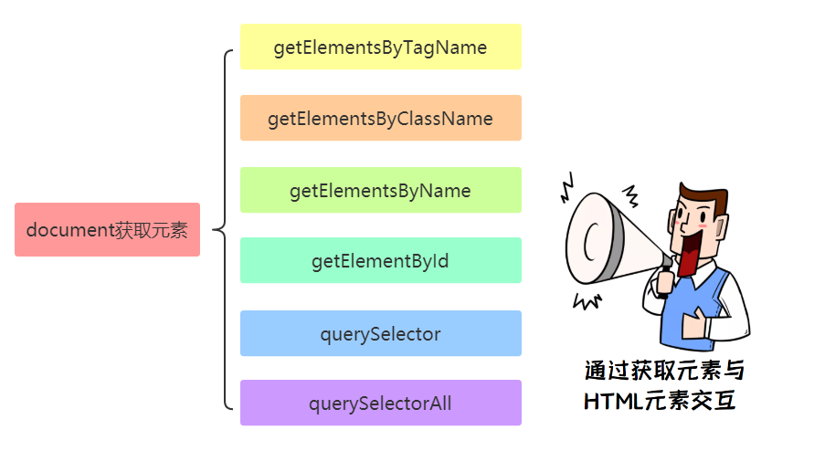


### document.getElementsByTagName()

`document.getElementsByTagName`方法搜索 HTML 标签名，返回符合条件的元素。它的返回值是一个类似数组对象（`HTMLCollection`实例），可以实时反映 HTML 文档的变化。如果没有任何匹配的元素，就返回一个空集

```js
var paras = document.getElementsByTagName('p');
```

如果传入`*`，就可以返回文档中所有 HTML 元素

```js
var allElements = document.getElementsByTagName('*');
```


### document.getElementsByClassName()

`document.getElementsByClassName`方法返回一个类似数组的对象（`HTMLCollection`实例），包括了所有`class`名字符合指定条件的元素，元素的变化实时反映在返回结果中

```js
var elements = document.getElementsByClassName(names);
```

由于`class`是保留字，所以 JavaScript 一律使用`className`表示 CSS 的`class`

参数可以是多个`class`，它们之间使用空格分隔

```js
var elements = document.getElementsByClassName('foo bar');
```


### document.getElementsByName()

`document.getElementsByName`方法用于选择拥有`name`属性的 HTML 元素（比如`<form>`、`<radio>`、``等），返回一个类似数组的的对象（`NodeList`实例），因为`name`属性相同的元素可能不止一个

```js
// 表单为 <form name="itbaizhan"></form>
var forms = document.getElementsByName('itbaizhan');
```


### document.getElementById()

`document.getElementById`方法返回匹配指定`id`属性的元素节点。如果没有发现匹配的节点，则返回`null`

```js
var elem = document.getElementById('para1');
```

注意，该方法的参数是大小写敏感的。比如，如果某个节点的`id`属性是`main`，那么`document.getElementById('Main')`将返回`null`


### document.querySelector()

`document.querySelector`方法接受一个 CSS 选择器作为参数，返回匹配该选择器的元素节点。如果有多个节点满足匹配条件，则返回第一个匹配的节点。如果没有发现匹配的节点，则返回`null`

```js
var el1 = document.querySelector('.myclass');
```


### document.querySelectorAll()

`document.querySelectorAll`方法与`querySelector`用法类似，区别是返回一个`NodeList`对象，包含所有匹配给定选择器的节点

```js
var elementList = document.querySelectorAll('.myclass');
```


**实时效果反馈**

**1. 以下那个是通过ID获取元素对象：**

<font style="background-color:rgb(233, 30, 100)">A</font>   getElementById

<font style="background-color:rgb(255, 197, 10)">B</font>   getElementsByTagName

<font style="background-color:#8bc34a">C</font>   getElementsByClassName

<font style="background-color:rgb(2, 170, 244);">D</font>   getElementsByName


**2. 以下那个是通过Class获取元素对象：**

<font style="background-color:rgb(233, 30, 100)">A</font>   getElementById

<font style="background-color:rgb(255, 197, 10)">B</font>   getElementsByTagName

<font style="background-color:#8bc34a">C</font>   getElementsByClassName

<font style="background-color:rgb(2, 170, 244);">D</font>   getElementsByName


**答案**

1=>A      2=>C


## document对象_方法/创建元素


### document.createElement()

`document.createElement`方法用来生成元素节点，并返回该节点

```js
var newDiv = document.createElement('div');
```


### document.createTextNode()

`document.createTextNode`方法用来生成文本节点（`Text`实例），并返回该节点。它的参数是文本节点的内容

```js
var newDiv = document.createElement('div');
var newContent = document.createTextNode('Hello');
newDiv.appendChild(newContent);
```


### document.createAttribute()

`document.createAttribute`方法生成一个新的属性节点（`Attr`实例），并返回它

```js
var attribute = document.createAttribute(name);
```

```js
var root = document.getElementById('root');
var it = document.createAttribute('itbaizhan');
it.value = 'it';
root.setAttributeNode(it);
```


**实时效果反馈**

**1. 下列代码是创建元素，并添加内容，横线处应该填写的内容是：**

```js
var newDiv = document.createElement('div');
var newContent = document.____('Hello');
newDiv.appendChild(newContent);
```

<font style="background-color:rgb(233, 30, 100)">A</font>   createElement

<font style="background-color:rgb(255, 197, 10)">B</font>   appendChild

<font style="background-color:#8bc34a">C</font>   createAttribute

<font style="background-color:rgb(2, 170, 244);">D</font>   createTextNode


**答案**

1=>D  


## Element对象_属性


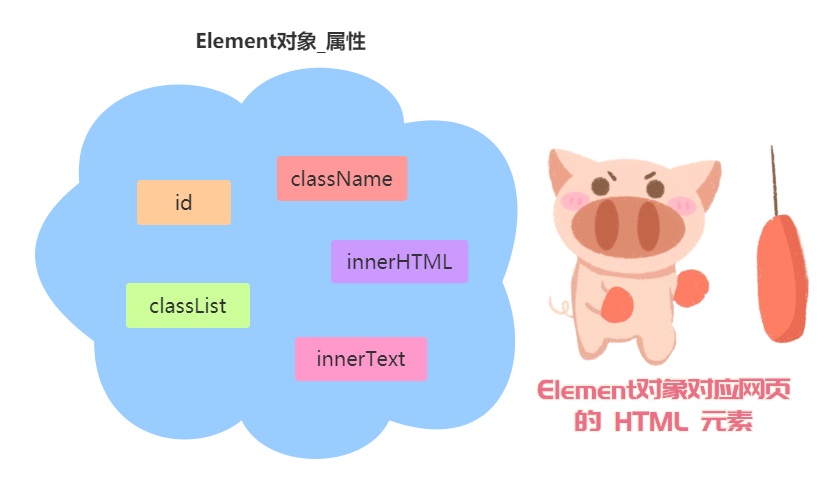


Element对象对应网页的 HTML 元素。每一个 HTML 元素，在 DOM 树上都会转化成一个Element节点对象（以下简称元素节点） 

### Element.id

`Element.id`属性返回指定元素的`id`属性，该属性可读写

```js
// HTML 代码为 <p id="foo">
var p = document.querySelector('p');
p.id // "foo"
```

### Element.className

`className`属性用来读写当前元素节点的`class`属性。它的值是一个字符串，每个`class`之间用空格分割

```js
// HTML 代码 <div class="one two three" id="myDiv"></div>
var div = document.getElementById('myDiv');
div.className
```

### Element.classList

`classList`对象有下列方法

> - `add()`：增加一个 class。
> - `remove()`：移除一个 class。
> - `contains()`：检查当前元素是否包含某个 class。
> - `toggle()`：将某个 class 移入或移出当前元素。

```js
var div = document.getElementById('myDiv');

div.classList.add('myCssClass');
div.classList.add('foo', 'bar');
div.classList.remove('myCssClass');
div.classList.toggle('myCssClass'); // 如果 myCssClass 不存在就加入，否则移除
div.classList.contains('myCssClass'); // 返回 true 或者 false
```

### Element.innerHTML

`Element.innerHTML`属性返回一个字符串，等同于该元素包含的所有 HTML 代码。该属性可读写，常用来设置某个节点的内容。它能改写所有元素节点的内容，包括`<HTML>`和`<body>`元素

```js
el.innerHTML = '';
```

### Element.innerText

`innerText`和`innerHTML`类似，不同的是`innerText`无法识别元素，会直接渲染成字符串


**实时效果反馈**

**1. 下列代码为div元素动态添加一个class，画横线处应该填写的内容是：**

```js
var div = document.getElementById('myDiv');
div.classList.___('myCssClass');
```

<font style="background-color:rgb(233, 30, 100)">A</font>   remove

<font style="background-color:rgb(255, 197, 10)">B</font>   add

<font style="background-color:#8bc34a">C</font>   toggle

<font style="background-color:rgb(2, 170, 244);">D</font>   contains


**答案**

1=>B  


## Element获取元素位置


| 属性         |                             描述                             |
| :----------- | :----------------------------------------------------------: |
| clientHeight | 获取元素高度包括`padding`部分，但是不包括`border`、`margin`  |
| clientWidth  | 获取元素宽度包括`padding`部分，但是不包括`border`、`margin`  |
| scrollHeight | 元素总高度，它包括`padding`，但是不包括`border`、`margin`包括溢出的不可见内容 |
| scrollWidth  | 元素总宽度，它包括`padding`，但是不包括`border`、`margin`包括溢出的不可见内容 |
| scrollLeft   |              元素的水平滚动条向右滚动的像素数量              |
| scrollTop    |              元素的垂直滚动条向下滚动的像素数量              |
| offsetHeight | 元素的 CSS 垂直高度（单位像素），包括元素本身的高度、padding 和 border |
| offsetWidth  | 元素的 CSS 水平宽度（单位像素），包括元素本身的高度、padding 和 border |
| offsetLeft   |                    到定位父级左边界的间距                    |
| offsetTop    |                    到定位父级上边界的间距                    |


### Element.clientHeight，Element.clientWidth

`Element.clientHeight`属性返回一个整数值，表示元素节点的 CSS 高度（单位像素），只对块级元素生效，对于行内元素返回`0`。如果块级元素没有设置 CSS 高度，则返回实际高度

除了元素本身的高度，它还包括`padding`部分，但是不包括`border`、`margin`。如果有水平滚动条，还要减去水平滚动条的高度。注意，这个值始终是整数，如果是小数会被四舍五入。

`Element.clientWidth`属性返回元素节点的 CSS 宽度，同样只对块级元素有效，也是只包括元素本身的宽度和`padding`，如果有垂直滚动条，还要减去垂直滚动条的宽度。

`document.documentElement`的`clientHeight`属性，返回当前视口的高度（即浏览器窗口的高度）。`document.body`的高度则是网页的实际高度。

```js
// 视口高度
document.documentElement.clientHeight

// 网页总高度
document.body.clientHeight
```


### Element.scrollHeight，Element.scrollWidth

`Element.scrollHeight`属性返回一个整数值（小数会四舍五入），表示当前元素的总高度（单位像素），它包括`padding`，但是不包括`border`、`margin`以及水平滚动条的高度（如果有水平滚动条的话）

`Element.scrollWidth`属性表示当前元素的总宽度（单位像素），其他地方都与`scrollHeight`属性类似。这两个属性只读

整张网页的总高度可以从`document.documentElement`或`document.body`上读取

```js
// 返回网页的总高度
document.documentElement.scrollHeight
document.body.scrollHeight
```


### Element.scrollLeft，Element.scrollTop

`Element.scrollLeft`属性表示当前元素的水平滚动条向右侧滚动的像素数量，`Element.scrollTop`属性表示当前元素的垂直滚动条向下滚动的像素数量。对于那些没有滚动条的网页元素，这两个属性总是等于0

如果要查看整张网页的水平的和垂直的滚动距离，要从`document.documentElement`元素上读取

```js
document.documentElement.scrollLeft
document.documentElement.scrollTop
```


### Element.offsetHeight，Element.offsetWidth

`Element.offsetHeight`属性返回一个整数，表示元素的 CSS 垂直高度（单位像素），包括元素本身的高度、padding 和 border，以及水平滚动条的高度（如果存在滚动条）。

`Element.offsetWidth`属性表示元素的 CSS 水平宽度（单位像素），其他都与`Element.offsetHeight`一致。

这两个属性都是只读属性，只比`Element.clientHeight`和`Element.clientWidth`多了边框的高度或宽度。如果元素的 CSS 设为不可见（比如`display: none;`），则返回`0`


### Element.offsetLeft，Element.offsetTop

`Element.offsetLeft`返回当前元素左上角相对于`Element.offsetParent`节点的水平位移，`Element.offsetTop`返回垂直位移，单位为像素。通常，这两个值是指相对于父节点的位移

```html
<div class="parent">
    <div class="box" id="box"></div>
</div>
```

```css
.parent{
    width: 200px;
    height: 200px;
    background: red;
    position: relative;
    left: 50px;
    top: 50px;
}

.box{
    width: 100px;
    height: 100px;
    background: yellow;
    position: relative;
    left: 50px;
    top: 50px;
}
```

```js
var box = document.getElementById("box");
console.log(box.offsetLeft);
console.log(box.offsetTop);
```


**实时效果反馈**

**1. 下面是获得整个视口的宽度和高度：**

```js
document.documentElement.___
document.documentElement.___
```

<font style="background-color:rgb(233, 30, 100)">A</font>   offsetLeft    offsetTop

<font style="background-color:rgb(255, 197, 10)">B</font>   scrollHeight   scrollWidth

<font style="background-color:#8bc34a">C</font>   clientLeft     clientTop


**2. 以下哪个是获得元素的高度，包含内外边距和边框：**

<font style="background-color:rgb(233, 30, 100)">A</font>   offsetLeft    offsetTop

<font style="background-color:rgb(255, 197, 10)">B</font>   offsetHeight     offsetWidth

<font style="background-color:#8bc34a">C</font>   clientLeft     clientTop

<font style="background-color:rgb(2, 170, 244);">D</font>   clientHeight    clientWidth


**答案**

1=>B   2=>B


## CSS操作


### `HTML` 元素的 `style` 属性

操作 CSS 样式最简单的方法，就是使用网页元素节点的`setAttribute`方法直接操作网页元素的`style`属性

```js
div.setAttribute(
  'style',
  'background-color:red;' + 'border:1px solid black;'
);
```


### 元素节点的`style`属性

```js
var divStyle = document.querySelector('div').style;

divStyle.backgroundColor = 'red';
divStyle.border = '1px solid black';
divStyle.width = '100px';
divStyle.height = '100px';
divStyle.fontSize = '10em';
```


### `cssText`属性

```js
var divStyle = document.querySelector('div').style;

divStyle.cssText = 'background-color: red;'
  + 'border: 1px solid black;'
  + 'height: 100px;'
  + 'width: 100px;';
```


**实时效果反馈**

**1. 下列是设置样式的代码，横线处应该填写的代码是：**

```js
var divStyle = document.querySelector('div');
divStyle.___.backgroundColor = 'red';
```

<font style="background-color:rgb(233, 30, 100)">A</font>   `style`

<font style="background-color:rgb(255, 197, 10)">B</font>   `cssText`

<font style="background-color:#8bc34a">C</font>   `setAttribute`

<font style="background-color:rgb(2, 170, 244);">D</font>   `getAttribute`


**答案**

1=>A


## 事件处理程序


事件处理程序分为：

1. HTML事件处理
2. DOM0级事件处理
3. DOM2级事件处理


### HTML事件

```html
<!DOCTYPE html>
<html>
    <head lang="en">
        <meta charset="UTF-8">
        <title>Js事件详解--事件处理</title>
    </head>
    <body>
        <div id="div">
            <button id="btn1" onclick="demo()">按钮</button>
        </div>
        <script>
            function demo(){
                alert("hello html事件处理");
            }
        </script>
    </body>
</html> 
```


### DOM0级事件处理

```html
<body>
    <div id="div">
        <button id="btn1">按钮</button>
    </div>
    <script>
        var btn1=document.getElementById("btn1");
        btn1.onclick=function(){alert("Hello DOM0级事件处理程序1");}//被覆盖掉
        btn1.onclick=function(){alert("Hello DOM0级事件处理程序2");}
    </script>
</body>
```


### DOM2级事件处理

```html
<body>
    <div id="div">
        <button id="btn1">按钮</button>
    </div>
    <script>
        var btn1=document.getElementById("btn1");
        btn1.addEventListener("click",demo1);
        btn1.addEventListener("click",demo2);
        btn1.addEventListener("click",demo3);
        function demo1(){
            alert("DOM2级事件处理程序1")
        }
        function demo2(){
            alert("DOM2级事件处理程序2")
        }
        function demo3(){
            alert("DOM2级事件处理程序3")
        }
        btn1.removeEventListener("click",demo2);
    </script>
</body>
```


**实时效果反馈**

**1. 下列代码，是属于哪种事件处理方式：**

```js
btn2.addEventListener('click',function(){
	console.log("触发事件");
})
```

<font style="background-color:rgb(233, 30, 100)">A</font>   HTML事件

<font style="background-color:rgb(255, 197, 10)">B</font>   DOM0级事件处理

<font style="background-color:#8bc34a">C</font>   DOM2级事件处理

<font style="background-color:rgb(2, 170, 244);">D</font>   IE事件处理程序


**答案**

1=>C


## 事件类型之鼠标事件


### 鼠标事件

鼠标事件指与鼠标相关的事件，具体的事件主要有以下一些

1. click：按下鼠标时触发
2. dblclick：在同一个元素上双击鼠标时触发
3. mousedown：按下鼠标键时触发
4. mouseup：释放按下的鼠标键时触发
5. mousemove：当鼠标在节点内部移动时触发。当鼠标持续移动时，该事件会连触发。
6. mouseenter：鼠标进入一个节点时触发，进入子节点不会触发这个事件
7. mouseleave：鼠标离开一个节点时触发，离开父节点不会触发这个事件
8. mouseover：鼠标进入一个节点时触发，进入子节点会再一次触发这个事件
9. mouseout：鼠标离开一个节点时触发，离开父节点也会触发这个事件
10. wheel：滚动鼠标的滚轮时触发


```js
var btn1 = document.getElementById("btn1");
btn1.onclick = function(){
    console.log("click事件");
}
```

> **温馨提示**
>
> 这些方法在使用的时候，除了DOM2级事件，都需要添加前缀`on`


**实时效果反馈**

**1. 下列代码是鼠标事件，划横线处应该填写的是：**

```js
// 需求：鼠标在元素内移动，会一直触发事件
var box = document.getElementById("box");
box.___ = function(){
    console.log("事件在元素上会一直触发");
}
```

<font style="background-color:rgb(233, 30, 100)">A</font>   `onclick`

<font style="background-color:rgb(255, 197, 10)">B</font>   `onmouseover`

<font style="background-color:#8bc34a">C</font>   `onmousemove`

<font style="background-color:rgb(2, 170, 244);">D</font>   `onmouseenter`


**答案**

1=>C


## Event事件对象


事件发生以后，会产生一个事件对象，作为参数传给监听函数。


### Event对象属性

1. Event.Target
2. Event.type


#### Event.target

Event.target属性返回事件当前所在的节点

```js
// HTML代码为
// <p id="para">Hello</p>
function setColor(e) {
  console.log(this === e.target);
  e.target.style.color = 'red';
}

para.addEventListener('click', setColor);
```


#### Event.type

Event.type属性返回一个字符串，表示事件类型。事件的类型是在生成事件的时候。该属性只读


### Event对象方法

1. Event.preventDefault()
2. Event.stopPropagation()


#### Event.preventDefault

Event.preventDefault方法取消浏览器对当前事件的默认行为。比如点击链接后，浏览器默认会跳转到另一个页面，使用这个方法以后，就不会跳转了

```js
btn.onclick = function(e){
    e.preventDefault(); // 阻止默认事件
    console.log("点击A标签");
}
```


#### Event.stopPropagation()

stopPropagation方法阻止事件在 DOM 中继续传播，防止再触发定义在别的节点上的监听函数，但是不包括在当前节点上其他的事件监听函数

```js
btn.onclick = function(e){
    e.stopPropagation(); // 阻止事件冒泡
    console.log("btn");
}
```


**实时效果反馈**

**1. 下列关于阻止默认事件方法正确的是：**

<font style="background-color:rgb(233, 30, 100)">A</font>   stopPropagation()

<font style="background-color:rgb(255, 197, 10)">B</font>   preventDefault()

<font style="background-color:#8bc34a">C</font>   target

<font style="background-color:rgb(2, 170, 244);">D</font>   currentTarget


**答案**

1=>B


## 事件类型之键盘事件


键盘事件由用户击打键盘触发，主要有keydown、keypress、keyup三个事件

1. keydown：按下键盘时触发。
2. keypress：按下有值的键时触发，即按下 Ctrl、Alt、Shift、Meta 这样无值的键，这个事件不会触发。对于有值的键，按下时先触发keydown事件，再触发这个事件。
3. keyup：松开键盘时触发该事件

```js
username.onkeypress = function(e){
    console.log("keypress事件");
}
```


### event对象

keyCode:唯一标识

```js
var username = document.getElementById("username");
username.onkeydown = function(e){
    if(e.keyCode === 13){
        console.log("回车");
    }
}
```


**实时效果反馈**

**1. 下列那个不是键盘事件：**

<font style="background-color:rgb(233, 30, 100)">A</font>   keydown

<font style="background-color:rgb(255, 197, 10)">B</font>   keypress

<font style="background-color:#8bc34a">C</font>   keyup

<font style="background-color:rgb(2, 170, 244);">D</font>   click


**答案**

1=>D  


## 事件类型之表单事件


表单事件是在使用表单元素及输入框元素可以监听的一系列事件

1. input事件
2. select事件
3. Change事件
4. reset事件
5. submit事件


### input事件

input事件当`<input>、<select>、<textarea>`的值发生变化时触发。对于复选框（`<input type=checkbox>`）或单选框（`<input type=radio>`），用户改变选项时，也会触发这个事件

input事件的一个特点，就是会连续触发，比如用户每按下一次按键，就会触发一次input事件。

```js
var username = document.getElementById("username");
username.oninput = function(e){
    console.log(e.target.value);
}
```


### select事件

select事件当在`<input>、<textarea>`里面选中文本时触发

```js
// HTML 代码如下
// <input id="test" type="text" value="Select me!" />

var elem = document.getElementById('test');
elem.addEventListener('select', function (e) {
  console.log(e.type); // "select"
}, false);
```


### Change 事件

Change事件当`<input>、<select>、<textarea>`的值发生变化时触发。它与input事件的最大不同，就是不会连续触发，只有当全部修改完成时才会触发

```js
var email = document.getElementById("email");
email.onchange = function(e){
    console.log(e.target.value);
}
```


### reset 事件，submit 事件

这两个事件发生在表单对象`<form>`上，而不是发生在表单的成员上。

reset事件当表单重置（所有表单成员变回默认值）时触发。

submit事件当表单数据向服务器提交时触发。注意，submit事件的发生对象是`<form>`元素，而不是`<button>`元素，因为提交的是表单，而不是按钮

```html
<form id="myForm" onsubmit="submitHandle">
    <button onclick="resetHandle">重置数据</button>
    <button>提交</button>
</form>
```

```js
var myForm = document.getElementById("myForm")
function resetHandle(){
    myForm.reset();
}
function submitHandle(){
    console.log("提交");
}
```


**实时效果反馈**

**1. 下列代码中，横线处应该填写的内容是：**

```js
// 需求：用户每次输入都需要触发的事件
var username = document.getElementById("username");
username.___ = function(e){
    console.log(e.target.value);
}
```

<font style="background-color:rgb(233, 30, 100)">A</font>   select

<font style="background-color:rgb(255, 197, 10)">B</font>   oninput

<font style="background-color:#8bc34a">C</font>   onchange

<font style="background-color:rgb(2, 170, 244);">D</font>   submit 


**答案**

1=>B  


## 事件代理(事件委托)


由于事件会在冒泡阶段向上传播到父节点，因此可以把子节点的监听函数定义在父节点上，由父节点的监听函数统一处理多个子元素的事件。这种方法叫做事件的代理（delegation）

```js
var ul = document.querySelector('ul');

ul.addEventListener('click', function (event) {
  if (event.target.tagName.toLowerCase() === 'li') {
    // some code
  }
});
```


**实时效果反馈**

**1. 下列是关于事件代理的处理，横线处应该填写的代码是：**

```js
var parent = document.getElementById("parent");
parent.addEventListener("click",function(e){
    if(e.___.tagName.___ === 'li'){
        console.log(e.target.innerHTML);
    }
})
```

<font style="background-color:rgb(233, 30, 100)">A</font>   target    toUpperCase()

<font style="background-color:rgb(255, 197, 10)">B</font>   target    toLowerCase()

<font style="background-color:#8bc34a">C</font>   currentTarget   toLowerCase()

<font style="background-color:rgb(2, 170, 244);">D</font>   currentTarget   toUpperCase()


**答案**

1=>B  


## 定时器之`setTimeout()`


JavaScript 提供定时执行代码的功能，叫做定时器（timer），主要由`setTimeout()`和`setInterval()`这两个函数来完成。它们向任务队列添加定时任务

`setTimeout`函数用来指定某个函数或某段代码，在多少毫秒之后执行。它返回一个整数，表示定时器的编号，以后可以用来取消这个定时器。

```js
var timerId = setTimeout(func|code, delay);
```

`setTimeout`函数接受两个参数，第一个参数`func|code`是将要推迟执行的函数名或者一段代码，第二个参数`delay`是推迟执行的毫秒数

```js
setTimeout(function(){
    console.log("定时器")
},1000)
```


> **温馨提示**
>
> 还有一个需要注意的地方，如果回调函数是对象的方法，那么`setTimeout`使得方法内部的`this`关键字指向全局环境，而不是定义时所在的那个对象


```js
var name = "sxt";
var user = {
    name: "itbaizhan",
    getName: function () {
        setTimeout(function(){
            console.log(this.name);
        },1000)
    }
};
user.getName();
```


解决方案

```js
var name = "sxt";
var user = {
    name: "itbaizhan",
    getName: function () {
        var that = this;
        setTimeout(function(){
            console.log(that.name);
        },1000)
    }
};
user.getName();
```


定时器可以进行取消

```js
var id = setTimeout(f, 1000);
clearTimeout(id);
```


**实时效果反馈**

**1. 以下是关于定时器`setTimeout`代码，运行结果是：**

```js
var name = "sxt";
var user = {
    name: "itbaizhan",
    getName: function () {
        var that = this;
        setTimeout(function(){
            console.log(that.name);
        },1000)
    }
};
user.getName();
```

<font style="background-color:rgb(233, 30, 100)">A</font>   itbaizhan

<font style="background-color:rgb(255, 197, 10)">B</font>   sxt

<font style="background-color:#8bc34a">C</font>   报错

<font style="background-color:rgb(2, 170, 244);">D</font>   undefined


**答案**

1=>A  


## 定时器之`setInterval()`


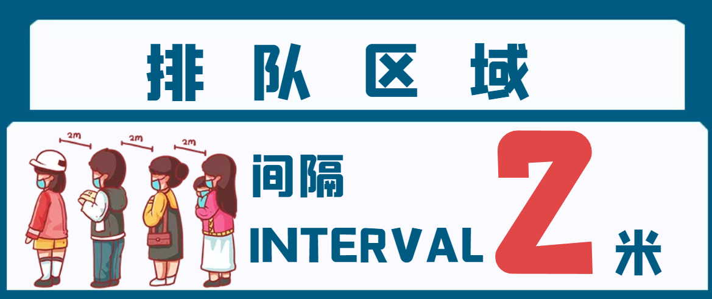


`setInterval`函数的用法与`setTimeout`完全一致，区别仅仅在于`setInterval`指定某个任务每隔一段时间就执行一次，也就是无限次的定时执行

```js
var timer = setInterval(function() {
  console.log(2);
}, 1000)
```


通过setInterval方法实现网页动画

```html
<!DOCTYPE html>
<html lang="en">
<head>
	<meta charset="UTF-8">
	<meta name="viewport" content="width=device-width, initial-scale=1.0">
	<title>Document</title>
	<style>
		#someDiv{
			width: 100px;
			height: 100px;
			background: red;
		}
	</style>
</head>
<body>
	<div id="someDiv"></div>
	<script>
		var div = document.getElementById('someDiv');
		var opacity = 1;
		var fader = setInterval(function() {
		  opacity -= 0.05;
		  if (opacity > 0) {
		    div.style.opacity = opacity;
		  } else {
		    clearInterval(fader);
		  }
		}, 30);

	</script>
</body>
</html>
```


定时器可以进行取消

```js
var id = setInterval(f, 1000);
clearInterval(id);
```


**实时效果反馈**

**1. 以下是关于定时器`setInterval`代码，每秒打印当前时间，横线处填写代码是：**

```js
___(function(){
    console.log(new Date().toLocaleTimeString());
},1000)
```

<font style="background-color:rgb(233, 30, 100)">A</font>   getTime

<font style="background-color:rgb(255, 197, 10)">B</font>   setTimeout

<font style="background-color:#8bc34a">C</font>   setInterval

<font style="background-color:rgb(2, 170, 244);">D</font>   function


**答案**

1=>C  


## 防抖(debounce)


防抖严格算起来应该属于性能优化的知识，但实际上遇到的频率相当高，处理不当或者放任不管就容易引起浏览器卡死。

从滚动条监听的例子说起

```js
function showTop  () {
    var scrollTop = document.documentElement.scrollTop;
    console.log('滚动条位置：' + scrollTop);
}
window.onscroll  = showTop
```

在运行的时候会发现存在一个问题：这个函数的默认执行频率，太！高！了！。 高到什么程度呢？以chrome为例，我们可以点击选中一个页面的滚动条，然后点击一次键盘的【向下方向键】，会发现函数执行了8-9次！


然而实际上我们并不需要如此高频的反馈，毕竟浏览器的性能是有限的，不应该浪费在这里，所以接着讨论如何优化这种场景。

基于上述场景，首先提出第一种思路：在第一次触发事件时，不立即执行函数，而是给出一个期限值比如200ms，然后

1. 如果在200ms内没有再次触发滚动事件，那么就执行函数
2. 如果在200ms内再次触发滚动事件，那么当前的计时取消，重新开始计时

效果：如果短时间内大量触发同一事件，只会执行一次函数


实现：既然前面都提到了计时，那实现的关键就在于setTimeout这个函数，由于还需要一个变量来保存计时，考虑维护全局纯净，可以借助闭包来实现

```js
function debounce(fn,delay){
    let timer = null //借助闭包
    return function() {
        if(timer){
            clearTimeout(timer) 
        }
        timer = setTimeout(fn,delay) // 简化写法
    }
}
// 然后是旧代码
function showTop  () {
    var scrollTop = document.documentElement.scrollTop;
    console.log('滚动条位置：' + scrollTop);
}
window.onscroll = debounce(showTop,300)
```


到这里，已经把防抖实现了

> **防抖定义**
>
> 对于短时间内连续触发的事件（上面的滚动事件），防抖的含义就是让某个时间期限（如上面的1000毫秒）内，事件处理函数只执行一次


**实时效果反馈**

**1. 以下是关于定时器防抖代码，横线处填写代码是：**

```js
function debounce(fn,delay){
    let timer = null 
    return function() {
        if(timer){
            _2_(timer) 
        }
        timer = _1_(fn,delay) 
    }
}
function showTop  () {
    var scrollTop = document.documentElement.scrollTop;
    console.log('滚动条位置：' + scrollTop);
}
window.onscroll = debounce(showTop,300)
```

<font style="background-color:rgb(233, 30, 100)">A</font>   setTimeout   clearInterval

<font style="background-color:rgb(255, 197, 10)">B</font>   setTimeout   clearTimeout

<font style="background-color:#8bc34a">C</font>   setInterval    clearTimeout

<font style="background-color:rgb(2, 170, 244);">D</font>   setInterval    clearInterval


**答案**

1=>B  


## 节流(throttle)


节流严格算起来应该属于性能优化的知识，但实际上遇到的频率相当高，处理不当或者放任不管就容易引起浏览器卡死


继续思考，使用上面的防抖方案来处理问题的结果是

如果在限定时间段内，不断触发滚动事件（比如某个用户闲着无聊，按住滚动不断的拖来拖去），只要不停止触发，理论上就永远不会输出当前距离顶部的距离

但是如果产品同学的期望处理方案是：即使用户不断拖动滚动条，也能在某个时间间隔之后给出反馈呢？

其实很简单：我们可以设计一种类似控制阀门一样定期开放的函数，也就是让函数执行一次后，在某个时间段内暂时失效，过了这段时间后再重新激活（类似于技能冷却时间）

效果：如果短时间内大量触发同一事件，那么在函数执行一次之后，该函数在指定的时间期限内不再工作，直至过了这段时间才重新生效


**实现**

这里借助setTimeout来做一个简单的实现，加上一个状态位valid来表示当前函数是否处于工作状态

```js
function throttle(fn,delay){
    let valid = true
    return function() {
       if(!valid){
           //休息时间 暂不接客
           return false 
       }
       // 工作时间，执行函数并且在间隔期内把状态位设为无效
        valid = false
        setTimeout(function(){
            fn()
            valid = true;
        }, delay)
    }
}

function showTop  () {
    var scrollTop = document.documentElement.scrollTop;
    console.log('滚动条位置：' + scrollTop);
}
window.onscroll = throttle(showTop,300) 
```


如果一直拖着滚动条进行滚动，那么会以300ms的时间间隔，持续输出当前位置和顶部的距离

讲完了这两个技巧，下面介绍一下平时开发中常遇到的场景:

1. 搜索框input事件，例如要支持输入实时搜索可以使用节流方案（间隔一段时间就必须查询相关内容），或者实现输入间隔大于某个值（如500ms），就当做用户输入完成，然后开始搜索，具体使用哪种方案要看业务需求
2. 页面resize事件，常见于需要做页面适配的时候。需要根据最终呈现的页面情况进行dom渲染（这种情形一般是使用防抖，因为只需要判断最后一次的变化情况）


**实时效果反馈**

**1. 以下是关于定时器节流代码，横线处填写代码是：**

```js
function throttle(fn,delay){
    let valid = true
    return function() {
       if(_1_){
           return false 
       }
        valid = false
        _2_(function(){
            fn()
            valid = true;
        }, delay)
    }
}
```

<font style="background-color:rgb(233, 30, 100)">A</font>   valid  setTimeout

<font style="background-color:rgb(255, 197, 10)">B</font>   valid  setInterval

<font style="background-color:#8bc34a">C</font>   !valid   setTimeout

<font style="background-color:rgb(2, 170, 244);">D</font>   !valid  setInterval

**答案**

1=>C  


# ES6


## 命令行工具


在正式讲解ES6新特性之前，我们需要了解一些命令行工具，在日后的课程中，我们会经常用到命令行


常用命令行工具有两种

1. `CMD` 命令行工具
2. `PowerShell` 命令行工具


### CMD命令行

1. 打开命令行窗口
   1. win：左下角开始，找到运行，点击，输入`cmd`，回车
   2. win：`win+r` 快速打开命令行窗口
   3. mac：command + 空格，输入`terminal`
2. 选择盘符：盘符名加冒号`E:`
3. 查看盘符及目录下文件与文件夹：`win:dir   mac:ls`
4. 清空命令行信息：`win:cls  mac:clear`
5. 进入文件夹或目录：`cd  文件夹名称`
6. 返回到上一级目录：`cd ../`
7. 快速补全目录或文件夹名称：`tab`
8. 创建文件夹：`mkdir 文件夹名称`
9. 查看历史输入过的命令：上下按键


### PowerShell

1. 打开方式
   1. 在开始位置搜索`PowerShell`打开
   2. 在对应目录按住`shift`+右键，打开
2. 其他保持一直


**实时效果反馈**

**1. 如何快速打开`CMD`命令行工具：**

<font style="background-color:rgb(233, 30, 100)">A</font>   `win+R`

<font style="background-color:rgb(255, 197, 10)">B</font>   `win+E`

<font style="background-color:#8bc34a">C</font>   `win+P`

<font style="background-color:rgb(2, 170, 244);">D</font>   `win+L`


**2. `CMD`命令行中进入文件夹或目录：**

<font style="background-color:rgb(233, 30, 100)">A</font>   `win+R`

<font style="background-color:rgb(255, 197, 10)">B</font>   `mkdir 文件夹名称`

<font style="background-color:#8bc34a">C</font>   `cd ../`

<font style="background-color:rgb(2, 170, 244);">D</font>   `cd  文件夹名称`


**答案**

1=>A    2=>D


## ECMAScript 6 简介


### ECMAScript 和 JavaScript 的关系

ECMAScript 和 JavaScript 的关系是，前者是后者的规格，后者是前者的一种实现，常场合，这两个词是可以互换的。


### 名称详解

ECMAScript 6（以下简称 ES6）是 JavaScript 语言的标准，在 2015 年 6 月发布。它的目标，是使得 JavaScript 语言可以用来编写复杂的大型应用程序，成为企业级开发语言。

| 版本    | 官方名称                            | **发布日期** |
| ------- | ----------------------------------- | ------------ |
| ES1     | ECMAScript 1                        | 1997         |
| ES2     | ECMAScript 2                        | 1998         |
| ES3     | ECMAScript 3                        | 1999         |
| ES4     | ECMAScript 4                        | 从未发布过   |
| ES5     | ECMAScript 5                        | 2009         |
| ES5.1   | ECMAScript 5.1                      | 2011         |
| **ES6** | **ECMAScript 2015（ECMAScript 6）** | **2015**     |
| ES7     | ECMAScript 2016                     | 2016         |
| ES8     | ECMAScript 2017                     | 2017         |
| ...     | ...                                 | ...          |

因此，ES6 既是一个历史名词，也是一个泛指，含义是 5.1 版以后的 JavaScript 的下一代标准，涵盖了 ES2015、ES2016、ES2017 等等


### 语法提案的批准流程

任何人都可以向标准委员会（又称 TC39 委员会）提案，要求修改语言标准。

一种新的语法从提案到变成正式标准，需要经历五个阶段。每个阶段的变动都需要由 TC39 委员会批准。

- Stage 0 - Strawman（展示阶段）
- Stage 1 - Proposal（征求意见阶段）
- Stage 2 - Draft（草案阶段）
- Stage 3 - Candidate（候选人阶段）
- Stage 4 - Finished（定案阶段）

一个提案只要能进入 Stage 2，就差不多肯定会包括在以后的正式标准里面。ECMAScript 当前的所有提案，可以在 TC39 的官方网站[GitHub.com/tc39/ecma262](https://github.com/tc39/ecma262)查看。


### ES6带来的新特性

1. `let` 和 `const` 命令
2. 变量的解构赋值
3. 字符串扩展
4. 函数扩展
5. 对象扩展
6. 数组扩展
7. 运算符扩展
8. Promise对象
9. Class
10. Class 继承
11. ...


## Nodejs环境安装


本节课为前置课程，在接下来的ES6课程中，我们需要先安装Nodejs环境


### Nodejs简介

Nodejs诞生于2009年，主攻服务器方向，使得利用`JavaScript`也可以完成服务器代码的编写


### Nodejs安装

> **Nodejs官网**
>
> https://nodejs.org/en/

Nodejs的安装与一般软件一样


### 大量的库

在安装`Nodejs`的同时，会附带一个`npm`命令，`npm` 是Node的包管理工具，这样正是接下来我们要用到的

npm 的简单结构有助于 Node.js 生态系统的激增，现在 npm 仓库托管了超过 1,000,000 个可以自由使用的开源库包


### `npm`镜像

由于服务器在国外，所以下载速度比较慢，我们可以用国内的镜像

> **阿里镜像地址**
>
> https://npmmirror.com/

在命令行运行如下命令即可

```bash
npm install -g cnpm --registry=https://registry.npmmirror.com
```

看到如下信息，代表安装成功


## Babel转码器


Babel 是一个广泛使用的 ES6 转码器，可以将 ES6 代码转为 ES5 代码，从而在老版本的浏览器执行。这意味着，你可以用 ES6 的方式编写程序，又不用担心现有环境是否支持

> **浏览器支持性查看**
>
> https://caniuse.com/
>
> **Babel官网**
>
> https://babeljs.io/


### 转码示例

原始代码用了箭头函数，Babel 将其转为普通函数，就能在不支持箭头函数的 JavaScript 环境执行了

```js
// 转码前
input.map(item => item + 1);

// 转码后
input.map(function (item) {
  return item + 1;
});
```


### Babel安装流程

#### 第一步：安装 Babel

```js
npm install --save-dev @babel/core
```


#### 第二步：配置文件`.babelrc`

Babel 的配置文件是.babelrc，存放在项目的根目录下。使用 Babel 的第一步，就是配置这个文件。

该文件用来设置转码规则和插件，基本格式如下

```js
{
  "presets": [],
  "plugins": []
}
```


#### 第三步：转码规则

presets字段设定转码规则，官方提供以下的规则集，你可以根据需要安装

```js
npm install --save-dev @babel/preset-env
```


#### 第四步：将规则加入`.babelrc`

```js
{
    "presets": [
      "@babel/env"
    ],
    "plugins": []
}
```


### Babel命令行转码

Babel 提供命令行工具`@babel/cli`，用于命令行转码

```js
npm install --save-dev @babel/cli
```

基本用法如下

```js
# 转码结果输出到标准输出
$ npx babel example.js

# 转码结果写入一个文件
# --out-file 或 -o 参数指定输出文件
$ npx babel example.js --out-file compiled.js
# 或者
$ npx babel example.js -o compiled.js

# 整个目录转码
# --out-dir 或 -d 参数指定输出目录
$ npx babel src --out-dir lib
# 或者
$ npx babel src -d lib
```


**实时效果反馈**

**1. Babel的作用是什么：**

<font style="background-color:rgb(233, 30, 100)">A</font>   Babel是ES6的一部分，是ES6的新特性

<font style="background-color:rgb(255, 197, 10)">B</font>   Babel是ES6的转码器，可以将 ES6 代码转为 ES5 代码

<font style="background-color:#8bc34a">C</font>   Babel是配置文件，配置ES6环境

<font style="background-color:rgb(2, 170, 244);">D</font>   Babel是ES5的基础知识


**2. 下列哪个是安装Babel命令转码工具：**

<font style="background-color:rgb(233, 30, 100)">A</font>   `npm install --save-dev @babel/core`

<font style="background-color:rgb(255, 197, 10)">B</font>   `npm install --save-dev @babel/preset-env`

<font style="background-color:#8bc34a">C</font>   `npm install --save-dev @babel/cli`

<font style="background-color:rgb(2, 170, 244);">D</font>   `npx babel example.js`


**答案**

1=>B     2=>C


##  Let 命令


`ES6 `新增了`let`命令，用来声明变量。它的用法类似于`var`，但是所声明的变量，只在`let`命令所在的代码块内有效。


### let块级作用域

```js
{
  let itbaizhan = 10;
  var sxt = 1;
}

itbaizhan // ReferenceError: itbaizhan is not defined.
sxt // 1
```


`for`循环的计数器，就很合适使用`let`命令

```js
for (let i = 0; i < 10; i++) {
  // ...
}

console.log(i);
// ReferenceError: i is not defined
```


对比`var`和`let`在循环中的应用

```js
var a = [];
for (var i = 0; i < 10; i++) {
  a[i] = function () {
    console.log(i);
  };
}
a[6](); // 10
```

上面代码，输出的`10`,而我们期待的是`6`

```js
var a = [];
for (let i = 0; i < 10; i++) {
  a[i] = function () {
    console.log(i);
  };
}
a[6](); // 6
```

上面代码，输出的`6`


### let不存在变量提升

`var`命令会发生“变量提升”现象，即变量可以在声明之前使用，值为`undefined`。这种现象多多少少是有些奇怪的，按照一般的逻辑，变量应该在声明语句之后才可以使用

为了纠正这种现象，`let`命令改变了语法行为，它所声明的变量一定要在声明后使用，否则报错。

```js
// var 的情况
console.log(foo); // 输出undefined
var foo = 2;

// let 的情况
console.log(bar); // 报错ReferenceError
let bar = 2;
```


### let不允许重复声明

`let`不允许在相同作用域内，重复声明同一个变量。

```js
// 报错
function func() {
  let a = 10;
  var a = 1;
}

// 报错
function func() {
  let a = 10;
  let a = 1;
}
```


**实时效果反馈**

**1. 下列那个不是Let的特性：**

<font style="background-color:rgb(233, 30, 100)">A</font>   Let是块级作用域

<font style="background-color:rgb(255, 197, 10)">B</font>   Let不存在变量提升

<font style="background-color:#8bc34a">C</font>   Let不允许重复声明

<font style="background-color:rgb(2, 170, 244);">D</font>   Let和Var一样并没有区别


**答案**

1=>D


## Const 命令


`const`声明一个只读的常量。一旦声明，常量的值就不能改变

```js
const PI = 3.1415;
PI // 3.1415

PI = 3;
// TypeError: Assignment to constant variable.
```


`const`声明的变量不得改变值，这意味着，`const`一旦声明变量，就必须立即初始化，不能留到以后赋值

```js
const foo;
// SyntaxError: Missing initializer in const declaration
```


`const`的作用域与let命令相同：只在声明所在的块级作用域内有效

```js
if (true) {
  const MAX = 5;
}

MAX // Uncaught ReferenceError: MAX is not defined
```


`const`命令声明的常量也是不存在提升

```js
if (true) {
  console.log(MAX); // ReferenceError
  const MAX = 5;
}
```


`const`声明的常量，也与`let`一样不可重复声明

```js
var message = "Hello!";
let age = 25;

// 以下两行都会报错
const message = "Goodbye!";
const age = 30;
```


**实时效果反馈**

**1. 下列`const`特性描述错误的是：**

<font style="background-color:rgb(233, 30, 100)">A</font>   `const`命令声明的常量不提升

<font style="background-color:rgb(255, 197, 10)">B</font>   `const`命令不可重复声明

<font style="background-color:#8bc34a">C</font>   `const`命令是块级作用域

<font style="background-color:rgb(2, 170, 244);">D</font>   `const`命令声明可以改变


**答案**

1=>D


## 对象解构赋值


解构可以用于对象

```js
let {name,age} = {name:"iwen",age:20};
```

> **温馨提示**
>
> 对象的属性没有次序，变量必须与属性同名，才能取到正确的值

```js
let {age,name} = {name:"iwen",age:20};
age // 20
```

```js
let {sex,age,name} = {name:"iwen",age:20};
sex // undefined
```

对象的解构赋值，可以很方便地将现有对象的方法，赋值到某个变量

```js
let { random,floor } = Math;
let { log } = console;
```

注意事项，如果要将一个已经声明的变量用于解构赋值，必须非常小心

```js
let hello = "Hello";
let { hello } = {hello:"hello"}; // 报错

let hello = "Hello";
({ hello } = {hello:"hello"}); // 正确
```


**实时效果反馈**

**1. 下列对象解构赋值的代码，输出结果是多少：**

```js
let hello = "Hello";
let { hello } = {hello:"hello"}; 
console.log(hello);
```

<font style="background-color:rgb(233, 30, 100)">A</font>   `hello`

<font style="background-color:rgb(255, 197, 10)">B</font>   `Hello`

<font style="background-color:#8bc34a">C</font>   报错

<font style="background-color:rgb(2, 170, 244);">D</font>   `undefined`


**答案**

1=>C


## 字符串扩展


### 字符串Unicode 表示法

ES6 加强了对 Unicode 的支持，允许采用`\uxxxx`形式表示一个字符，其中`xxxx`表示字符的 Unicode 码点。


#### Unicode

统一码（Unicode），也叫万国码、单一码，是计算机科学领域里的一项业界标准，包括字符集、编码方案等。Unicode是为了解决传统的字符编码方案的局限而产生的，它为每种语言中的每个字符设定了统一并且唯一的二进制编码，以满足跨语言、跨平台进行文本转换、处理的要求。

```js
"\u0061"
// "a"
```


### 字符串遍历器接口

`for...of`循环遍历

```js
for (let i of 'itbaizhan') {
  console.log(i);
}
```


### 模板字符串

模板字符串（template string）是增强版的字符串，用反引号（`）标识。它可以当作普通字符串使用，也可以用来定义多行字符串，或者在字符串中嵌入变量。

```js
let url = "www.itbaizhan.com"
let h1 = "<a href='"+ url +"'>itbaizhan</a>"
let h2 = `<a href='${url}'>itbaizhan</a>`
```


**实时效果反馈**

**1. 下列字符串模板，表示正确的是：**

<font style="background-color:rgb(233, 30, 100)">A</font>   ``

<font style="background-color:rgb(255, 197, 10)">B</font>   ``

<font style="background-color:#8bc34a">C</font>   ``

<font style="background-color:rgb(2, 170, 244);">D</font>   ``


**答案**

1=>B


## 字符串新增方法


### includes(), startsWith(), endsWith()

传统上，JavaScript 只有`indexOf`方法，可以用来确定一个字符串是否包含在另一个字符串中。ES6 又提供了三种新方法。

1. **includes()**：返回布尔值，表示是否找到了参数字符串
2. **startsWith()**：返回布尔值，表示参数字符串是否在原字符串的头部
3. **endsWith()**：返回布尔值，表示参数字符串是否在原字符串的尾部

```js
let s = 'Hello world!';

s.startsWith('Hello') // true
s.endsWith('!') // true
s.includes('o') // true
```

这三个方法都支持第二个参数，表示开始搜索的位置

```js
let s = 'Hello world!';

s.startsWith('world', 6) // true
s.endsWith('Hello', 5) // true
s.includes('Hello', 6) // false
```


### repeat()

`repeat`方法返回一个新字符串，表示将原字符串重复`n`次。

```js
'x'.repeat(3) // "xxx"
'hello'.repeat(2) // "hellohello"
'na'.repeat(0) // ""
```


### padStart()，padEnd()

ES2017 引入了字符串补全长度的功能。如果某个字符串不够指定长度，会在头部或尾部补全。`padStart()`用于头部补全，`padEnd()`用于尾部补全。

```js
'x'.padStart(5, 'ab') // 'ababx'
'x'.padStart(4, 'ab') // 'abax'

'x'.padEnd(5, 'ab') // 'xabab'
'x'.padEnd(4, 'ab') // 'xaba'
```


### trimStart()，trimEnd()

ES2019对字符串实例新增了`trimStart()`和`trimEnd()`这两个方法。它们的行为与`trim()`一致，`trimStart()`消除字符串头部的空格，`trimEnd()`消除尾部的空格。它们返回的都是新字符串，不会修改原始字符串。

```js
const s = '  itbaizhan  ';

s.trim() // "itbaizhan"
s.trimStart() // "itbaizhan  "
s.trimEnd() // "  itbaizhan"
```


### at()

`at()`方法接受一个整数作为参数，返回参数指定位置的字符，支持负索引（即倒数的位置）。

```js
const str = 'hello';
str.at(1) // "e"
str.at(-1) // "o"
```

> **温馨提示**
>
> 如果参数位置超出了字符串范围，`at()`返回`undefined`


**实时效果反馈**

**1. 下列字符串方法中，那个可以判断是否包含某个字符串：**

<font style="background-color:rgb(233, 30, 100)">A</font>   `includes()`

<font style="background-color:rgb(255, 197, 10)">B</font>   `repeat()`

<font style="background-color:#8bc34a">C</font>   `padStart()`

<font style="background-color:rgb(2, 170, 244);">D</font>   `at()`


**答案**

1=>A


## 数组扩展_扩展运算符


扩展运算符（spread）是三个点（`...`）。将一个数组转为用逗号分隔的参数序列

```js
console.log(...[1, 2, 3])
// 1 2 3

console.log(1, ...[2, 3, 4], 5)
// 1 2 3 4 5
```


### 替代函数的 apply 方法

由于扩展运算符可以展开数组，所以不再需要`apply`方法，将数组转为函数的参数了

```js
// ES5 的写法
Math.max.apply(null, [14, 3, 77])

// ES6 的写法
Math.max(...[14, 3, 77])

// 等同于
Math.max(14, 3, 77);
```


### 合并数组

扩展运算符提供了数组合并的新写法

```js
const arr1 = ['a', 'b'];
const arr2 = ['c'];
const arr3 = ['d', 'e'];

// ES5 的合并数组
arr1.concat(arr2, arr3);
// [ 'a', 'b', 'c', 'd', 'e' ]

// ES6 的合并数组
[...arr1, ...arr2, ...arr3]
// [ 'a', 'b', 'c', 'd', 'e' ]
```


**实时效果反馈**

**1. 下列代码，获取数组的最大值，划横线处填写的代码是：**

```js
Math.max(___[14, 3, 77])
```

<font style="background-color:rgb(233, 30, 100)">A</font>   `apply`

<font style="background-color:rgb(255, 197, 10)">B</font>   `call`

<font style="background-color:#8bc34a">C</font>   `...`

<font style="background-color:rgb(2, 170, 244);">D</font>   `concat`


**答案**

1=>C


## 数组扩展_新增方法


### Array.from() 

`Array.from`方法用于将类数组转为真正的数组

> **温馨提示**
>
> 常见的类数组有三类：
>
> 1. arguments
> 2. 元素集合
> 3. 类似数组的对象


#### arguments

```js
function add(){
    let collect = Array.from(arguments);
    collect.push(40);
    console.log(collect);
}
add(10,20,30)
```

#### 元素集合

```js
let divs = document.querySelectorAll('div');
console.log(Array.from(divs));
```

#### 类似数组的对象

```js
let arrayLike = {
    '0': 'a',
    '1': 'b',
    '2': 'c',
    length: 3
};
let arr = Array.from(arrayLike);
console.log(arr);
```


### Array.of()

`Array.of()`方法用于将一组值，转换为数组

```js
Array.of(3, 11, 8) // [3,11,8]
```


**实时效果反馈**

**1. 下列代码输出结果是什么：**

```js
Array.of(3)
Array(3)
```

<font style="background-color:rgb(233, 30, 100)">A</font>   `[3]    [3]`

<font style="background-color:rgb(255, 197, 10)">B</font>   `[,,,]   [,,,]`

<font style="background-color:#8bc34a">C</font>   `[,,]   [3]`

<font style="background-color:rgb(2, 170, 244);">D</font>   `[3]   [,,,]`


**答案**

1=>D


## 对象的扩展


### 属性的简洁表示法

ES6 允许在大括号里面，直接写入变量和函数，作为对象的属性和方法。这样的书写更加简洁。

```js
let name = "iwen"
const user = {
    name,
    age:20
}
```

除了属性简写，方法也可以简写

```js
const o = {
  method() {
    return "Hello!";
  }
};

// 等同于

const o = {
  method: function() {
    return "Hello!";
  }
};
```

这种写法用于函数的返回值，将会非常方便

```js
function getPoint() {
  const x = 1;
  const y = 10;
  return {x, y};
}

getPoint() // {x:1, y:10}
```


### 属性名表达式

ES6 允许字面量定义对象时，用表达式作为对象的属性名，即把表达式放在方括号内

```js
let propKey = 'itbaizhan';

let obj = {
  [propKey]: true,
  ['a' + 'bc']: 123
};
```


### 对象的扩展运算符

ES2018 将这个运算符引入了对象

```js
let z = { a: 3, b: 4 };
let n = { ...z };
console.log(n);

{...{}, a: 1}
// { a: 1 }
```


**实时效果反馈**

**1. 下列代码输出结果是什么：**

```js
let propKey = 'itbaizhan';
let obj = {
    [propKey]: true,
    ['a' + 'bc']: 123
};
console.log(obj.propKey);
```

<font style="background-color:rgb(233, 30, 100)">A</font>   `true`

<font style="background-color:rgb(255, 197, 10)">B</font>   报错

<font style="background-color:#8bc34a">C</font>   `undefined`

<font style="background-color:rgb(2, 170, 244);">D</font>   `propKey `


**答案**

1=>C


## 函数的扩展_箭头函数


### 基本用法

ES6 允许使用“箭头”（`=>`）定义函数

```js
var add = (x) => x;

// 等同于
var add = function (x) {
    return x;
};
```

如果箭头函数不需要参数或需要多个参数，就使用一个圆括号代表参数部分

```js
var add = (x,y) => x+y;
// 等同于
var add = function (x,y) {
    return x+y;
};

var add = () => 100;
// 等同于
var add = function () {
    return 100;
};
```

如果箭头函数的代码块部分多于一条语句，就要使用大括号将它们括起来，并且使用`return`语句返回

```js
var add = (x,y) => {
    var z = 10;
    return x+y+z
};

// 等同于
var add = function (x,y) {
    var z = 100
    return x+y+z
};
```

由于大括号被解释为代码块，所以如果箭头函数直接返回一个对象，必须在对象外面加上括号，否则会报错。

```js
var add = (x,y) => ({x:10,y:20});
```

箭头函数的一个用处是简化回调函数（匿名函数）

```js
var arr = [10,20,30]
arr.map(item =>{
    console.log(item);
})
```


### 使用注意点

对于普通函数来说，内部的`this`指向函数运行时所在的对象，但是这一点对箭头函数不成立。它没有自己的`this`对象，内部的`this`就是定义时上层作用域中的`this`

```js
var name = "itbaizhan"
var user = {
    name:"iwen",
    getName(){
        setTimeout(() =>{
            console.log(this.name); // iwen
        })
    }
}
user.getName()
```

> **温馨提示**
>
> 箭头函数里面根本没有自己的`this`，而是引用外层的`this`


**实时效果反馈**

**1. 下列代码运行结果是多少：**

```js
var name = "itbaizhan"
var user = {
    name:"iwen",
    getName(){
        setTimeout(() =>{
            console.log(this.name);
        })
    }
}
user.getName()
```

<font style="background-color:rgb(233, 30, 100)">A</font>   itbaizhan

<font style="background-color:rgb(255, 197, 10)">B</font>   iwen

<font style="background-color:#8bc34a">C</font>   null

<font style="background-color:rgb(2, 170, 244);">D</font>   报错


**答案**

1=>B


## Set 数据结构


### 基本用法

ES6 提供了新的数据结构 Set。它类似于数组，但是成员的值都是唯一的，没有重复的值。

`Set`本身是一个构造函数，用来生成 Set 数据结构。

```js
const s = new Set();

[2, 3, 5, 4, 5, 2, 2].forEach(x => s.add(x));

for (let i of s) {
  console.log(i);
}
// 2 3 5 4
```

通过`add()`方法向 Set 结构加入成员，结果表明 Set 结构不会添加重复的值。


`Set`函数可以接受一个数组作为参数

```js
const set = new Set([1, 2, 3, 4, 4]);
[...set]
// [1, 2, 3, 4]
```


数组去除重复成员的方法

```js
// 去除数组的重复成员
[...new Set(array)]
```


字符串去除重复字符

```js
[...new Set('ababbc')].join('')
// "abc"
```


向 Set 加入值的时候，不会发生类型转换，所以`5`和`"5"`是两个不同的值。

```js
var mySet = new Set();
mySet.add("5")
mySet.add(5)
console.log(mySet); // Set(2) {'5', 5}
```


### size属性

返回`Set`实例的成员总数

```js
const items = new Set([1, 2, 3, 4, 5, 5, 5, 5]);
items.size // 5
```


**实时效果反馈**

**1. 下列代码输出结果是多少：**

```js
var mySet = new Set();
mySet.add("5")
mySet.add(5)
mySet.add(5)
console.log(mySet); 
```

<font style="background-color:rgb(233, 30, 100)">A</font>   `"5" 5 5`

<font style="background-color:rgb(255, 197, 10)">B</font>   `"5" 5`

<font style="background-color:#8bc34a">C</font>   `"5"`

<font style="background-color:rgb(2, 170, 244);">D</font>   `null`


**答案**

1=>B


## Set 数据结构方法


### add() 

`set` 添加方法

```js
var mySet = new Set();
mySet.add("5")
console.log(mySet); 
```


### delete() 

删除某个值，返回一个布尔值，表示删除是否

```js
var mySet = new Set();
mySet.add("5")
var flag = mySet.delete("5");
console.log(flag);  // true
```


### has() 

返回一个布尔值，表示该值是否为`Set`的成员

```js
var mySet = new Set();
mySet.add("5")
var flag = mySet.has("5");
console.log(flag);  // true
```


### clear()

清除所有成员，没有返回值

```js
var mySet = new Set();
mySet.add("5")
mySet.clear();
console.log(mySet);  // Set(0) {size: 0}
```


**实时效果反馈**

**1. 下列那个方法可以清空`Set`数据结构中所有的数据：**

<font style="background-color:rgb(233, 30, 100)">A</font>   `add()`

<font style="background-color:rgb(255, 197, 10)">B</font>   `delete()`

<font style="background-color:#8bc34a">C</font>   `has()`

<font style="background-color:rgb(2, 170, 244);">D</font>   `clear()`


**答案**

1=>D


## Promise 对象


### 基本概念

Promise 是异步编程的一种解决方案，比传统的解决方案——回调函数和事件——更合理和更强大。它由社区最早提出和实现，ES6 将其写进了语言标准，统一了用法，原生提供了`Promise`对象

所谓`Promise`，简单说就是一个容器，里面保存着某个未来才会结束的事件（通常是一个异步操作）的结果。从语法上说，Promise 是一个对象，从它可以获取异步操作的消息。Promise 提供统一的 API，各种异步操作都可以用同样的方法进行处理

有了`Promise`对象，就可以将异步操作以同步操作的流程表达出来，避免了层层嵌套的回调函数。此外，`Promise`对象提供统一的接口，使得控制异步操作更加容易


### 基本用法

ES6 规定，`Promise`对象是一个构造函数，用来生成`Promise`实例

```js
const promise = new Promise(function(resolve, reject) {
  // ... some code

  if (/* 异步操作成功 */){
    resolve(value);
  } else {
    reject(error);
  }
});
```

`Promise`构造函数接受一个函数作为参数，该函数的两个参数分别是`resolve`和`reject`。它们是两个函数，由 JavaScript 引擎提供，不用自己部署

`Promise`实例生成以后，可以用`then`方法分别指定`resolved`状态和`rejected`状态的回调函数。

```js
promise.then(function(value) {
  // success
}, function(error) {
  // failure
});
```


### 加载图片资源例子

```html
<!DOCTYPE html>
<html lang="en">
<head>
    <meta charset="UTF-8">
    <meta http-equiv="X-UA-Compatible" content="IE=edge">
    <meta name="viewport" content="width=device-width, initial-scale=1.0">
    <title>Document</title>
</head>
<body>
    <div></div>
    <script>
        function loadImageAsync(url) {
            var promise = new Promise(function (resolve, reject) {
                const image = new Image();
                image.onload = function () {
                    resolve(image);
                };
                image.onerror = function () {
                    reject(new Error('Could not load image at ' + url));
                };
                image.src = url;
            });
            return promise;
        }
        loadImageAsync("http://iwenwiki.com/api/vue-data/vue-data-1.png")
        .then(function(data){
            console.log(data);
            $("div").append(data)
        },function(error){
            $("div").html(error)
        })
    </script>
</body>
</html>
```


**实时效果反馈**

**1. `Promise`的作用是什么，下列描述正确的是：**

<font style="background-color:rgb(233, 30, 100)">A</font>   `Promise` 是异步编程的一种解决方案，可以将异步操作以同步操作的流程表达出来

<font style="background-color:rgb(255, 197, 10)">B</font>   `Promise`是同步编程的一种解决方案，可以将同步操作以异步操作的流程表达出来

<font style="background-color:#8bc34a">C</font>   `Promise`使得控制同步操作更加容易

<font style="background-color:rgb(2, 170, 244);">D</font>   `Promise`还不是ES6的标准，目前是社区版本


**答案**

1=>A


## Promise对象_Ajax实操


Promise封装Ajax，让网络请求的异步操作变得更简单

```html
<!DOCTYPE html>
<html lang="en">
<head>
    <meta charset="UTF-8">
    <meta http-equiv="X-UA-Compatible" content="IE=edge">
    <meta name="viewport" content="width=device-width, initial-scale=1.0">
    <title>Document</title>
</head>
<body>
    <script>
        const getJSON = function (url) {
            const promise = new Promise(function (resolve, reject) {
                const handler = function () {
                    if (this.readyState !== 4) {
                        return;
                    }
                    if (this.status === 200) {
                        resolve(this.response);
                    } else {
                        reject(new Error(this.statusText));
                    }
                };
                const client = new XMLHttpRequest();
                client.open("GET", url);
                client.onreadystatechange = handler;
                client.responseType = "json";
                client.setRequestHeader("Accept", "application/json");
                client.send();
            });
            return promise;
        };
        		getJSON("http://iwenwiki.com/api/blueberrypai/getIndexBanner.php").then(function (json) {
            console.log(json);
        }, function (error) {
            console.error('出错了', error);
        });
    </script>
</body>
</html>
```


## Async 函数


ES2017 标准引入了 async 函数，使得异步操作变得更加方便

async函数可以将异步操作变为同步操作


### 示例代码

```js
function print(){
    setTimeout(() =>{
        console.log("定时器");
    },1000)
    console.log("Hello");
}

print()
```

### 基本语法

```js
function timeout(ms) {
  return new Promise((resolve) => {
    setTimeout(resolve, ms);
  });
}

async function asyncPrint(value, ms) {
  await timeout(ms);
  console.log(value);
}

asyncPrint('hello world', 50);
```


### 异步应用

```js
function ajax(url){
    return new Promise(function(resolve,reject){
        $.getJSON(url,function(result){
            resolve(result)
        },function(error){
            reject(error) 
        })
    })
}

async function getInfo(){
    let ids = await ajax("http://iwenwiki.com/api/generator/list.php")
    let names = await ajax("http://iwenwiki.com/api/generator/id.php?id="+ids[0])
    let infos = await ajax("http://iwenwiki.com/api/generator/name.php?name=" + names.name)
    console.log(infos);
}

getInfo();
```


**实时效果反馈**

**1. `Async` 是什么：**

<font style="background-color:rgb(233, 30, 100)">A</font>   Async是完成网络请求，如Ajax一样

<font style="background-color:rgb(255, 197, 10)">B</font>   Async的作用是完成异步网络请求，如Ajax一样

<font style="background-color:#8bc34a">C</font>   Async使得异步操作变得更加方便

<font style="background-color:rgb(2, 170, 244);">D</font>   Async是新的网络请求解决方案


**答案**

1=>C


## Class 的基本语法


### 类的由来

JavaScript 语言中，生成实例对象的传统方法是通过构造函数

```js
function Point(x, y) {
  this.x = x;
  this.y = y;
}

Point.prototype.toString = function () {
  return '(' + this.x + ', ' + this.y + ')';
};

var p = new Point(1, 2);
```


ES6 提供了更接近传统语言的写法，引入了 Class（类）这个概念，作为对象的模板。通过`class`关键字，可以定义类

基本上，ES6 的`class`可以看作只是一个语法糖，它的绝大部分功能，ES5 都可以做到，新的`class`写法只是让对象原型的写法更加清晰、更像面向对象编程的语法而已

```js
class Point {
  constructor(x, y) {
    this.x = x;
    this.y = y;
  }

  toString() {
    return '(' + this.x + ', ' + this.y + ')';
  }
}
```


### constructor 方法

`constructor()`方法是类的默认方法，通过`new`命令生成对象实例时，自动调用该方法。一个类必须有`constructor()`方法，如果没有显式定义，一个空的`constructor()`方法会被默认添加

```js
class Point {
}

// 等同于
class Point {
  constructor() {}
}
```


### 类的实例 

生成类的实例的写法，与 ES5 完全一样，也是使用`new`命令

```js
class Point {
  // ...
}

// 报错
var point = Point(2, 3);

// 正确
var point = new Point(2, 3);
```


### 注意点


#### 不存在提升

类不存在变量提升（hoist），这一点与 ES5 完全不同

```js
new Foo(); // ReferenceError
class Foo {}
```


**实时效果反馈**

**1. 下列代码，划横线处要填写的代码时：**

```js
class Person {
    constructor(name) {
        this.name = name;
    }
}

var p = ___ Person("sxt")
```

<font style="background-color:rgb(233, 30, 100)">A</font>   `""`

<font style="background-color:rgb(255, 197, 10)">B</font>   `new`

<font style="background-color:#8bc34a">C</font>   `this`

<font style="background-color:rgb(2, 170, 244);">D</font>   `class`


**答案**

1=>B


## Class属性与方法


### 实例方法

通过类的实例对象调用方法

```js
class People{
    say(){
        console.log("Hello");
    }
}
var p = new People();
p.say()
```


### 实例属性

实例属性指的是类的实例对象可调用的属性

```js
class People{
    constructor(name,age){
        this.name = name;
        this.age = age;
    }
    say(){
        console.log(this.name,this.age);
    }
}
var p = new People("iwen",20);
p.say()
console.log(p.name,p.age);
```


### 静态方法

类相当于实例的原型，所有在类中定义的方法，都会被实例继承。如果在一个方法前，加上`static`关键字，就表示该方法不会被实例继承，而是直接通过类来调用，这就称为“静态方法”

```js
class Person {
    static classMethod() {
        console.log("Hello");
    }
}

Person.classMethod() // Hello

var p = new Person();
p.classMethod() // p.classMethod is not a function
```


> **温馨提示**
>
> 注意，如果静态方法包含`this`关键字，这个`this`指的是类，而不是实例。

```js
class People {
    static getSay() {
        this.say();
    }
    static say() {
        console.log('hello');
    }
    say() {
        console.log('world');
    }
}
People.getSay() // hello
```


### 静态属性

静态属性指的是 Class 本身的属性，即`Class.propName`

```js
class People{}
People.status = "等待"
console.log(People.status);
```


**实时效果反馈**

**1. 下列代码，运行结果是什么：**

```js
class People {
    static getSay() {
        this.say();
    }
    static say() {
        console.log('hello');
    }
    say() {
        console.log('world');
    }
}
People.getSay()
```

<font style="background-color:rgb(233, 30, 100)">A</font>   `hello`

<font style="background-color:rgb(255, 197, 10)">B</font>   `world`

<font style="background-color:#8bc34a">C</font>   `null`

<font style="background-color:rgb(2, 170, 244);">D</font>   `undefined`


**答案**

1=>A


## Class 的继承


### 基础用法

Class 可以通过`extends`关键字实现继承，让子类继承父类的属性和方法。extends 的写法比 ES5 的原型链继承，要清晰和方便很多

```js
class Point {
}

class ColorPoint extends Point {
}
```


ES6 规定，子类必须在`constructor()`方法中调用`super()`，否则就会报错，这是因为子类自己的`this`对象，必须先通过父类的构造函数完成塑造，得到与父类同样的实例属性和方法，然后再对其进行加工，添加子类自己的实例属性和方法。如果不调用`super()`方法，子类就得不到自己的`this`对象

```js
class Point {
    constructor(x,y){
        this.x = x;
        this.y = y;
    }
    getPoint(){
        console.log(this.x,this.y);
    }
}
class ColorPoint extends Point {
    constructor(x,y,z){
        super(x,y)
        this.z = z;
    }
}
let cp = new ColorPoint(10,20,30)
cp.getPoint();
```


## Module 的语法


历史上，JavaScript 一直没有模块（module）体系，无法将一个大程序拆分成互相依赖的小文件，再用简单的方法拼装起来。其他语言都有这项功能，比如 Ruby 的`require`、Python 的`import`，甚至就连 CSS 都有`@import`，但是 JavaScript 任何这方面的支持都没有，这对开发大型的、复杂的项目形成了巨大障碍


ES6 模块是通过`export`命令显式指定输出的代码，再通过`import`命令输入。

```js
export var Hello = "hello" // hello.js文件
import { Hello } from "./hello.js" // index.js文件
```


### 测试方式

我们采用Nodejs方式进行测试Module语法

但是nodejs采用的是CommonJS的模块化规范，使用require引入模块；而import是ES6的模块化规范关键字。想要使用import，必须引入babel转义支持，通过babel进行编译，使其变成node的模块化代码。

**疑惑：**为啥不用前端方式测试，前端方式测试会更加麻烦

第一步：全局安装babel-cli `npm install  -g babel-cli`

第二步：安装 babel-preset-env `npm install -D babel-preset-env`

第三步：运行代码 `babel-node --presets env index.js`


### export 命令

export命令导出变量

```javascript
export var firstName = 'sxt';
export var lastName = 'itbaizhan';
export var year = 2000;
```


export命令导出函数

```js
export function add(x, y) {
  return x + y;
};
```


### import 命令

使用`export`命令定义了模块的对外接口以后，其他 JS 文件就可以通过`import`命令加载这个模块

```js
// name.js
export var firstName = 'sxt';
export var lastName = 'itbaizhan';
export var year = 2000;

// main.js
import { firstName, lastName, year } from './profile.js';
```

如果想为输入的变量重新取一个名字，`import`命令要使用`as`关键字，将输入的变量重命名

```js
// value.js
export var value = 1;

// main.js
import { value as val } from './value.js';
```

除了指定加载某个输出值，还可以使用整体加载，即用星号（`*`）指定一个对象，所有输出值都加载在这个对象上面

```js
// circle.js
export function area(radius) {
  return Math.PI * radius * radius;
}
export function circumference(radius) {
  return 2 * Math.PI * radius;
}


// main.js
import { area, circumference } from './circle';
// 可以修改如下
import * as circle from './circle';
```


### export default 命令

从前面的例子可以看出，使用`import`命令的时候，用户需要知道所要加载的变量名或函数名，否则无法加载。但是，用户肯定希望快速上手，未必愿意阅读文档，去了解模块有哪些属性和方法

为了给用户提供方便，让他们不用阅读文档就能加载模块，就要用到`export default`命令，为模块指定默认输出。

```js
// export-default.js
export default function () {
  console.log('foo');
}
```

其他模块加载该模块时，`import`命令可以为该匿名函数指定任意名字

```js
// import-default.js
import customName from './export-default';
customName(); // 'foo'
```


**实时效果反馈**

**1. 下列那个不属于ES6的Module语法的关键字：**

<font style="background-color:rgb(233, 30, 100)">A</font>   `export`

<font style="background-color:rgb(255, 197, 10)">B</font>   `import`

<font style="background-color:#8bc34a">C</font>   `export default`

<font style="background-color:rgb(2, 170, 244);">D</font>   `require`


**答案**

1=>D


# Vue


## Vue是什么？为什么要学习他


### Vue是什么？

Vue是前端优秀框架， 是一套用于构建用户界面的**渐进式框架**


### 为什么要学习Vue

1. Vue是目前前端最火的框架之一
2. Vue是目前企业技术栈中要求的知识点
3. Vue可以提升开发体验
4. Vue学习难度较低
5. ...


## Vue开发前的准备


### 安装Vue工具 `Vue CLI`

`Vue CLI` Vue.js 开发的标准工具，`Vue CLI ` 是一个基于 Vue.js 进行快速开发的完整系统

```js
npm install -g @vue/cli
```

安装之后，你就可以在命令行中访问 `vue` 命令。你可以通过简单运行 `vue`，看看是否展示出了一份所有可用命令的帮助信息，来验证它是否安装成功。

```js
vue --version
```


### 创建一个项目

运行以下命令来创建一个新项目

```js
vue create vue-demo
```

> **温馨提示**
>
> 在控制台中，可以用上下按键调整选择项
>
> 在控制台中，可以用空格(spacebar)选择是否选中和取消选中

可以选择默认项目模板，或者选“手动选择特性”来选取需要的特性。


我们选择`Babel`和`Progressive Web App (PWA) Support` 两个选项即可

> **温馨提示**
>
> 在学习期间，不要选中 `Linter / Formatter` 以避免不必要的错误提示


Vue目前有两个主流大版本`vue2`和`vue3`，我们本套课程选择`vue3`最新版本


配置放在哪里? `In dedicated config files ` 专用配置文件或者 `In package.json `在package.json文件


将其保存为未来项目的预置? `y`代表保存，并添加名字，`n`不保存


项目创建成功如下提示信息


### 运行项目

第一步：进入项目根目录`cd vue-demo`

第二步：运行`npm run serve` 启动项目


### 安装Vue高亮插件

VSCode中安装`vetur`或者`volar`都可，前者针对Vue2版本，后者针对Vue3版本


## 模板语法


### 文本

数据绑定最常见的形式就是使用“Mustache” (双大括号) 语法的文本插值

```html
<span>Message: {{ msg }}</span>
```

一般配合`js` 中的`data()`设置数据

```js
export default {
  name: 'HelloWorld',
  data(){
    return{
      msg:"消息提示"
    }
  }
}
```


### 原始 HTML

双大括号会将数据解释为普通文本，而非 HTML 代码。为了输出真正的 HTML，你需要使用`v-html` 指令

```html
<p>Using mustaches: {{ rawHtml }}</p>
<p>Using v-html directive: <span v-html="rawHtml"></span></p>
```

```js
data(){
    return{
        rawHtml:"<a href='https://www.itbaizhan.com'>百战</a>"
    }
}
```


### 属性 Attribute

Mustache 语法不能在 HTML 属性中使用，然而，可以使用 `v-bind` 指令

```html
<div v-bind:id="dynamicId"></div>
```

```js
data(){
    return{
        dynamicId:1001
    }
}
```

> **温馨提示**
>
> `v-bind:` 可以简写成 `:`


### 使用 JavaScript 表达式

在我们的模板中，我们一直都只绑定简单的 property 键值，Vue.js 都提供了完全的 JavaScript 表达式支持

```js
{{ number + 1 }}

{{ ok ? 'YES' : 'NO' }}

{{ message.split('').reverse().join('') }}
```

这些表达式会在当前活动实例的数据作用域下作为 JavaScript 被解析。有个限制就是，每个绑定都只能包含**单个表达式**，所以下面的例子都**不会**生效。

```js
<!--  这是语句，不是表达式：-->
{{ var a = 1 }}

<!-- 流程控制也不会生效，请使用三元表达式 -->
{{ if (ok) { return message } }}
```


## 条件渲染


### v-if

`v-if` 指令用于条件性地渲染一块内容。这块内容只会在指令的表达式返回 `true` 值的时候被渲染。

```html
<p v-if="flag">我是孙猴子</p>
```

```js
data() {
    return {
        flag: true
    }
}
```


### v-else

你可以使用 `v-else` 指令来表示 `v-if` 的“else 块”

```html
<p v-if="flag">我是孙猴子</p>
<p v-else>你是傻猴子</p>
```

```js
data() {
    return {
        flag: false
    }
}
```


### v-show

另一个用于条件性展示元素的选项是 `v-show` 指令

```html
<h1 v-show="ok">Hello!</h1>
```


### `v-if` vs `v-show` 的区别

`v-if` 是“真正”的条件渲染，因为它会确保在切换过程中，条件块内的事件监听器和子组件适当地被销毁和重建。

`v-if` 也是**惰性的**：如果在初始渲染时条件为假，则什么也不做——直到条件第一次变为真时，才会开始渲染条件块。

相比之下，`v-show` 就简单得多——不管初始条件是什么，元素总是会被渲染，并且只是简单地基于 CSS 进行切换。

一般来说，`v-if` 有更高的切换开销，而 `v-show` 有更高的初始渲染开销。因此，如果需要非常频繁地切换，则使用 `v-show` 较好；如果在运行时条件很少改变，则使用 `v-if` 较好


## 列表渲染


### 用 `v-for` 把一个数组映射为一组元素

我们可以用 `v-for` 指令基于一个数组来渲染一个列表。`v-for` 指令需要使用 `item in items` 形式的特殊语法，其中 items 是源数据数组，而 `item` 则是被迭代的数组元素的**别名**。

```html
<ul>
    <li v-for="item in items">{{ item.message }}</li>
</ul>
```

```js
data() {
    return {
        items: [{ message: 'Foo' }, { message: 'Bar' }]
    }
}
```


### 维护状态

当 Vue 正在更新使用 `v-for` 渲染的元素列表时，它默认使用“就地更新”的策略。如果数据项的顺序被改变，Vue 将不会移动 DOM 元素来匹配数据项的顺序，而是就地更新每个元素，并且确保它们在每个索引位置正确渲染。

为了给 Vue 一个提示，以便它能跟踪每个节点的身份，从而重用和重新排序现有元素，你需要为每项提供一个唯一的 `key` attribute：

```html
<div v-for="(item,index) in items" :key="item.id|index">
  <!-- 内容 -->
</div>
```


## 事件处理


### 监听事件


我们可以使用 `v-on` 指令 (通常缩写为 `@` 符号) 来监听 DOM 事件，并在触发事件时执行一些 JavaScript。用法为 `v-on:click="methodName"` 或使用快捷方式 `@click="methodName"`

```html
<button @click="counter += 1">Add 1</button>
```

```js
data() {
    return {
        counter: 0
    }
}
```


### 事件处理方法

然而许多事件处理逻辑会更为复杂，所以直接把 JavaScript 代码写在 `v-on` 指令中是不可行的。因此 `v-on` 还可以接收一个需要调用的方法名称。

```html
<button @click="greet">Greet</button>
```

```js
methods: {
    greet(event) {
        // `event` 是原生 DOM event
        if (event) {
            alert(event.target.tagName)
        }
    }
}
```


### 内联处理器中的方法

这是官方的翻译称呼，其实我们可以直接叫他 "事件传递参数"

```html
<button @click="say('hi')">Say hi</button>
<button @click="say('what')">Say what</button>
```

```js
methods: {
    say(message) {
        alert(message)
    }
}
```


## 表单输入绑定


你可以用 `v-model` 指令在表单 `<input>`、`<textarea>` 及 `<select>` 元素上创建双向数据绑定。它会根据控件类型自动选取正确的方法来更新元素。尽管有些神奇，但 `v-model` 本质上不过是语法糖。它负责监听用户的输入事件来更新数据，并在某种极端场景下进行一些特殊处理。

```html
<input v-model="message" placeholder="edit me" />
<p>Message is: {{ message }}</p>
```

```js
data() {
    return {
        message:""
    }
}
```


### 修饰符

#### `.lazy`

在默认情况下，`v-model` 在每次 `input` 事件触发后将输入框的值与数据进行同步 。你可以添加 `lazy` 修饰符，从而转为在 `change` 事件之后进行同步

```html
<input v-model.lazy="message" />
<p>Message is: {{ message }}</p>
```

```js
data() {
    return {
        message:""
    }
}
```


#### `.trim`

如果要自动过滤用户输入的首尾空白字符，可以给 `v-model` 添加 `trim` 修饰符

```html
<input v-model.trim="message" />
```

```js
data() {
    return {
        message:""
    }
}
```


## 组件基础


### 单文件组件

Vue 单文件组件（又名 `*.vue` 文件，缩写为 **SFC**）是一种特殊的文件格式，它允许将 Vue 组件的模板、逻辑 **与** 样式封装在单个文件中

```vue
<template>
    <h3>单文件组件</h3>
</template>

<script>
export default {
    name:"MyComponent"
}
</script>

<style scoped>
h3{
    color: red;
}
</style>
```


### 加载组件

第一步：引入组件 `import MyComponentVue from './components/MyComponent.vue'`

第二步：挂载组件 `components: { MyComponentVue }`

第三步：显示组件 `<my-componentVue />`


### 组件的组织

通常一个应用会以一棵嵌套的组件树的形式来组织


# 


## Props组件交互


组件与组件之间是需要存在交互的，否则完全没关系，组件的意义就很小了

`Prop` 是你可以在组件上注册的一些自定义 attribute

```vue
<my-componentVue title="标题"/>
```

```vue
<template>
    <h3>单文件组件</h3>
    <p>{{ title }}</p>
</template>

<script>
export default {
    name:"MyComponent",
    props:{
        title:{
            type:String,
            default:""
        }
    }
}
</script>
```


### Prop 类型

Prop传递参数其实是没有类型限制的

```vue
props: {
  title: String,
  likes: Number,
  isPublished: Boolean,
  commentIds: Array,
  author: Object,
  callback: Function
}
```

> **温馨提示**
>
> 数据类型为数组或者对象的时候，默认值是需要返回工厂模式


## 自定义事件组件交互


自定义事件可以在组件中反向传递数据，`prop` 可以将数据从父组件传递到子组件，那么反向如何操作呢，就可以利用自定义事件实现 `$emit`

```vue
<template>
    <h3>单文件组件</h3>
    <button @click="sendHandle">发送数据</button>
</template>

<script>
export default {
    name: "MyComponent",
    methods:{
        sendHandle(){
            this.$emit("onCustom","数据")
        }
    }
}
</script>

<style scoped>
h3 {
    color: red;
}
</style>
```

```vue
<template>
  <my-componentVue @onCustom="getData" />
</template>

<script>

import MyComponentVue from './components/MyComponent.vue'

export default {
  name: 'App',
  components: {
    MyComponentVue
  },
  methods: {
    getData(data) {
      console.log(data);
    }
  }
}
</script>
```


## 组件生命周期


每个组件在被创建时都要经过一系列的初始化过程——例如，需要设置数据监听、编译模板、将实例挂载到 DOM 并在数据变化时更新 DOM 等。同时在这个过程中也会运行一些叫做**生命周期钩子**的函数，这给了用户在不同阶段添加自己的代码的机会


为了方便记忆，我们可以将他们分类：

创建时：`beforeCreate`、`created`

渲染时：`beforeMount`、`mounted`

更新时：`beforeUpdate`、`updated`

卸载时：`beforeUnmount`、`unmounted`


## Vue引入第三方


`Swiper` 开源、免费、强大的触摸滑动插件

`Swiper` 是纯javascript打造的滑动特效插件，面向手机、平板电脑等移动终端

`Swiper` 能实现触屏焦点图、触屏Tab切换、触屏轮播图切换等常用效果


>**温馨提示**
>
>官方文档：https://swiperjs.com/vue
>
>安装指定版本: `npm instal --save swiper@8.1.6`


### 基础实现

```vue
<template>
  <div class="hello">
    <swiper class="mySwiper">
      <swiper-slide>Slide 1</swiper-slide>
      <swiper-slide>Slide 2</swiper-slide>
      <swiper-slide>Slide 3</swiper-slide>
    </swiper>
  </div>
</template>

<script>
import { Swiper, SwiperSlide } from 'swiper/vue';
import 'swiper/css';

export default {
  name: 'HelloWorld',
  components: {
    Swiper,
    SwiperSlide,
  }
}
</script>
```


### 添加指示器

```vue
<template>
  <div class="hello">
    <swiper class="mySwiper" :modules="modules" :pagination="{ clickable: true }">
      <swiper-slide>
        
      </swiper-slide>
      <swiper-slide>
        
      </swiper-slide>
      <swiper-slide>
        
      </swiper-slide>
    </swiper>
  </div>
</template>

<script>
import { Pagination } from 'swiper';
import { Swiper, SwiperSlide } from 'swiper/vue';
import 'swiper/css';
import 'swiper/css/pagination';

export default {
  name: 'HelloWorld',
  data(){
    return{
      modules: [ Pagination ]
    }
  },
  components: {
    Swiper,
    SwiperSlide,
  }
}
</script>
```


## Axios网络请求


Axios 是一个基于 promise 的网络请求库


### 安装

Axios的应用是需要单独安装的 `npm install --save axios`


### 引入

组件中引入: `import axios from "axios"`

全局引用: 

```js
import axios from "axios"

const app = createApp(App);
app.config.globalProperties.$axios = axios
app.mount('#app')

// 在组件中调用
this.$axios
```


### 网络请求基本示例

#### get请求

```js
axios({
    method: "get",
    url: "http://iwenwiki.com/api/blueberrypai/getChengpinDetails.php"
}).then(res => {
    console.log(res.data);
})
```


#### post请求

> **温馨提示**
>
> post请求参数是需要额外处理的
>
> 1. 安装依赖: `npm install --save querystring`
> 2. 转换参数格式: `qs.stringify({})`

```js
axios({
    method:"post",
    url:"http://iwenwiki.com/api/blueberrypai/login.php",
    data:qs.stringify({
        user_id:"iwen@qq.com",
        password:"iwen123",
        verification_code:"crfvw"
    })
}).then(res =>{
    console.log(res.data);
})
```


### 快捷方案

#### get请求

```js
axios.get("http://iwenwiki.com/api/blueberrypai/getChengpinDetails.php")
    .then(res =>{
      console.log(res.data);
    })
```


#### post请求

```js
axios.post("http://iwenwiki.com/api/blueberrypai/login.php", qs.stringify({
      user_id: "iwen@qq.com",
      password: "iwen123",
      verification_code: "crfvw"
    }))
      .then(res => {
        console.log(res.data);
      })
```


## Axios网络请求封装


在日常应用过程中，一个项目中的网络请求会很多，此时一般采取的方案是将网络请求封装起来


在`src`目录下创建文件夹`utils`，并创建文件`request`，用来存储网络请求对象 `axios`

```js
import axios from "axios"
import qs from "querystring"


const errorHandle = (status,info) => {
    switch(status){
        case 400:
            console.log("语义有误");
            break;
        case 401:
            console.log("服务器认证失败");
            break;
        case 403:
            console.log("服务器拒绝访问");
            break;
        case 404:
            console.log("地址错误");
            break;
        case 500:
            console.log("服务器遇到意外");
            break;
        case 502:
            console.log("服务器无响应");
            break;
        default:
            console.log(info);
            break;
    }
}


const instance = axios.create({
    timeout:5000
})

instance.interceptors.request.use(
    config =>{
        if(config.method === "post"){
            config.data = qs.stringify(config.data)
        }
        return config;
    },
    error => Promise.reject(error)
)

instance.interceptors.response.use(
    response => response.status === 200 ? Promise.resolve(response) : Promise.reject(response),
    error =>{
        const { response } = error;
        errorHandle(response.status,response.info)
    }
)

export default instance;
```


在`src`目录下创建文件夹`api`，并创建文件`index`和`path`分别用来存放网络请求方法和请求路径

```js
// path.js
const base = {
    baseUrl:"http://iwenwiki.com",
    chengpin:"/api/blueberrypai/getChengpinDetails.php"
}

export default base
```

```js
// index.js
import path from "./path"
import axios from "../utils/request"

export default {
    getChengpin(){
        return axios.get(path.baseUrl + path.chengpin)
    }
}
```


在组件中直接调用网络请求

```js
import api from "../api/index"

api.getChengpin().then(res =>{
    console.log(res.data);
})
```


## 网络请求跨域解决方案


JS采取的是同源策略

同源策略是浏览器的一项安全策略，浏览器只允许js 代码请求和当前所在服务器域名,端口,协议相同的数据接口上的数据,这就是同源策略.

也就是说，当协议、域名、端口任意一个不相同时，都会产生跨域问题，所以又应该如何解决跨域问题呢


### 跨域错误提示信息


### 目前主流的跨域解决方案有两种：

1. 后台解决：cors
2. 前台解决：proxy

```js
devServer: {
    proxy: {
      '/api': {
        target: '<url>',
        changeOrigin: true
      }
    }
}
```

> **温馨提示**
>
> 解决完跨域配置之后，要记得重启服务器才行哦！


## Vue引入路由配置


在Vue中，我们可以通过`vue-router`路由管理页面之间的关系

Vue Router 是 Vue.js 的官方路由。它与 Vue.js 核心深度集成，让用 Vue.js 构建单页应用变得轻而易举


### 在Vue中引入路由

第一步：安装路由 `npm install --save vue-router`

第二步：配置独立的路由文件

```js
// index.js
import { createRouter, createWebHashHistory } from 'vue-router'
import HomeView from '../views/HomeView.vue'

const routes = [
  {
    path: '/',
    name: 'home',
    component: HomeView
  },
  {
    path: '/about',
    name: 'about',
    component: () => import('../views/AboutView.vue')
  }
]

const router = createRouter({
  history: createWebHashHistory(),
  routes
})

export default router
```

第三步：引入路由到项目

```js
// main.js
import router from './router'
app.use(router)
```

第四步：指定路由显示入口 `<router-view/>`

第五步：指定路由跳转

```vue
<router-link to="/">Home</router-link> |
<router-link to="/about">About</router-link>
```


## 路由传递参数


页面跳转过程中，是可以携带参数的，这也是很常见的业务

例如：在一个列表项，点击进入查看每个列表项的详情


第一步：在路由配置中指定参数的`key`

```js
{
    path:"/list/:name",
    name:"list",
    component:() => import("../views/ListView.vue")
}
```

第二步：在跳转过程中携带参数

```vue
<li><router-link to="/list/内蒙">内蒙旅游十大景区</router-link></li>
<li><router-link to="/list/北京">北京旅游十大景区</router-link></li>
<li><router-link to="/list/四川">四川旅游十大景区</router-link></li>
```

第三步：在详情页面读取路由携带的参数

```vue
<p>{{ $route.params.name }}城市旅游景区详情</p>
```


## 嵌套路由配置


路由嵌套是非常常见的需求

第一步：创建子路由要加载显示的页面

第二步：在路由配置文件中添加子路由配置

```js
{
    path:"/news",
    name:"news",
    redirect:"/news/baidu",
    component:() => import("../views/NewsView.vue"),
    children:[
       {
       		path:"baidu",
            component:() => import("../views/NewsList/BaiduNews.vue"),
       },
       {
            path:"wangyi",
            component:() => import("../views/NewsList/WangyiNews.vue"),
       }
    ]
}
```

第三步：指定子路由显示位置`<router-view></router-view>`

第四步：添加子路由跳转链接

```vue
<router-link to="/news/baidu">百度新闻</router-link> | 
<router-link to="/news/wangyi">网易新闻</router-link>
```

第五步：重定向配置 `redirect:"/news/baidu"`


## Vue状态管理(Vuex)


Vuex 是一个专为 Vue.js 应用程序开发的**状态管理模式 + 库**。它采用集中式存储管理应用的所有组件的状态，并以相应的规则保证状态以一种可预测的方式发生变化。

简单来说，状态管理可以理解成为了更方便的管理组件之间的数据交互，提供了一个集中式的管理方案，任何组件都可以按照指定的方式进行读取和改变数据


### 引入Vuex的步骤

第一步：安装Vuex `npm install --save vuex`

第二步：配置Vuex文件	

```js
import { createStore } from 'vuex'

export default createStore({
  state: {
      counter:0
  }
})
```

第三步：在主文件中引入Vuex

```js
import store from './store'
app.use(store)
```

第四步：在组件中读取状态

```vue
<p>counter:{{ $store.state.counter }}</p>
// 或者
import { mapState } from 'vuex';
computed:{
    ...mapState(["counter"])
}
```


## Vue状态管理核心(Vuex)


最常用的核心概念包含: `State`、`Getter`、`Mutation`、`Action`


### Getter

对Vuex中的数据进行过滤

```js
import { createStore } from 'vuex'

export default createStore({
  state: {
    counter: 0
  },
  getters: {
    getCount(state){
      return state.counter > 0 ? state.counter : "counter小于0，不符合要求"
    }
  }
})
```

```js
import { mapState,mapGetters } from 'vuex';
computed:{
    ...mapGetters(["getCount"])
}
```


### Mutation

更改 Vuex 的 store 中的状态的唯一方法是提交 mutation。Vuex 中的 mutation 非常类似于事件：每个 mutation 都有一个字符串的事件类型 (type)和一个回调函数 (handler)。这个回调函数就是我们实际进行状态更改的地方，并且它会接受 state 作为第一个参数

```js
import { createStore } from 'vuex'

export default createStore({
  state: {
    counter: 0
  },
  getters: {
  },
  mutations: {
    setCounter(state, num) {
      state.counter += num
    }
  }
})
```

```js
import { mapState,mapMutations } from 'vuex';

methods:{
    ...mapMutations(["setCounter"]),
    clickHandler(){
      // this.$store.commit("setCounter",20)
	  // 或者
      // this.setCounter(10)
    }
}
```


### Action

Action 类似于 mutation，不同在于：

- Action 提交的是 mutation，而不是直接变更状态
- Action 可以包含任意异步操作

```js
import { createStore } from 'vuex'
import axios from "axios"

export default createStore({
  state: {
    counter: 0
  },
  getters: {
    getCount(state){
      return state.counter > 0 ? state.counter : "counter小于0，不符合要求"
    }
  },
  mutations: {
    setCounter(state, num) {
      state.counter += num
    }
  },
  actions: {
    asyncSetCount({ commit }){
      axios.get("http://iwenwiki.com/api/generator/list.php")
      .then(res =>{
        commit("setCounter",res.data[0])
      })
    }
  }
})

```

```js
import { mapState,mapMutations,mapGetters,mapActions } from 'vuex';

methods:{
    ...mapActions(["asyncSetCount"]),
    clickAsyncHandler(){
        // this.$store.dispatch("asyncSetCount")
        // 或者
        // this.asyncSetCount()
    }
}
```


## Vue3新特性1


Vue3是目前Vue的最新版本，自然也是新增了很多新特性


### 六大亮点

- Performance：性能更比Vue 2.0强。
- Tree shaking support：可以将无用模块“剪辑”，仅打包需要的。
- **Composition API：组合API**
- Fragment, Teleport, Suspense：“碎片”，Teleport即Protal传送门，“悬念”
- Better TypeScript support：更优秀的Ts支持
- Custom Renderer API：暴露了自定义渲染API


### ref或者reactive

在2.x中通过组件data的方法来定义一些当前组件的数据

```js
data() {
  return {
    name: 'iwen',
    list: [],
  }
}
```

在3.x中通过ref或者reactive创建响应式对象

```js
import { ref,reactive } from "vue"
export default {
  name: 'HelloWorld',
  setup(){
      const name = ref("iwen")
      const state = reactive({
          list:[]
      })

    return{
        name,
        state
    }
  }
}
```


### methods中定义的方法写在setup()

在2.x中methods来定义一些当前组件内部方法

```js
methods:{
    http(){}
}
```

在3.x中直接在setup方法中定义并return

```js
setup() {
    const http = ()=>{
        // do something
    }
    return {
      http
    };
}
```


### setup()中使用props和context

在2.x中，组件的方法中可以通过this获取到当前组件的实例，并执行data变量的修改，方法的调用，组件的通信等等，但是在3.x中，setup()在beforeCreate和created时机就已调用，无法使用和2.x一样的this，但是可以通过接收setup(props,ctx)的方法，获取到当前组件的实例和props

```js
export default {
  props: {
    name: String,
  },
  setup(props,ctx) {
    console.log(props.name)
    ctx.emit('event')
  },
}
```


## Vue3新特性2


### 在setup中使生命周期函

你可以通过在生命周期钩子前面加上 “on” 来访问组件的生命周期钩子。

下表包含如何在 setup () 内部调用生命周期钩子

| Options API   | Hook inside setup |
| ------------- | ----------------- |
| beforeCreate  | Not needed*       |
| created       | Not needed*       |
| beforeMount   | onBeforeMount     |
| mounted       | onMounted         |
| beforeUpdate  | onBeforeUpdate    |
| updated       | onUpdated         |
| beforeUnmount | onBeforeUnmount   |
| unmounted     | onUnmounted       |

```js
export default {
  setup() {
    // mounted
    onMounted(() => {
      console.log('Component is mounted!')
    })
  }
}
```


### Provide / Inject

- provide() 和 inject() 可以实现嵌套组件之间的数据传递。
- 这两个函数只能在 setup() 函数中使用。
- 父级组件中使用 provide() 函数向下传递数据。
- 子级组件中使用 inject() 获取上层传递过来的数据。
- 不限层级 

```js
// 父组件
import { provide } from "vue"

setup() {
    provide("customVal", "我是父组件向子组件传递的值");
}
```

```js
// 子组件
import { inject } from "vue"

setup() {
    const customVal = inject("customVal");
    return {
      customVal
    }
}
```


### Fragment

Fragment翻译为：“碎片”

- 不再限于模板中的单个根节点

```vue
<template>
  
  <HelloWorld msg="Welcome to Your Vue.js App" />
</template>
```


## Vue3加载Element-plus


Element，一套为开发者、设计师和产品经理准备的基于 `Vue 2.0` 的桌面端组件库

Element Plus 基于 `Vue 3`，面向设计师和开发者的组件库


### 安装Element-Plus

```js
npm install element-plus --save
```


### 完整引用

如果你对打包后的文件大小不是很在乎，那么使用完整导入会更方便

```js
import { createApp } from 'vue'
import ElementPlus from 'element-plus'
import 'element-plus/dist/index.css'
import App from './App.vue'

const app = createApp(App)

app.use(ElementPlus)
app.mount('#app')
```


### 按需导入

按需导入才是我们的最爱，毕竟在真实的应用场景中并不是每个组件都会用到，这会造成不小的浪费

首先你需要安装`unplugin-vue-components` 和 `unplugin-auto-import`这两款插件

```js
npm install -D unplugin-vue-components unplugin-auto-import
```


然后修改`vue.config.js`配置文件

```js
const { defineConfig } = require('@vue/cli-service')
const AutoImport = require('unplugin-auto-import/webpack')
const Components = require('unplugin-vue-components/webpack')
const { ElementPlusResolver } = require('unplugin-vue-components/resolvers')

module.exports = defineConfig({
  transpileDependencies: true,
  configureWebpack: {
    plugins: [
      AutoImport({
        resolvers: [ElementPlusResolver()]
      }),
      Components({
        resolvers: [ElementPlusResolver()]
      })
    ]
  }
})
```


最后，可以直接在组件中使用

```html
<template>
	<el-button>Default</el-button>
	<el-button type="primary">Primary</el-button>
</template>
```


**实时效果反馈**

**1. 在Vue3项目中引入饿了么UI组件库，下来命令正确的是：**

<font style="background-color:rgb(233, 30, 100)">A</font>   `npm install --save element-iu`

<font style="background-color:rgb(255, 197, 10)">B</font>   `vue add element`

<font style="background-color:#8bc34a">C</font>   `npm install element-plus --save`

<font style="background-color:rgb(2, 170, 244);">D</font>   `vue add element-plus`


**答案**

1=>C


## Vue3加载Element-plus的字体图标


`Element-plus`不仅仅是提供了各种组件，同时还提供了一整套的字体图标方便开发者使用


### 安装`icons`字体图标

```js
npm install @element-plus/icons-vue
```


### 全局注册

在项目根目录下，创建`plugins`文件夹，在文件夹下创建文件`icons.js`文件

```js
import * as components from "@element-plus/icons-vue";
export default {
    install: (app) => {
        for (const key in components) {
            const componentConfig = components[key];
            app.component(componentConfig.name, componentConfig);
        }
    },
};
```


### 引入文件

在`main.js`中引入`icons.js`文件

```js
import elementIcon from "./plugins/icons";
app.use(elementIcon)
```


### 使用方式

接下来就可以直接在组件中引入使用了

```html
<el-icon class="expand" color="#409EFC" :size="30">
    <expand />
</el-icon>
```

